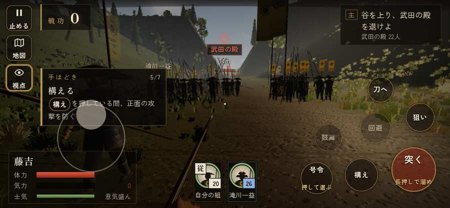

# テストプレイヤーの感想：歴史好きの大人

- 人：ミチオ（62歳・郷土史の会）（11番）
- 変わり目：連打・iPhone 横 844×390・新しく始める通し・速い・身分 上・問屋:刀・槍・具足・一人称
- 時：2026/9/28 0:10:08（75秒かかった）
- 画面：iPhone の横向き 844×390・倍率3・指で触る操作（touch.js の釦・棒・なぞり）・画質 低
- 遊んだ戦：田野の戦い・天目山（達成）
- 機械の混み具合：5（load average）

## ひとこと

> 田野・天目山を、一人称で歩いて見て回りました。務めは果たせましたが、気になる所がいくつか。名のある武将なのに、顔も装束も並の侍と同じ。細かい事ですが、こういう所で嘘っぽくなる。行き先があるのに20秒動かない兵。これでは興が醒めます。「鼓舞」をしたいのに、押す丸が出ていない。これでは興が醒めます。

## 見つけた問題（4件・困った順）

### 1. 行き先があるのに20秒動かない兵
- どこで：田野の戦い・天目山・182秒・end
- 何が：味方の足軽：味方の足軽（号令：attack）at (104,-5)／味方の滝川一益：味方の滝川一益（号令：attack）at (105,-5)
- どれくらい困ったか：★★★ やめたくなった（4回）
- 直し方の目安：道が塞がれていないか、行き先に着いたと見なせているかを見る
- 画面：（その戦の山場の一枚）

### 2. 名のある武将なのに、顔も装束も並の侍と同じ
- どこで：田野の戦い・天目山・5秒・brief
- 何が：滝川一益（味方）
- どれくらい困ったか：★ 少し気になった（36回）
- 直し方の目安：units.js の GENERALS に顔・甲冑・兜を足す
- 画面：（その戦の山場の一枚）

### 3. 名のある武将なのに、顔も装束も並の侍と同じ
- どこで：田野の戦い・天目山・90秒・narrow
- 何が：土屋昌恒（敵）
- どれくらい困ったか：★ 少し気になった（9回）
- 直し方の目安：units.js の GENERALS に顔・甲冑・兜を足す
- 画面：（その戦の山場の一枚）

### 4. 「鼓舞」をしたいのに、押す丸が出ていない
- どこで：田野の戦い・天目山・175秒・end
- 何が：欲しかった時：田野の戦い・天目山・175秒・end
- どれくらい困ったか：★ 少し気になった（2回）
- 直し方の目安：その時に使える釦は出す（touchFrame の出し入れ）
- 画面：（その戦の山場の一枚）

## 遊んだ記録

- 田野の戦い・天目山：183秒・任務達成・戦功168・組17/20・討ち取り12・突き1777/当たり42・号令0回・指で押した数1738・読み込み3.8秒・戦の前の札241字・1コマ7.1ms（実時間36秒・内訳 brain 0.0・pad 0.8・tf 0.5・upd 5.7・eye 0.1）
  - 任務の流れ：0s 滝川一益のもとで、下知を待て → 15s 谷を上り、武田の殿を退けよ → 70s 崖道で、土屋昌恒の衆を破れ → 113s 田野の陣に踏み込み、残った武田の者を退けよ → 171s 田野の陣に踏み込み、残った武田の者を退けよ〔済〕
  - 受けた傷：侍 66・足軽 39・武将 4
  - 開戦：
  - 一人称で見回す（45秒）：
  - 山場：
