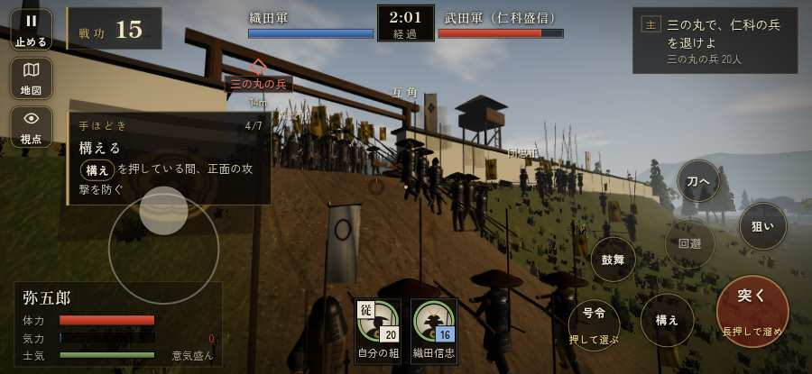

# テストプレイヤーの感想：はじめての中学生

- 人：ハルト（13歳・中学一年）（30番）
- 変わり目：迷子になりやすい・iPhone 横 932×430・新しく始める通し・ふつう・身分 上・問屋:刀・槍・具足・三人称
- 時：2026/9/28 0:08:39（98秒かかった）
- 画面：iPhone の横向き 932×430・倍率3・指で触る操作（touch.js の釦・棒・なぞり）・画質 低
- 遊んだ戦：高遠城の戦い（達成）
- 機械の混み具合：4（load average）

## ひとこと

> とりあえずやってみた。高遠城をやった。1回はなんかクリアできた。「前へ進もうとしても進めない所があった」のとこ、ふつうに困った。「戦場が札に食われている」のとこ、ふつうに困った。「HUD の札どうしが重なって読めない」のとこ、だるい。ぶっちゃけ、ここで一回やめかけた。

## 見つけた問題（7件・困った順）

### 1. 戦場が札に食われている（画面の3分の1超）
- どこで：高遠城の戦い・10秒・brief
- 何が：932×430 で 35%／932×430 で 36%
- どれくらい困ったか：★★★ やめたくなった（6回）
- 直し方の目安：札を小さくするか、平時は薄く・畳む
- 画面：（その戦の山場の一枚）

### 2. HUD の札どうしが重なって読めない
- どこで：高遠城の戦い・135秒・san
- 何が：.tl と #tutorial（932×430）
- どれくらい困ったか：★★★ やめたくなった（5回）
- 直し方の目安：置き場所をずらすか、片方を出している間はもう片方を隠す
- 画面：（その戦の山場の一枚）

### 3. 字が小さい（11px 未満）
- どこで：高遠城の戦い・戦のあと
- 何が：li > span > small：10.8333px「戦功183」／li > span > small：10.8333px「足軽7・侍0」
- どれくらい困ったか：★★★ やめたくなった（3回）
- 直し方の目安：11px 以上にする（飾りの字なら外す）
- 画面：（その戦の山場の一枚）

### 4. 前へ進もうとしても進めない所があった
- どこで：高遠城の戦い・33秒・gate
- 何が：(-27, 9)・段 gate
- どれくらい困ったか：★★ かなり困った（3回）
- 直し方の目安：当たり（柵・建物・地形）と道のつながりを見直す
- 画面：

### 5. 遊び手を責める言い回し
- どこで：高遠城の戦い・201秒・hon
- 何が：「平助！　しっかりせい！」（台詞）／「市兵衛！　しっかりせい！」（台詞）
- どれくらい困ったか：★★ かなり困った（2回）
- 直し方の目安：責めずに、次にどうすればよいかを言う
- 画面：（その戦の山場の一枚）

### 6. 「鼓舞」をしたいのに、押す丸が出ていない
- どこで：高遠城の戦い・226秒・end
- 何が：欲しかった時：高遠城の戦い・226秒・end
- どれくらい困ったか：★ 少し気になった（3回）
- 直し方の目安：その時に使える釦は出す（touchFrame の出し入れ）
- 画面：（その戦の山場の一枚）

### 7. 「回避」をしたいのに、押す丸が出ていない
- どこで：高遠城の戦い・220秒・end
- 何が：欲しかった時：高遠城の戦い・220秒・end
- どれくらい困ったか：★ 少し気になった（2回）
- 直し方の目安：その時に使える釦は出す（touchFrame の出し入れ）
- 画面：（その戦の山場の一枚）

## 遊んだ記録

- 高遠城の戦い：232秒・任務達成・戦功183・組15/20・討ち取り7・突き774/当たり21・号令0回・指で押した数798・読み込み1.8秒・戦の前の札257字・1コマ8.1ms（実時間49秒・内訳 brain 0.0・pad 0.3・tf 0.3・upd 7.4・eye 0.1）
  - 任務の流れ：0s 森長可のもとで、城攻めの下知を待て → 16s 大手門を破る組を守り、門を破れ → 115s 三の丸で、仁科の兵を退けよ → 149s 二の丸の門から打って出た兵を退け、二の丸へ入れ → 180s 本丸で、仁科盛信の衆を退けよ → 220s 本丸で、仁科盛信の衆を退けよ〔済〕
  - 受けた傷：足軽 113・弓 32
  - 開戦：
  - 山場：
