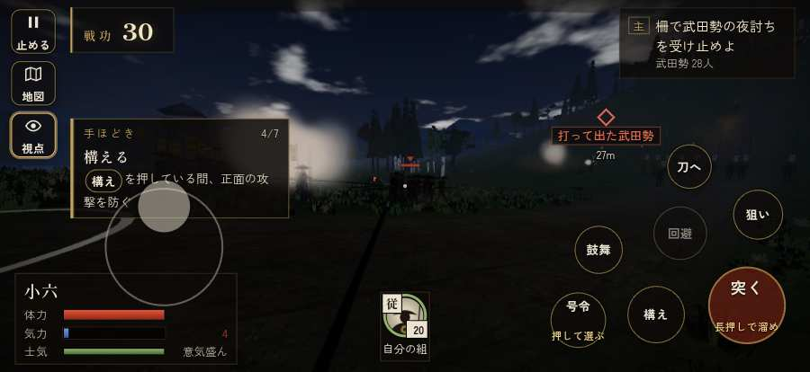

# テストプレイヤーの感想：はじめての中学生

- 人：ハルト（13歳・中学一年）（40番）
- 変わり目：連打・iPhone 横 874×402・新しく始める通し・ゆっくり・身分 中ほど・問屋:刀・槍・具足・一人称
- 時：2026/9/28 0:08:35（209秒かかった）
- 画面：iPhone の横向き 874×402・倍率3・指で触る操作（touch.js の釦・棒・なぞり）・画質 低
- 遊んだ戦：岩村城の戦い・水晶山（達成）、天王寺の戦い（達成）、雑賀攻め・小雑賀川（失敗・倒れた）
- 機械の混み具合：4（load average）

## ひとこと

> 友だちにすすめられて、やってみた。岩村城・水晶山と天王寺と雑賀攻め・小雑賀川をやった。2回はなんかクリアできた。1回すぐ死んだ…。「戦場が札に食われている」のとこ、だるい。「前へ進もうとしても進めない所があった」のとこ、ふつうに困った。「字が小さい」のとこ、ふつうに困った。ぶっちゃけ、ここで一回やめかけた。問屋で「槍持ち雇い賃 3貫・給金」買ってみた。

## 見つけた問題（12件・困った順）

### 1. 戦場が札に食われている（画面の3分の1超）
- どこで：岩村城の戦い・水晶山・140秒・raid
- 何が：874×402 で 39%／874×402 で 46%
- どれくらい困ったか：★★★ やめたくなった（77回）
- 直し方の目安：札を小さくするか、平時は薄く・畳む
- 画面：（その戦の山場の一枚）

### 2. 字が小さい（11px 未満）
- どこで：岩村城の戦い・水晶山・戦のあと
- 何が：li > span > small：10.8333px「戦功210」／li > span > small：10.8333px「足軽24・侍4」
- どれくらい困ったか：★★★ やめたくなった（13回）
- 直し方の目安：11px 以上にする（飾りの字なら外す）
- 画面：（その戦の山場の一枚）

### 3. HUD の札どうしが重なって読めない
- どこで：岩村城の戦い・水晶山・145秒・raid
- 何が：#tutorial と #subtitle（874×402）／.tl と #tutorial（874×402）
- どれくらい困ったか：★★★ やめたくなった（9回）
- 直し方の目安：置き場所をずらすか、片方を出している間はもう片方を隠す
- 画面：（その戦の山場の一枚）

### 4. 遊び手を責める言い回し
- どこで：岩村城の戦い・水晶山・208秒・raid
- 何が：「勘助！　しっかりせい！」（台詞）／「孫七！　しっかりせい！」（台詞）
- どれくらい困ったか：★★★ やめたくなった（7回）
- 直し方の目安：責めずに、次にどうすればよいかを言う
- 画面：（その戦の山場の一枚）

### 5. 前へ進もうとしても進めない所があった
- どこで：天王寺の戦い・33秒・break
- 何が：(-2, 83)・段 break
- どれくらい困ったか：★★ かなり困った（5回）
- 直し方の目安：当たり（柵・建物・地形）と道のつながりを見直す
- 画面：（その戦の山場の一枚）

### 6. 次に何をすればいいか分からない時間が続いた
- どこで：天王寺の戦い・151秒・fort
- 何が：151秒ごろ、段「fort」。任務「天王寺砦の門へ入れ」のまま30秒、印は124m先、近くに敵もいない
- どれくらい困ったか：★★ かなり困った（1回）
- 直し方の目安：印を近くに出す・台詞で次の行き先を言う・進み具合を見せる
- 画面：（その戦の山場の一枚）

### 7. 前へ進もうとしても進めない所があった
- どこで：雑賀攻め・小雑賀川・33秒・stakes
- 何が：(-1, 12)・段 stakes
- どれくらい困ったか：★★ かなり困った（1回）
- 直し方の目安：当たり（柵・建物・地形）と道のつながりを見直す

### 8. 指の端末なのに、問屋の説明が鍵盤の言い方
- どこで：天王寺の戦いの前・城下
- 何が：「具足・打刀 施設は数字キー 1〜9、または」
- どれくらい困ったか：★ 少し気になった（2回）
- 直し方の目安：isTouch の時は「持替の丸で」などの言い方に
- 画面：（その戦の山場の一枚）

### 9. 「回避」をしたいのに、押す丸が出ていない
- どこで：天王寺の戦い・254秒・end
- 何が：欲しかった時：天王寺の戦い・254秒・end
- どれくらい困ったか：★ 少し気になった（2回）
- 直し方の目安：その時に使える釦は出す（touchFrame の出し入れ）
- 画面：（その戦の山場の一枚）

### 10. 「狙い」をしたいのに、押す丸が出ていない
- どこで：天王寺の戦い・255秒・end
- 何が：欲しかった時：天王寺の戦い・255秒・end
- どれくらい困ったか：★ 少し気になった（1回）
- 直し方の目安：その時に使える釦は出す（touchFrame の出し入れ）
- 画面：（その戦の山場の一枚）

### 11. 「鼓舞」をしたいのに、押す丸が出ていない
- どこで：雑賀攻め・小雑賀川・313秒・counter
- 何が：欲しかった時：雑賀攻め・小雑賀川・313秒・counter
- どれくらい困ったか：★ 少し気になった（1回）
- 直し方の目安：その時に使える釦は出す（touchFrame の出し入れ）

### 12. すぐに倒れてしまった
- どこで：雑賀攻め・小雑賀川・320秒・counter
- 何が：320秒で倒れた（受けた傷：足軽 228・侍 36・鉄砲 18）
- どれくらい困ったか：★ 少し気になった（1回）
- 直し方の目安：初めの戦は受ける傷を減らす・危ない時に字幕で構えを教える

## 遊んだ記録

- 岩村城の戦い・水晶山：355秒・任務達成・戦功210・組14/20・討ち取り28・突き1509/当たり82・号令0回・指で押した数1515・読み込み1.1秒・戦の前の札257字・1コマ4.9ms（実時間50秒・内訳 brain 0.0・pad 0.3・tf 0.3・upd 4.2・eye 0.1）
  - 任務の流れ：0s 河尻秀隆のもとで、陣の柵の守りにつけ → 14s 柵の持ち場に篝火を焚け（2か所） → 104s 柵の持ち場に篝火を焚け（2か所）〔済〕 → 112s 柵で武田勢の夜討ちを受け止めよ → 222s 退く武田勢を、城の麓まで追え → 342s 退く武田勢を、城の麓まで追え〔済〕
  - 受けた傷：足軽 132・騎馬 70・侍 21
  - 開戦：
  - 山場：
  - 勝ち負けが決まった所：
- 天王寺の戦い：264秒・任務達成・戦功119・組20/20・討ち取り2・突き1093/当たり5・号令0回・指で押した数2606・読み込み0.8秒・戦の前の札260字・1コマ5.2ms（実時間29秒・内訳 brain 0.0・pad 0.3・tf 0.3・upd 4.6・eye 0.1）
  - 任務の流れ：0s 信長公の下知を待て → 14s 砦を囲む本願寺勢を突き破れ（雑賀の鉄砲に気をつけよ） → 84s 天王寺砦の門へ入れ → 164s 砦から打って出て、本願寺勢を崩せ → 252s 砦から打って出て、本願寺勢を崩せ〔済〕
  - 受けた傷：足軽 13
- 雑賀攻め・小雑賀川：320秒・任務失敗（倒れた）・戦功104・組0/20・討ち取り19・突き1361/当たり50・号令0回・指で押した数4016・読み込み0.5秒・戦の前の札260字・1コマ6.6ms（実時間44秒・内訳 brain 0.0・pad 0.4・tf 0.4・upd 5.7・eye 0.1）
  - 任務の流れ：0s 堀秀政のもとで、下知を待て → 15s 川の中の乱杭を抜いて、渡る道を開けよ（3か所） → 138s 川を渡り、柵の前の雑賀衆を崩せ → 212s 打って出た雑賀の鉄砲衆を受け止めよ
  - 受けた傷：足軽 228・侍 36・鉄砲 18
