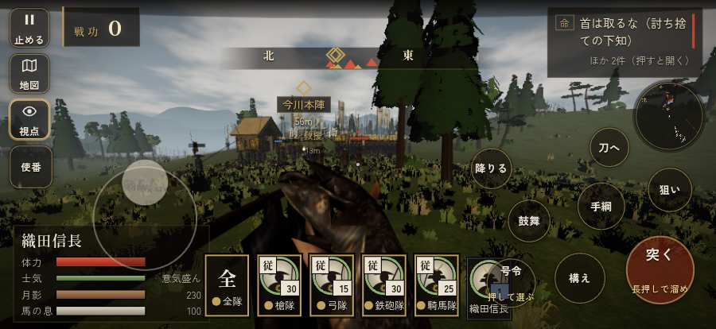

# テストプレイヤーの感想：歴史好きの大人

- 人：ミチオ（62歳・郷土史の会）（41番）
- 変わり目：迷子になりやすい・iPhone 横 874×402・信長で出陣・速い・身分 上・問屋:刀・槍・具足・一人称
- 時：2026/9/28 0:12:07（86秒かかった）
- 画面：iPhone の横向き 874×402・倍率3・指で触る操作（touch.js の釦・棒・なぞり）・画質 低
- 遊んだ戦：桶狭間の戦い（信長で出陣）（達成）
- 機械の混み具合：4（load average）

## ひとこと

> 桶狭間（信長で出陣）を、一人称で歩いて見て回りました。務めは果たせましたが、気になる所がいくつか。兵が一息で飛んだ。細かい事ですが、こういう所で嘘っぽくなる。戦う兵が遠景の大軍（影の兵）の中に埋もれている。細かい事ですが、こういう所で嘘っぽくなる。崩れた部隊が、また戦っている。これでは興が醒めます。

## 見つけた問題（3件・困った順）

### 1. 兵が一息で飛んだ（6m 超）
- どこで：桶狭間の戦い（信長で出陣）・14秒・wait
- 何が：味方の先手の組頭 与兵衛：味方の先手の組頭 与兵衛：(4,120) → (-32,-52)／味方の侍：味方の侍：(4,138) → (8,-52)
- どれくらい困ったか：★★★ やめたくなった（67回）
- 直し方の目安：位置を直接書き換えている所を探す（出し直し・押し出し）
- 画面：（その戦の山場の一枚）

### 2. 戦う兵が遠景の大軍（影の兵）の中に埋もれている
- どこで：桶狭間の戦い（信長で出陣）・81秒・assault
- 何が：敵の兵 8人が、遠景の大軍 #0（中心 -40,-175・480人）の中（-13, -172）／敵の兵 10人が、遠景の大軍 #0（中心 -40,-175・480人）の中（-10, -172）
- どれくらい困ったか：★★★ やめたくなった（14回）
- 直し方の目安：遠景の大軍を戦う場所から離す（addDistantArmy の x,z,w,d を見直す）か、兵の行き先を大軍の外にする
- 画面：（その戦の山場の一枚）

### 3. 崩れた部隊が、また戦っている
- どこで：桶狭間の戦い（信長で出陣）・31秒・assault
- 何が：部隊（号令：flee）
- どれくらい困ったか：★★★ やめたくなった（3回）
- 直し方の目安：崩れた部隊の号令を上書きしない
- 画面：（その戦の山場の一枚）

## 遊んだ記録

- 桶狭間の戦い（信長で出陣）：135秒・任務達成・戦功160・組84/100・討ち取り7・突き46/当たり12・号令0回・指で押した数92・読み込み1.7秒・戦の前の札313字・1コマ8.6ms（実時間33秒・内訳 brain 0.0・pad 0.1・tf 0.2・upd 8.0・eye 0.1）
  - 任務の流れ：0s 今川義元の本陣を突け → 70s 今川義元の本陣を突け〔済〕／本陣の敵を突き崩せ → 126s 今川義元の本陣を突け〔済〕／本陣の敵を突き崩せ〔済〕
  - 受けた傷：鉄砲 23・足軽 5
  - 開戦：
  - 山場：
  - 一人称で見回す（54秒）：
