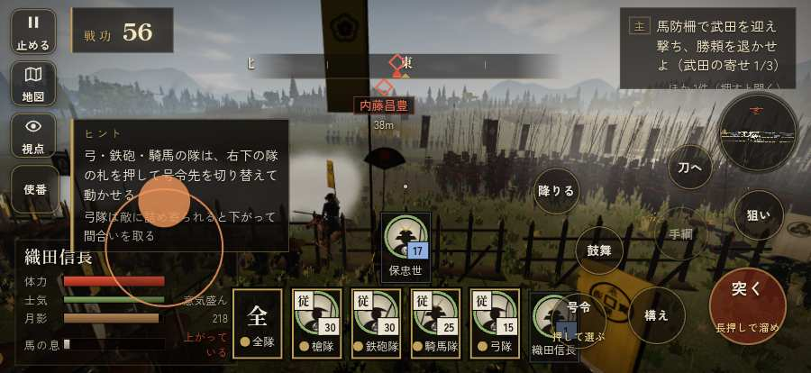

# テストプレイヤーの感想：アクション好き

- 人：ソウタ（24歳・アクションゲーム好き）（42番）
- 変わり目：構え多め・iPhone 横 874×402・信長で出陣・速い・身分 上・問屋:馬・三人称
- 時：2026/9/28 0:13:37（96秒かかった）
- 画面：iPhone の横向き 874×402・倍率3・指で触る操作（touch.js の釦・棒・なぞり）・画質 低
- 遊んだ戦：設楽原の決戦（信長で出陣）（達成）
- 機械の混み具合：4（load average）

## ひとこと

> とにかく突っ込んだ。2分で15人斬った。116回突いて57回当たり。まあまあ。HUD の札どうしが重なって読めない、ストレスたまる。前へ進もうとしても進めない所があった、手応えがスカスカ。「狙い」をしたいのに、押す丸が出ていない、ストレスたまる。もっと派手に、じゃなくて重く斬り合いたい。

## 見つけた問題（5件・困った順）

### 1. HUD の札どうしが重なって読めない
- どこで：設楽原の決戦（信長で出陣）・5秒・brief
- 何が：.bl.full と #h-units（874×402）／#subtitle と #h-units（874×402）
- どれくらい困ったか：★★ かなり困った（40回）
- 直し方の目安：置き場所をずらすか、片方を出している間はもう片方を隠す
- 画面：（その戦の山場の一枚）

### 2. 前へ進もうとしても進めない所があった
- どこで：設楽原の決戦（信長で出陣）・55秒・brief
- 何が：(14, 37)・段 brief
- どれくらい困ったか：★★ かなり困った（1回）
- 直し方の目安：当たり（柵・建物・地形）と道のつながりを見直す
- 画面：

### 3. 戦場が札に食われている（画面の3分の1超）
- どこで：設楽原の決戦（信長で出陣）・5秒・brief
- 何が：874×402 で 58%／874×402 で 64%
- どれくらい困ったか：★ 少し気になった（24回）
- 直し方の目安：札を小さくするか、平時は薄く・畳む
- 画面：（その戦の山場の一枚）

### 4. 戦う兵が遠景の大軍（影の兵）の中に埋もれている
- どこで：設楽原の決戦（信長で出陣）・1秒・brief
- 何が：味方の兵 4人が、遠景の大軍 #6（中心 -34,-70・180人）の中（-36, -64）／敵の兵 18人が、遠景の大軍 #14（中心 102,0・130人）の中（97, -4）
- どれくらい困ったか：★ 少し気になった（4回）
- 直し方の目安：遠景の大軍を戦う場所から離す（addDistantArmy の x,z,w,d を見直す）か、兵の行き先を大軍の外にする
- 画面：（その戦の山場の一枚）

### 5. 「狙い」をしたいのに、押す丸が出ていない
- どこで：設楽原の決戦（信長で出陣）・120秒・brief
- 何が：欲しかった時：設楽原の決戦（信長で出陣）・120秒・brief
- どれくらい困ったか：★ 少し気になった（1回）
- 直し方の目安：その時に使える釦は出す（touchFrame の出し入れ）
- 画面：（その戦の山場の一枚）

## 遊んだ記録

- 設楽原の決戦（信長で出陣）：128秒・任務達成・戦功200・組99/100・討ち取り15・突き116/当たり57・号令0回・指で押した数256・読み込み1.4秒・戦の前の札306字・1コマ15.1ms（実時間53秒・内訳 brain 0.2・pad 0.3・tf 0.2・upd 14.2・eye 0.2）
  - 任務の流れ：0s 馬防柵で武田を迎え撃ち、勝頼を退かせよ（武田の寄せ 0/3） → 22s 馬防柵で武田を迎え撃ち、勝頼を退かせよ（武田の寄せ 1/3） → 68s 馬防柵で武田を迎え撃ち、勝頼を退かせよ（武田の寄せ 2/3） → 102s 馬防柵で武田を迎え撃ち、勝頼を退かせよ（武田の寄せ 3/3）〔済〕 → 107s 馬防柵で武田を迎え撃ち、勝頼を退かせよ（武田の寄せ 3/3）〔済〕／柵を出て、殿の馬場信春の隊を崩せ → 118s 馬防柵で武田を迎え撃ち、勝頼を退かせよ（武田の寄せ 3/3）〔済〕／柵を出て、殿の馬場信春の隊を崩せ〔済〕
  - 受けた傷：足軽 51・騎馬 39・侍 13・武将 2
  - 開戦：
  - 山場：
