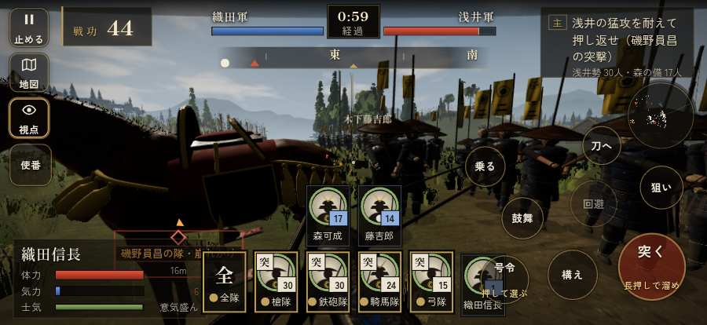

# テストプレイヤーの感想：指揮好きの戦略家

- 人：ケイコ（45歳・将棋と戦略ゲーム好き）（43番）
- 変わり目：連打・iPhone 横 874×402・信長で出陣・ふつう・足軽から・問屋:鉄砲・一人称
- 時：2026/9/28 0:15:16（98秒かかった）
- 画面：iPhone の横向き 874×402・倍率3・指で触る操作（touch.js の釦・棒・なぞり）・画質 低
- 遊んだ戦：姉川の戦い（信長で出陣）（達成）
- 機械の混み具合：4（load average）

## ひとこと

> 姉川（信長で出陣）で、号令を17回かけました。信長でも出陣して、軍配も触りました。HUD の札どうしが重なって読めない。ここが直れば、ぐっと指揮が楽しくなる。戦場が札に食われている。命令が信用できないと、策が立てられません。戦う兵が遠景の大軍（影の兵）の中に埋もれている。命令が信用できないと、策が立てられません。勝てはしましたが、自分の采配で勝った手応えはまだ薄いです。

## 見つけた問題（7件・困った順）

### 1. HUD の札どうしが重なって読めない
- どこで：姉川の戦い（信長で出陣）・5秒・brief
- 何が：.tl と #cmdpanel（874×402）／.bl と #h-units（874×402）
- どれくらい困ったか：★★★ やめたくなった（95回）
- 直し方の目安：置き場所をずらすか、片方を出している間はもう片方を隠す
- 画面：（その戦の山場の一枚）

### 2. 戦場が札に食われている（画面の3分の1超）
- どこで：姉川の戦い（信長で出陣）・5秒・brief
- 何が：874×402 で 107%／874×402 で 75%
- どれくらい困ったか：★★★ やめたくなった（31回）
- 直し方の目安：札を小さくするか、平時は薄く・畳む
- 画面：（その戦の山場の一枚）

### 3. 戦う兵が遠景の大軍（影の兵）の中に埋もれている
- どこで：姉川の戦い（信長で出陣）・21秒・charge
- 何が：敵の兵 7人が、遠景の大軍 #18（中心 20,-46・100人）の中（21, -40）／味方・敵の兵 12人が、遠景の大軍 #18（中心 22,-1・100人）の中（28, -4）
- どれくらい困ったか：★★ かなり困った（30回）
- 直し方の目安：遠景の大軍を戦う場所から離す（addDistantArmy の x,z,w,d を見直す）か、兵の行き先を大軍の外にする
- 画面：（その戦の山場の一枚）

### 4. 崩れた部隊が、また戦っている
- どこで：姉川の戦い（信長で出陣）・61秒・charge
- 何が：磯野員昌の隊（号令：flee）／浅井の二の手（号令：flee）
- どれくらい困ったか：★★ かなり困った（6回）
- 直し方の目安：崩れた部隊の号令を上書きしない
- 画面：（その戦の山場の一枚）

### 5. 行き先があるのに20秒動かない兵
- どこで：姉川の戦い（信長で出陣）・66秒・charge
- 何が：味方の弓：味方の弓（号令：attack）at (23,37)／味方の甚兵衛：味方の甚兵衛（号令：attack）at (24,33)
- どれくらい困ったか：★★ かなり困った（2回）
- 直し方の目安：道が塞がれていないか、行き先に着いたと見なせているかを見る
- 画面：（その戦の山場の一枚）

### 6. 自分が遠景の大軍（影の兵）の中に立っている
- どこで：姉川の戦い（信長で出陣）・126秒・counter
- 何が：味方・敵の兵 7人が、遠景の大軍 #18（中心 17,4・100人）の中（22, 8）／味方の兵 1人が、遠景の大軍 #18（中心 17,4・100人）の中（22, 4）
- どれくらい困ったか：★ 少し気になった（3回）
- 直し方の目安：遠景の大軍を戦う場所から離す（addDistantArmy の x,z,w,d を見直す）か、兵の行き先を大軍の外にする
- 画面：（その戦の山場の一枚）

### 7. 遊び手を責める言い回し
- どこで：姉川の戦い（信長で出陣）・108秒・charge
- 何が：「長吉！　しっかりせい！」（台詞）／「佐吉！　しっかりせい！」（台詞）
- どれくらい困ったか：★ 少し気になった（2回）
- 直し方の目安：責めずに、次にどうすればよいかを言う
- 画面：（その戦の山場の一枚）

## 遊んだ記録

- 姉川の戦い（信長で出陣）：166秒・任務達成・戦功180・組93/100・討ち取り7・突き1589/当たり17・号令17回・指で押した数1592・読み込み11.3秒・戦の前の札292字・1コマ10.5ms（実時間50秒・内訳 brain 0.0・pad 0.8・tf 0.5・upd 9.1・eye 0.1）
  - 任務の流れ：0s 浅井の猛攻を耐えて押し返せ → 18s 浅井の猛攻を耐えて押し返せ（磯野員昌の突撃） → 89s 浅井の猛攻を耐えて押し返せ（長政の旗本） → 121s 浅井の猛攻を耐えて押し返せ（長政の旗本）〔済〕／姉川を渡り、向こう岸で踏みとどまる浅井の殿（浅井政澄）を崩せ → 156s 浅井の猛攻を耐えて押し返せ（長政の旗本）〔済〕／姉川を渡り、向こう岸で踏みとどまる浅井の殿（浅井政澄）を崩せ〔済〕
  - 受けた傷：足軽 41・侍 22・武将 8
  - 開戦：
  - 山場：
  - 勝ち負けが決まった所：
