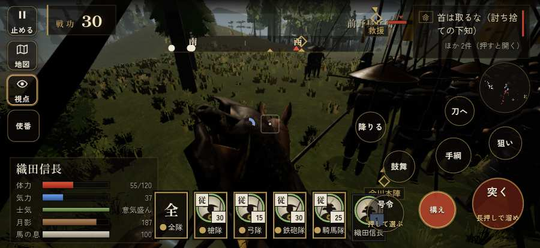

# テストプレイヤーの感想：せっかちな社会人

- 人：ユウキ（35歳・昼休みに遊ぶ会社員）（44番）
- 変わり目：構え多め・iPhone 横 874×402・信長で出陣・ゆっくり・身分 少し上・問屋:刀・槍・具足・一人称
- 時：2026/9/28 0:16:57（78秒かかった）
- 画面：iPhone の横向き 874×402・倍率3・指で触る操作（touch.js の釦・棒・なぞり）・画質 低
- 遊んだ戦：桶狭間の戦い（信長で出陣）（達成）
- 機械の混み具合：4（load average）

## ひとこと

> 昼休みに2分ほど。桶狭間（信長で出陣）。何もする事が無いまま待たされた。時間がもったいない。戦場が札に食われている。時間がもったいない。戦の前の説明が長い。正直、飛ばしたい。勝ち負けはすぐ分かって、そこは良かった。

## 見つけた問題（6件・困った順）

### 1. 戦場が札に食われている（画面の3分の1超）
- どこで：桶狭間の戦い（信長で出陣）・5秒・brief
- 何が：874×402 で 44%／874×402 で 58%
- どれくらい困ったか：★★ かなり困った（25回）
- 直し方の目安：札を小さくするか、平時は薄く・畳む
- 画面：（その戦の山場の一枚）

### 2. 同じ知らせが20秒に4回以上
- どこで：桶狭間の戦い（信長で出陣）・36秒・assault
- 何が：「横腹を突いている（1/6）」（報せ）／「敵が崩れて逃げていく！」（報せ）
- どれくらい困ったか：★★ かなり困った（6回）
- 直し方の目安：一度出したら、しばらく同じ物を出さない
- 画面：（その戦の山場の一枚）

### 3. 何もする事が無いまま待たされた
- どこで：桶狭間の戦い（信長で出陣）・117秒・assault
- 何が：61秒、任務札が変わらず敵もいない（段 assault）
- どれくらい困ったか：★★ かなり困った（1回）
- 直し方の目安：飛ばせる（canSkip）ようにするか、待つ間にする事を置く
- 画面：

### 4. HUD の札どうしが重なって読めない
- どこで：桶狭間の戦い（信長で出陣）・10秒・brief
- 何が：#tutorial と #subtitle（874×402）／.tl と #tutorial（874×402）
- どれくらい困ったか：★ 少し気になった（5回）
- 直し方の目安：置き場所をずらすか、片方を出している間はもう片方を隠す
- 画面：（その戦の山場の一枚）

### 5. 崩れた部隊が、また戦っている
- どこで：桶狭間の戦い（信長で出陣）・30秒・assault
- 何が：部隊（号令：flee）／備の兵（号令：flee）
- どれくらい困ったか：★ 少し気になった（5回）
- 直し方の目安：崩れた部隊の号令を上書きしない
- 画面：（その戦の山場の一枚）

### 6. 戦の前の説明が長い
- どこで：桶狭間の戦い（信長で出陣）
- 何が：桶狭間の戦い（信長で出陣）：313字（読むのに1分かかる）
- どれくらい困ったか：★ 少し気になった（1回）
- 直し方の目安：三行ほどに縮め、残りは「くわしく」に畳む
- 画面：（その戦の山場の一枚）

## 遊んだ記録

- 桶狭間の戦い（信長で出陣）：135秒・任務達成・戦功160・組99/100・討ち取り29・突き55/当たり69・号令0回・指で押した数131・読み込み2.2秒・戦の前の札313字・1コマ8.9ms（実時間35秒・内訳 brain 0.0・pad 0.2・tf 0.3・upd 8.3・eye 0.1）
  - 任務の流れ：0s 今川義元の本陣を突け → 56s 今川義元の本陣を突け〔済〕／本陣の敵を突き崩せ → 126s 今川義元の本陣を突け〔済〕／本陣の敵を突き崩せ〔済〕
  - 受けた傷：足軽 43・侍 31・弓 6
  - 開戦：
  - 山場：
