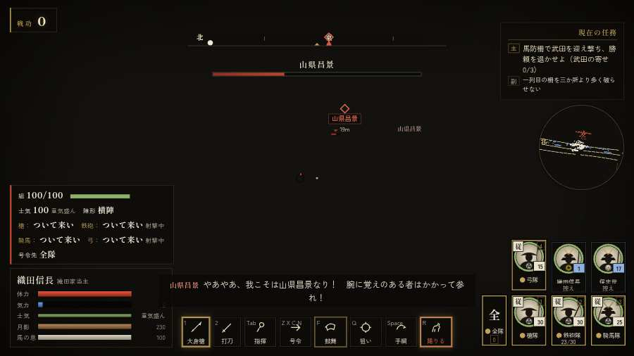
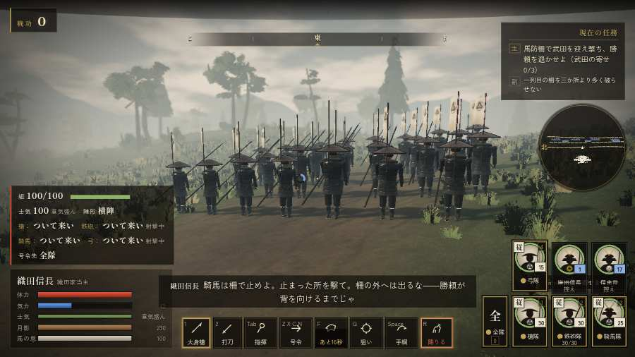

# テストプレイヤーの感想：はじめての中学生

- 人：ハルト（13歳・中学一年）（45番）
- 変わり目：連打・パソコン 1280×720・信長で出陣・ゆっくり・身分 少し上・問屋:馬・一人称
- 時：2026/9/28 0:08:43（198秒かかった）
- 画面：パソコン 1280×720・鍵盤とマウス・画質 中
- 遊んだ戦：設楽原の決戦（信長で出陣）（達成）
- 機械の混み具合：5（load average）

## ひとこと

> とりあえずやってみた。設楽原（信長で出陣）をやった。1回はなんかクリアできた。「字が枠から切れている」のとこ、マジで意味わかんない。「戦場が札に食われている」のとこ、だるい。「前へ進もうとしても進めない所があった」のとこ、だるい。ぶっちゃけ、ここで一回やめかけた。

## 見つけた問題（7件・困った順）

### 1. 字が枠から切れている
- どこで：設楽原の決戦（信長で出陣）・開戦
- 何が：#h-units > .uc.ally > .nm「織田信長」／#h-units > .uc.ally > .nm「保忠世」
- どれくらい困ったか：★★★ やめたくなった（102回）
- 直し方の目安：枠を広げるか、字を折り返す
- 画面：（その戦の山場の一枚）

### 2. 戦場が札に食われている（画面の3分の1超）
- どこで：設楽原の決戦（信長で出陣）・5秒・brief
- 何が：1280×720 で 38%／1280×720 で 46%
- どれくらい困ったか：★★★ やめたくなった（40回）
- 直し方の目安：札を小さくするか、平時は薄く・畳む
- 画面：（その戦の山場の一枚）

### 3. HUD の札どうしが重なって読めない
- どこで：設楽原の決戦（信長で出陣）・5秒・brief
- 何が：#skiphint と #h-units（1280×720）
- どれくらい困ったか：★★★ やめたくなった（3回）
- 直し方の目安：置き場所をずらすか、片方を出している間はもう片方を隠す
- 画面：（その戦の山場の一枚）

### 4. 字が小さい（11px 未満）
- どこで：設楽原の決戦（信長で出陣）・戦のあと
- 何が：li > span > small：10.8333px「戦功200」／li > span > small：10.8333px「足軽15・侍2」
- どれくらい困ったか：★★★ やめたくなった（3回）
- 直し方の目安：11px 以上にする（飾りの字なら外す）
- 画面：（その戦の山場の一枚）

### 5. 前へ進もうとしても進めない所があった
- どこで：設楽原の決戦（信長で出陣）・12秒・brief
- 何が：(-1, -46)・段 brief
- どれくらい困ったか：★★ かなり困った（1回）
- 直し方の目安：当たり（柵・建物・地形）と道のつながりを見直す
- 画面：

### 6. 指の端末なのに、鍵盤・マウスの案内が出ている
- どこで：設楽原の決戦（信長で出陣）・251秒・brief
- 何が：戦のあとの画面に「と演出を飛ばします ・ Enter で「タイトルへ」 ・」
- どれくらい困ったか：★ 少し気になった（1回）
- 直し方の目安：isTouch の時は「画面を押す」などの言い方にする
- 画面：（その戦の山場の一枚）

### 7. 遊び手を責める言い回し
- どこで：設楽原の決戦（信長で出陣）・42秒・brief
- 何が：「伝七！　しっかりせい！」（台詞）
- どれくらい困ったか：★ 少し気になった（1回）
- 直し方の目安：責めずに、次にどうすればよいかを言う
- 画面：（その戦の山場の一枚）

## 遊んだ記録

- 設楽原の決戦（信長で出陣）：251秒・任務達成・戦功200・組89/100・討ち取り17・突き0/当たり32・号令0回・指で押した数1・読み込み2.5秒・戦の前の札299字・1コマ23.1ms（実時間143秒・内訳 brain 0.0・pad 0.0・tf 0.0・upd 0.0・eye 0.2）
  - 任務の流れ：0s 馬防柵で武田を迎え撃ち、勝頼を退かせよ（武田の寄せ 0/3） → 50s 馬防柵で武田を迎え撃ち、勝頼を退かせよ（武田の寄せ 1/3） → 140s 馬防柵で武田を迎え撃ち、勝頼を退かせよ（武田の寄せ 2/3） → 199s 馬防柵で武田を迎え撃ち、勝頼を退かせよ（武田の寄せ 3/3）〔済〕 → 204s 馬防柵で武田を迎え撃ち、勝頼を退かせよ（武田の寄せ 3/3）〔済〕／柵を出て、殿の馬場信春の隊を崩せ → 241s 馬防柵で武田を迎え撃ち、勝頼を退かせよ（武田の寄せ 3/3）〔済〕／柵を出て、殿の馬場信春の隊を崩せ〔済〕
  - 受けた傷：足軽 22
  - 開戦：
  - 山場：
