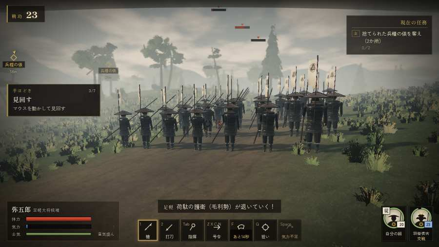

# テストプレイヤーの感想：歴史好きの大人

- 人：ミチオ（62歳・郷土史の会）（46番）
- 変わり目：連打・パソコン 1280×720・織田家編の戦を一つ・ふつう・身分 上・問屋:供・一人称
- 時：2026/9/28 0:12:05（115秒かかった）
- 画面：パソコン 1280×720・鍵盤とマウス・画質 高
- 遊んだ戦：三木城・大村の合戦（達成）
- 機械の混み具合：5（load average）

## ひとこと

> 三木城・大村の合戦を、一人称で歩いて見て回りました。務めは果たせましたが、気になる所がいくつか。名のある武将なのに、顔も装束も並の侍と同じ。史実を知る者としては、ここは看過できません。字が枠から切れている。史実を知る者としては、ここは看過できません。崩れた部隊が、また戦っている。史実を知る者としては、ここは看過できません。

## 見つけた問題（3件・困った順）

### 1. 崩れた部隊が、また戦っている
- どこで：三木城・大村の合戦・130秒・omura
- 何が：別所の新手（号令：flee）／大村坂の別所勢（号令：flee）
- どれくらい困ったか：★★ かなり困った（2回）
- 直し方の目安：崩れた部隊の号令を上書きしない
- 画面：（その戦の山場の一枚）

### 2. 字が枠から切れている
- どこで：三木城・大村の合戦・開戦
- 何が：#h-units > .uc.ally > .nm「羽柴秀吉」
- どれくらい困ったか：★ 少し気になった（39回）
- 直し方の目安：枠を広げるか、字を折り返す
- 画面：（その戦の山場の一枚）

### 3. 名のある武将なのに、顔も装束も並の侍と同じ
- どこで：三木城・大村の合戦・5秒・brief
- 何が：羽柴秀吉（味方）
- どれくらい困ったか：★ 少し気になった（27回）
- 直し方の目安：units.js の GENERALS に顔・甲冑・兜を足す
- 画面：（その戦の山場の一枚）

## 遊んだ記録

- 三木城・大村の合戦：219秒・任務達成・戦功185・組0/20・討ち取り41・突き0/当たり91・号令0回・指で押した数1・読み込み1.2秒・戦の前の札266字・1コマ12.6ms（実時間70秒・内訳 brain 0.0・pad 0.0・tf 0.0・upd 0.0・eye 0.1）
  - 任務の流れ：0s 羽柴秀吉のもとで、下知を待て → 15s 荷駄の護衛を退け、荷を奪え → 38s 捨てられた兵糧の俵を奪え（2か所） → 57s 捨てられた兵糧の俵を奪え（2か所）〔済〕 → 61s 平田の付城へ駆けつけ、柵に取り付く別所勢を退けよ → 130s 大村坂で、別所・毛利勢を崩せ → 207s 大村坂で、別所・毛利勢を崩せ〔済〕
  - 受けた傷：足軽 188・侍 14・弓 6
  - 開戦：
  - 山場：
  - 一人称で見回す（45秒）：
