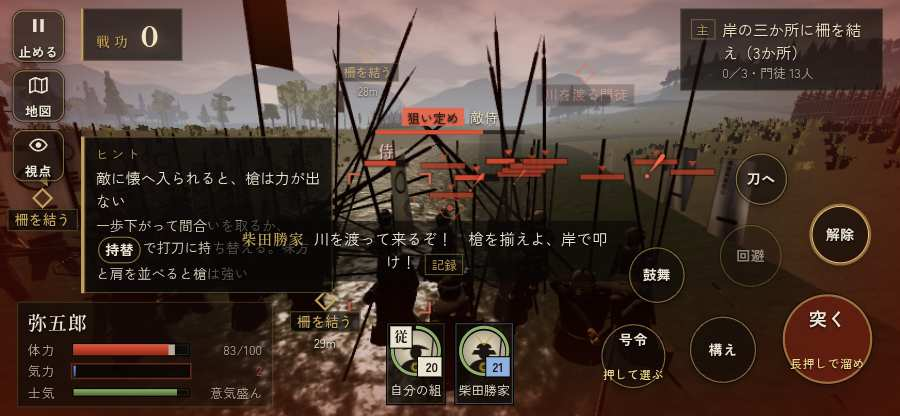

# テストプレイヤーの感想：アクション好き

- 人：ソウタ（24歳・アクションゲーム好き）（47番）
- 変わり目：走りっぱなし・iPhone 横 844×390・新しく始める通し・ゆっくり・身分 少し上・問屋:馬・三人称
- 時：2026/9/28 0:14:03（80秒かかった）
- 画面：iPhone の横向き 844×390・倍率3・指で触る操作（touch.js の釦・棒・なぞり）・画質 低
- 遊んだ戦：長島一向一揆（失敗・倒れた）
- 機械の混み具合：5（load average）

## ひとこと

> とにかく突っ込んだ。6分で13人斬った。408回突いて33回当たり。当たらなさすぎ。戦場が札に食われている、ここは爽快感が死んでる。倒れて戦が終わった、ストレスたまる。突いても、なかなか当たらない、ここは爽快感が死んでる。1回やられた。難しいのはいいけど、何でやられたか分かるようにしてほしい。

## 見つけた問題（7件・困った順）

### 1. 戦場が札に食われている（画面の3分の1超）
- どこで：長島一向一揆・15秒・build
- 何が：844×390 で 39%／844×390 で 43%
- どれくらい困ったか：★★ かなり困った（33回）
- 直し方の目安：札を小さくするか、平時は薄く・畳む
- 画面：（その戦の山場の一枚）

### 2. 倒れて戦が終わった
- どこで：長島一向一揆・354秒・sally
- 何が：354秒で倒れた（受けた傷：足軽 211・侍 27）
- どれくらい困ったか：★★ かなり困った（1回）
- 直し方の目安：初めの戦は受ける傷を減らす・危ない時に字幕で構えを教える
- 画面：（その戦の山場の一枚）

### 3. 突いても、なかなか当たらない
- どこで：長島一向一揆・354秒・sally
- 何が：408回突いて、当たりは33回
- どれくらい困ったか：★★ かなり困った（1回）
- 直し方の目安：指の端末では、突きの向きを近くの敵へ少し寄せる（狙いの補助）
- 画面：（その戦の山場の一枚）

### 4. HUD の札どうしが重なって読めない
- どこで：長島一向一揆・55秒・build
- 何が：#flash と #bark（844×390）／.tl と #tutorial（844×390）
- どれくらい困ったか：★ 少し気になった（8回）
- 直し方の目安：置き場所をずらすか、片方を出している間はもう片方を隠す
- 画面：（その戦の山場の一枚）

### 5. 遊び手を責める言い回し
- どこで：長島一向一揆・123秒・build
- 何が：「弥五郎、何をしておる。「柵を結う」はあちらじゃ！」（台詞）／「弥助！　しっかりせい！」（台詞）
- どれくらい困ったか：★ 少し気になった（4回）
- 直し方の目安：責めずに、次にどうすればよいかを言う
- 画面：（その戦の山場の一枚）

### 6. 馬に乗れる場面がなかった
- どこで：長島一向一揆・354秒・sally
- 何が：長島一向一揆
- どれくらい困ったか：★ 少し気になった（1回）
- 直し方の目安：空馬（主を失った馬）をもう少し置く
- 画面：（その戦の山場の一枚）

### 7. 自分のすぐそばの敵が6秒以上なにもしない
- どこで：長島一向一揆・274秒・sally
- 何が：敵の足軽：敵の足軽
- どれくらい困ったか：★ 少し気になった（1回）
- 直し方の目安：近くの敵（遊び手）を狙いに入れる
- 画面：（その戦の山場の一枚）

## 遊んだ記録

- 長島一向一揆：354秒・任務失敗（倒れた）・戦功77・組7/20・討ち取り13・突き408/当たり33・号令0回・指で押した数576・読み込み1.3秒・戦の前の札244字・1コマ4.8ms（実時間44秒・内訳 brain 0.0・pad 0.2・tf 0.2・upd 4.3・eye 0.1）
  - 任務の流れ：0s 柴田勝家のもとで、下知を待て → 15s 岸の三か所に柵を結え（3か所） → 165s 岸の三か所に柵を結え（3か所）〔済〕 → 168s 岸に着いた一揆の舟の者を退けよ → 251s 柵の前で、打って出た門徒を受け止めよ
  - 受けた傷：足軽 211・侍 27
  - 開戦：
  - 山場：
  - 勝ち負けが決まった所：
