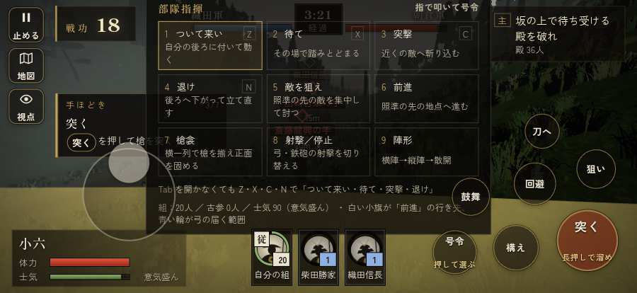

# テストプレイヤーの感想：指揮好きの戦略家

- 人：ケイコ（45歳・将棋と戦略ゲーム好き）（48番）
- 変わり目：迷子になりやすい・iPhone 横 874×402・新しく始める通し・速い・身分 少し上・問屋:供・三人称
- 時：2026/9/28 0:15:27（164秒かかった）
- 画面：iPhone の横向き 874×402・倍率3・指で触る操作（touch.js の釦・棒・なぞり）・画質 低
- 遊んだ戦：刀根坂の戦い（失敗・倒れた）、小谷城の戦い（達成）、長島一向一揆（達成）
- 機械の混み具合：5（load average）

## ひとこと

> 刀根坂と小谷城と長島一向一揆で、号令を38回かけました。HUD の札どうしが重なって読めない。采配の上で、これは痛い。戦場が札に食われている。ここが直れば、ぐっと指揮が楽しくなる。前へ進もうとしても進めない所があった。ここが直れば、ぐっと指揮が楽しくなる。勝てはしましたが、自分の采配で勝った手応えはまだ薄いです。問屋で中間雇い賃 2貫・給金 を揃えました。

## 見つけた問題（8件・困った順）

### 1. HUD の札どうしが重なって読めない
- どこで：刀根坂の戦い・5秒・brief
- 何が：.tl と #cmdpanel（874×402）／#armybar と #cmdpanel（874×402）
- どれくらい困ったか：★★★ やめたくなった（121回）
- 直し方の目安：置き場所をずらすか、片方を出している間はもう片方を隠す
- 画面：（その戦の山場の一枚）

### 2. 戦場が札に食われている（画面の3分の1超）
- どこで：刀根坂の戦い・5秒・brief
- 何が：874×402 で 76%／874×402 で 79%
- どれくらい困ったか：★★★ やめたくなった（62回）
- 直し方の目安：札を小さくするか、平時は薄く・畳む
- 画面：（その戦の山場の一枚）

### 3. 崩れた部隊が、また戦っている
- どこで：刀根坂の戦い・233秒・second
- 何が：部隊（号令：flee）／京極丸の守り（号令：flee）
- どれくらい困ったか：★★ かなり困った（5回）
- 直し方の目安：崩れた部隊の号令を上書きしない
- 画面：（その戦の山場の一枚）

### 4. 任務札が長く変わらないのに、何も起きない
- どこで：小谷城の戦い・224秒・escort
- 何が：90秒「お市の方と三人の姫の一行を、谷の織田の陣まで供せよ」のまま、88秒なにも起きない（段：escort）／91秒「岸の三か所に柵を結え（3か所）」のまま、89秒なにも起きない（段：build）
- どれくらい困ったか：★★ かなり困った（2回）
- 直し方の目安：この段で待たせるなら、飛ばせる（canSkip）か、進み具合（objProgress）や台詞で先を見せる

### 5. 前へ進もうとしても進めない所があった
- どこで：長島一向一揆・378秒・end
- 何が：(-8, -28)・段 end
- どれくらい困ったか：★★ かなり困った（1回）
- 直し方の目安：当たり（柵・建物・地形）と道のつながりを見直す

### 6. 遊び手を責める言い回し
- どこで：刀根坂の戦い・207秒・second
- 何が：「彦三！　しっかりせい！」（台詞）／「又八！　しっかりせい！」（台詞）
- どれくらい困ったか：★ 少し気になった（3回）
- 直し方の目安：責めずに、次にどうすればよいかを言う
- 画面：（その戦の山場の一枚）

### 7. 指の端末なのに、問屋の説明が鍵盤の言い方
- どこで：小谷城の戦いの前・城下
- 何が：「具足・打刀 施設は数字キー 1〜9、または」
- どれくらい困ったか：★ 少し気になった（2回）
- 直し方の目安：isTouch の時は「持替の丸で」などの言い方に
- 画面：（その戦の山場の一枚）

### 8. 倒れて戦が終わった
- どこで：刀根坂の戦い・252秒・second
- 何が：252秒で倒れた（受けた傷：足軽 129・武将 20・侍 19）
- どれくらい困ったか：★ 少し気になった（1回）
- 直し方の目安：初めの戦は受ける傷を減らす・危ない時に字幕で構えを教える
- 画面：（その戦の山場の一枚）

## 遊んだ記録

- 刀根坂の戦い：252秒・任務失敗（倒れた）・戦功35・組4/20・討ち取り5・突き67/当たり26・号令25回・指で押した数131・読み込み8.7秒・戦の前の札256字・1コマ5.9ms（実時間40秒・内訳 brain 0.0・pad 0.1・tf 0.2・upd 5.5・eye 0.1）
  - 任務の流れ：0s 信長公の供をせよ → 14s 信長公について峠道を追え：朝倉の殿を破れ → 126s 坂の上で待ち受ける殿を破れ
  - 受けた傷：足軽 129・武将 20・侍 19
  - 開戦：
  - 山場：
  - 勝ち負けが決まった所：
- 小谷城の戦い：345秒・任務達成・戦功131・組19/20・討ち取り0・突き0/当たり0・号令9回・指で押した数154・読み込み0.6秒・戦の前の札266字・1コマ3.7ms（実時間26秒・内訳 brain 0.0・pad 0.0・tf 0.2・upd 3.4・eye 0.0）
  - 任務の流れ：0s 羽柴秀吉のもとで、夜攻めの下知を待て → 15s 羽柴秀吉について、谷を京極丸まで登れ → 41s 京極丸に攻め入り、守りを退けよ → 62s 京極丸を守れ：本丸と小丸の両方から寄せてくる → 133s お市の方と三人の姫の一行を、谷の織田の陣まで供せよ → 333s お市の方と三人の姫の一行を、谷の織田の陣まで供せよ〔済〕
  - 受けた傷：弓 6
- 長島一向一揆：378秒・任務達成・戦功180・組19/20・討ち取り2・突き25/当たり8・号令4回・指で押した数255・読み込み0.5秒・戦の前の札242字・1コマ4.6ms（実時間36秒・内訳 brain 0.1・pad 0.1・tf 0.2・upd 4.2・eye 0.0）
  - 任務の流れ：0s 柴田勝家のもとで、下知を待て → 15s 岸の三か所に柵を結え（3か所） → 165s 岸の三か所に柵を結え（3か所）〔済〕 → 168s 岸に着いた一揆の舟の者を退けよ → 266s 柵の前で、打って出た門徒を受け止めよ → 366s 柵の前で、打って出た門徒を受け止めよ〔済〕
  - 受けた傷：足軽 52・鉄砲 11
