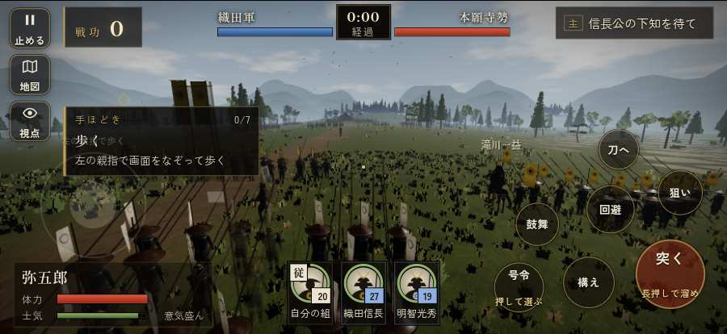

# テストプレイヤーの感想：せっかちな社会人

- 人：ユウキ（35歳・昼休みに遊ぶ会社員）（49番）
- 変わり目：連打・iPhone 横 874×402・新しく始める通し・ふつう・身分 中ほど・問屋:刀・槍・具足・三人称
- 時：2026/9/28 0:18:14（147秒かかった）
- 画面：iPhone の横向き 874×402・倍率3・指で触る操作（touch.js の釦・棒・なぞり）・画質 低
- 遊んだ戦：天王寺の戦い（達成）、雑賀攻め・小雑賀川（失敗・倒れた）
- 機械の混み具合：4（load average）

## ひとこと

> 昼休みに10分ほど。天王寺と雑賀攻め・小雑賀川。前へ進もうとしても進めない所があった。時間がもったいない。戦場が札に食われている。正直、飛ばしたい。戦が始まるまでの読み込みが長い。ここで閉じる人は多いと思う。読み込みも9秒待たされた。勝ち負けはすぐ分かって、そこは良かった。

## 見つけた問題（13件・困った順）

### 1. 戦場が札に食われている（画面の3分の1超）
- どこで：天王寺の戦い・15秒・break
- 何が：874×402 で 35%／874×402 で 37%
- どれくらい困ったか：★★ かなり困った（44回）
- 直し方の目安：札を小さくするか、平時は薄く・畳む
- 画面：（その戦の山場の一枚）

### 2. HUD の札どうしが重なって読めない
- どこで：雑賀攻め・小雑賀川・35秒・stakes
- 何が：#tutorial と #subtitle（874×402）／.tl と #tutorial（874×402）
- どれくらい困ったか：★★ かなり困った（9回）
- 直し方の目安：置き場所をずらすか、片方を出している間はもう片方を隠す
- 画面：（その戦の山場の一枚）

### 3. 前へ進もうとしても進めない所があった
- どこで：天王寺の戦い・33秒・break
- 何が：(-2, 72)・段 break
- どれくらい困ったか：★★ かなり困った（7回）
- 直し方の目安：当たり（柵・建物・地形）と道のつながりを見直す
- 画面：

### 4. 戦が始まるまでの読み込みが長い
- どこで：天王寺の戦い
- 何が：天王寺の戦い：押してから 9.3秒（機械が混んでいる時の値）
- どれくらい困ったか：★★ かなり困った（1回）
- 直し方の目安：読み込みの間に、戦の心得を読ませる／重い物を後から足す
- 画面：（その戦の山場の一枚）

### 5. 何もする事が無いまま待たされた
- どこで：天王寺の戦い・147秒・fort
- 何が：60秒、任務札が変わらず敵もいない（段 fort）
- どれくらい困ったか：★★ かなり困った（1回）
- 直し方の目安：飛ばせる（canSkip）ようにするか、待つ間にする事を置く
- 画面：

### 6. 前へ進もうとしても進めない所があった
- どこで：雑賀攻め・小雑賀川・33秒・stakes
- 何が：(-3, 4)・段 stakes
- どれくらい困ったか：★★ かなり困った（1回）
- 直し方の目安：当たり（柵・建物・地形）と道のつながりを見直す
- 画面：（その戦の山場の一枚）

### 7. 崩れた部隊が、また戦っている
- どこで：天王寺の戦い・71秒・break
- 何が：囲みの新手（号令：flee）／囲みの門徒（号令：flee）
- どれくらい困ったか：★ 少し気になった（10回）
- 直し方の目安：崩れた部隊の号令を上書きしない
- 画面：（その戦の山場の一枚）

### 8. 遊び手を責める言い回し
- どこで：雑賀攻め・小雑賀川・88秒・stakes
- 何が：「市兵衛！　しっかりせい！」（台詞）／「佐吉！　しっかりせい！」（台詞）
- どれくらい困ったか：★ 少し気になった（5回）
- 直し方の目安：責めずに、次にどうすればよいかを言う
- 画面：（その戦の山場の一枚）

### 9. 「狙い」をしたいのに、押す丸が出ていない
- どこで：天王寺の戦い・267秒・end
- 何が：欲しかった時：天王寺の戦い・267秒・end
- どれくらい困ったか：★ 少し気になった（2回）
- 直し方の目安：その時に使える釦は出す（touchFrame の出し入れ）
- 画面：（その戦の山場の一枚）

### 10. 「鼓舞」をしたいのに、押す丸が出ていない
- どこで：雑賀攻め・小雑賀川・289秒・counter
- 何が：欲しかった時：雑賀攻め・小雑賀川・289秒・counter
- どれくらい困ったか：★ 少し気になった（2回）
- 直し方の目安：その時に使える釦は出す（touchFrame の出し入れ）

### 11. 戦の前の説明が長い
- どこで：天王寺の戦い
- 何が：天王寺の戦い：262字（読むのに1分かかる）
- どれくらい困ったか：★ 少し気になった（1回）
- 直し方の目安：三行ほどに縮め、残りは「くわしく」に畳む
- 画面：（その戦の山場の一枚）

### 12. 戦の前の説明が長い
- どこで：雑賀攻め・小雑賀川
- 何が：雑賀攻め・小雑賀川：262字（読むのに1分かかる）
- どれくらい困ったか：★ 少し気になった（1回）
- 直し方の目安：三行ほどに縮め、残りは「くわしく」に畳む
- 画面：（その戦の山場の一枚）

### 13. 倒れて戦が終わった
- どこで：雑賀攻め・小雑賀川・296秒・counter
- 何が：296秒で倒れた（受けた傷：足軽 311・鉄砲 30・侍 29）
- どれくらい困ったか：★ 少し気になった（1回）
- 直し方の目安：初めの戦は受ける傷を減らす・危ない時に字幕で構えを教える

## 遊んだ記録

- 天王寺の戦い：278秒・任務達成・戦功115・組20/20・討ち取り0・突き2491/当たり0・号令0回・指で押した数2449・読み込み9.3秒・戦の前の札262字・1コマ5.7ms（実時間44秒・内訳 brain 0.0・pad 0.6・tf 0.4・upd 4.7・eye 0.1）
  - 任務の流れ：0s 信長公の下知を待て → 14s 砦を囲む本願寺勢を突き破れ（雑賀の鉄砲に気をつけよ） → 87s 天王寺砦の門へ入れ → 167s 砦から打って出て、本願寺勢を崩せ → 266s 砦から打って出て、本願寺勢を崩せ〔済〕
  - 開戦：
- 雑賀攻め・小雑賀川：296秒・任務失敗（倒れた）・戦功94・組0/20・討ち取り12・突き3067/当たり42・号令0回・指で押した数5677・読み込み0.6秒・戦の前の札262字・1コマ8.2ms（実時間51秒・内訳 brain 0.0・pad 1.0・tf 0.5・upd 6.5・eye 0.1）
  - 任務の流れ：0s 堀秀政のもとで、下知を待て → 15s 川の中の乱杭を抜いて、渡る道を開けよ（3か所） → 107s 川を渡り、柵の前の雑賀衆を崩せ → 225s 打って出た雑賀の鉄砲衆を受け止めよ
  - 受けた傷：足軽 311・鉄砲 30・侍 29
