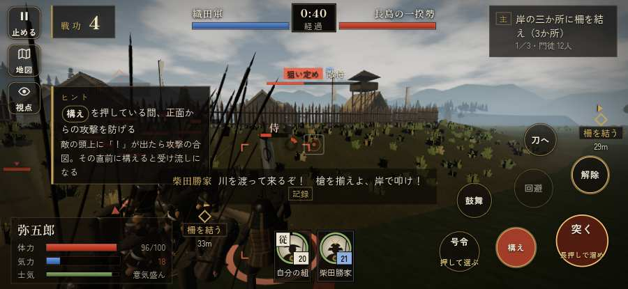

# テストプレイヤーの感想：アクション好き

- 人：ソウタ（24歳・アクションゲーム好き）（57番）
- 変わり目：台詞を全部読む・iPhone 横 932×430・織田家編の戦を一つ・ふつう・身分 少し上・問屋:刀・槍・具足・三人称
- 時：2026/9/28 0:12:28（84秒かかった）
- 画面：iPhone の横向き 932×430・倍率3・指で触る操作（touch.js の釦・棒・なぞり）・画質 低
- 遊んだ戦：長島一向一揆（達成）
- 機械の混み具合：4（load average）

## ひとこと

> とにかく突っ込んだ。6分で26人斬った。845回突いて75回当たり。当たらなさすぎ。前へ進もうとしても進めない所があった、ストレスたまる。突いても、なかなか当たらない、ストレスたまる。「狙い」をしたいのに、押す丸が出ていない、もったいない。ちょっと簡単すぎるかも。もっと強い奴と斬り合いたい。

## 見つけた問題（8件・困った順）

### 1. 前へ進もうとしても進めない所があった
- どこで：長島一向一揆・343秒・end
- 何が：(-8, -50)・段 end
- どれくらい困ったか：★★ かなり困った（1回）
- 直し方の目安：当たり（柵・建物・地形）と道のつながりを見直す
- 画面：（その戦の山場の一枚）

### 2. 突いても、なかなか当たらない
- どこで：長島一向一揆・347秒・end
- 何が：845回突いて、当たりは75回
- どれくらい困ったか：★★ かなり困った（1回）
- 直し方の目安：指の端末では、突きの向きを近くの敵へ少し寄せる（狙いの補助）
- 画面：（その戦の山場の一枚）

### 3. 戦場が札に食われている（画面の3分の1超）
- どこで：長島一向一揆・45秒・build
- 何が：932×430 で 34%／932×430 で 35%
- どれくらい困ったか：★ 少し気になった（11回）
- 直し方の目安：札を小さくするか、平時は薄く・畳む
- 画面：（その戦の山場の一枚）

### 4. 崩れた部隊が、また戦っている
- どこで：長島一向一揆・43秒・build
- 何が：川を渡る門徒（号令：flee）／舟から上がった一揆勢（号令：flee）
- どれくらい困ったか：★ 少し気になった（5回）
- 直し方の目安：崩れた部隊の号令を上書きしない
- 画面：（その戦の山場の一枚）

### 5. HUD の札どうしが重なって読めない
- どこで：長島一向一揆・240秒・boats
- 何が：.tl と #tutorial（932×430）
- どれくらい困ったか：★ 少し気になった（3回）
- 直し方の目安：置き場所をずらすか、片方を出している間はもう片方を隠す
- 画面：（その戦の山場の一枚）

### 6. 自分のすぐそばの敵が6秒以上なにもしない
- どこで：長島一向一揆・246秒・boats
- 何が：敵の侍：敵の侍／敵の足軽：敵の足軽
- どれくらい困ったか：★ 少し気になった（2回）
- 直し方の目安：近くの敵（遊び手）を狙いに入れる
- 画面：（その戦の山場の一枚）

### 7. 「狙い」をしたいのに、押す丸が出ていない
- どこで：長島一向一揆・336秒・end
- 何が：欲しかった時：長島一向一揆・336秒・end
- どれくらい困ったか：★ 少し気になった（1回）
- 直し方の目安：その時に使える釦は出す（touchFrame の出し入れ）
- 画面：（その戦の山場の一枚）

### 8. 馬に乗れる場面がなかった
- どこで：長島一向一揆・347秒・end
- 何が：長島一向一揆
- どれくらい困ったか：★ 少し気になった（1回）
- 直し方の目安：空馬（主を失った馬）をもう少し置く
- 画面：（その戦の山場の一枚）

## 遊んだ記録

- 長島一向一揆：347秒・任務達成・戦功210・組20/20・討ち取り26・突き845/当たり75・号令0回・指で押した数986・読み込み1.6秒・戦の前の札244字・1コマ4.6ms（実時間43秒・内訳 brain 0.1・pad 0.3・tf 0.2・upd 4.0・eye 0.1）
  - 任務の流れ：0s 柴田勝家のもとで、下知を待て → 15s 岸の三か所に柵を結え（3か所） → 165s 岸の三か所に柵を結え（3か所）〔済〕 → 168s 岸に着いた一揆の舟の者を退けよ → 249s 柵の前で、打って出た門徒を受け止めよ → 335s 柵の前で、打って出た門徒を受け止めよ〔済〕
  - 受けた傷：足軽 212・侍 34
  - 開戦：
  - 山場：
  - 勝ち負けが決まった所：
