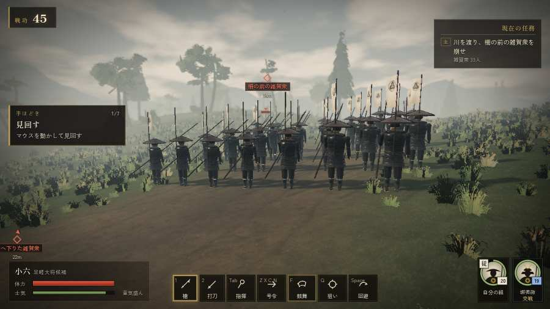

# テストプレイヤーの感想：歴史好きの大人

- 人：ミチオ（62歳・郷土史の会）（61番）
- 変わり目：構え多め・パソコン 1280×720・新しく始める通し・速い・身分 中ほど・問屋:買わない・三人称
- 時：2026/9/28 0:09:38（185秒かかった）
- 画面：パソコン 1280×720・鍵盤とマウス・画質 高
- 遊んだ戦：雑賀攻め・小雑賀川（失敗・倒れた）、手取川の戦い（達成）、信貴山城の戦い（達成）
- 機械の混み具合：5（load average）

## ひとこと

> 雑賀攻め・小雑賀川と手取川と信貴山城を、一人称で歩いて見て回りました。務めは果たせましたが、気になる所がいくつか。名のある武将なのに、顔も装束も並の侍と同じ。当時の人が見たら首を傾げるでしょう。行き先があるのに20秒動かない兵。これでは興が醒めます。字が枠から切れている。当時の人が見たら首を傾げるでしょう。

## 見つけた問題（8件・困った順）

### 1. 行き先があるのに20秒動かない兵
- どこで：信貴山城の戦い・140秒・gate
- 何が：味方の弓：味方の弓（号令：attack）at (-1,-61)／味方の弓：味方の弓（号令：attack）at (-1,-60)
- どれくらい困ったか：★★★ やめたくなった（38回）
- 直し方の目安：道が塞がれていないか、行き先に着いたと見なせているかを見る

### 2. 敵が近いのに、まわりの兵の多くが棒立ち
- どこで：手取川の戦い・40秒・rear
- 何が：40秒：まわり35mの41人のうち20人が止まったまま（段 rear）
- どれくらい困ったか：★★ かなり困った（1回）
- 直し方の目安：敵が30m内に入ったら、構える・にじり寄る・槍を揃えるなど体を動かす

### 3. 字が枠から切れている
- どこで：雑賀攻め・小雑賀川・開戦
- 何が：#h-units > .uc.ally > .nm「堀秀政」
- どれくらい困ったか：★ 少し気になった（182回）
- 直し方の目安：枠を広げるか、字を折り返す
- 画面：（その戦の山場の一枚）

### 4. 名のある武将なのに、顔も装束も並の侍と同じ
- どこで：信貴山城の戦い・5秒・brief
- 何が：筒井順慶（味方）
- どれくらい困ったか：★ 少し気になった（42回）
- 直し方の目安：units.js の GENERALS に顔・甲冑・兜を足す

### 5. 名のある武将なのに、顔も装束も並の侍と同じ
- どこで：雑賀攻め・小雑賀川・5秒・brief
- 何が：堀秀政（味方）
- どれくらい困ったか：★ 少し気になった（28回）
- 直し方の目安：units.js の GENERALS に顔・甲冑・兜を足す
- 画面：（その戦の山場の一枚）

### 6. 指の端末なのに、問屋の説明が鍵盤の言い方
- どこで：手取川の戦いの前・城下
- 何が：「具足・打刀 施設は数字キー 1〜9、または」
- どれくらい困ったか：★ 少し気になった（2回）
- 直し方の目安：isTouch の時は「持替の丸で」などの言い方に
- 画面：（その戦の山場の一枚）

### 7. 倒れて戦が終わった
- どこで：雑賀攻め・小雑賀川・171秒・counter
- 何が：172秒で倒れた（受けた傷：足軽 151・侍 13）
- どれくらい困ったか：★ 少し気になった（1回）
- 直し方の目安：初めの戦は受ける傷を減らす・危ない時に字幕で構えを教える
- 画面：（その戦の山場の一枚）

### 8. 崩れた部隊が、また戦っている
- どこで：手取川の戦い・106秒・rear
- 何が：上杉の先手（号令：flee）
- どれくらい困ったか：★ 少し気になった（1回）
- 直し方の目安：崩れた部隊の号令を上書きしない

## 遊んだ記録

- 雑賀攻め・小雑賀川：172秒・任務失敗（倒れた）・戦功86・組0/20・討ち取り40・突き0/当たり104・号令0回・指で押した数1・読み込み2.8秒・戦の前の札254字・1コマ10.9ms（実時間47秒・内訳 brain 0.0・pad 0.0・tf 0.0・upd 0.0・eye 0.1）
  - 任務の流れ：0s 堀秀政のもとで、下知を待て → 15s 川の中の乱杭を抜いて、渡る道を開けよ（3か所） → 55s 川を渡り、柵の前の雑賀衆を崩せ → 109s 打って出た雑賀の鉄砲衆を受け止めよ
  - 受けた傷：足軽 151・侍 13
  - 開戦：
  - 一人称で見回す（45秒）：
  - 山場：
- 手取川の戦い：177秒・任務達成・戦功185・組17/20・討ち取り18・突き0/当たり85・号令0回・指で押した数7・読み込み0.4秒・戦の前の札243字・1コマ9.8ms（実時間36秒・内訳 brain 0.0・pad 0.0・tf 0.0・upd 0.0・eye 0.1）
  - 任務の流れ：0s 柴田勝家のもとで、下知を待て → 18s 北の岸の浅瀬の口まで退け → 28s 北の岸で、上杉の追手を食い止めよ（味方が渡りきるまで） → 139s 増えた手取川を渡り、南の岸へ → 165s 増えた手取川を渡り、南の岸へ〔済〕
  - 受けた傷：騎馬 28・足軽 9・侍 0
- 信貴山城の戦い：215秒・任務達成・戦功190・組20/20・討ち取り28・突き0/当たり104・号令0回・指で押した数13・読み込み0.4秒・戦の前の札244字・1コマ10.1ms（実時間45秒・内訳 brain 0.0・pad 0.0・tf 0.0・upd 0.0・eye 0.1）
  - 任務の流れ：0s 筒井順慶のもとで、城攻めの下知を待て → 16s 筒井順慶について尾根道を登れ → 36s 尾根道の伏兵を退けよ → 51s 門の脇の物見櫓に火を放て（矢を止める） → 76s 門を破る組を守り、門を破れ → 160s 天守の前で、松永の最後の衆を退けよ → 202s 天守の前で、松永の最後の衆を退けよ〔済〕
  - 受けた傷：足軽 30・弓 15・鉄砲 11・侍 0
