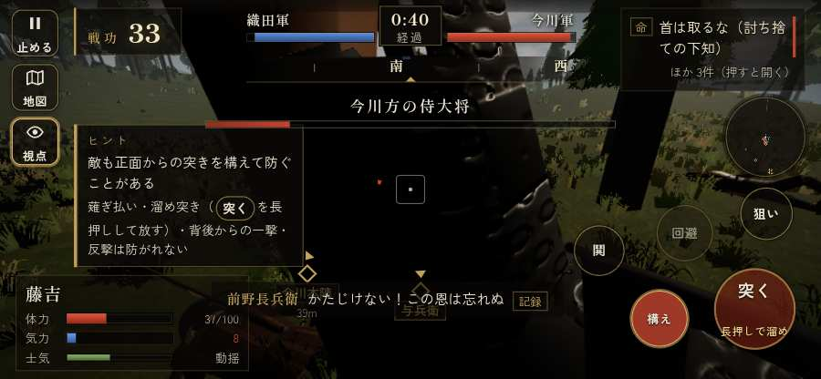

# テストプレイヤーの感想：せっかちな社会人

- 人：ユウキ（35歳・昼休みに遊ぶ会社員）（74番）
- 変わり目：構え多め・iPhone 横 844×390・新しく始める通し・ゆっくり・足軽から・問屋:刀・槍・具足・一人称
- 時：2026/9/28 0:15:51（70秒かかった）
- 画面：iPhone の横向き 844×390・倍率3・指で触る操作（touch.js の釦・棒・なぞり）・画質 低
- 遊んだ戦：桶狭間の戦い（失敗・倒れた）
- 機械の混み具合：4（load average）

## ひとこと

> 昼休みに1分ほど。桶狭間。戦場が札に食われている。ここで閉じる人は多いと思う。戦の前の説明が長い。正直、飛ばしたい。倒れて戦が終わった。時間がもったいない。結局、何分遊べば一区切りなのかが分からない。

## 見つけた問題（4件・困った順）

### 1. 戦場が札に食われている（画面の3分の1超）
- どこで：桶狭間の戦い・5秒・wait
- 何が：844×390 で 35%／844×390 で 50%
- どれくらい困ったか：★★ かなり困った（9回）
- 直し方の目安：札を小さくするか、平時は薄く・畳む
- 画面：（その戦の山場の一枚）

### 2. HUD の札どうしが重なって読めない
- どこで：桶狭間の戦い・10秒・assault
- 何が：#tutorial と #subtitle（844×390）／#flash と #bark（844×390）
- どれくらい困ったか：★ 少し気になった（3回）
- 直し方の目安：置き場所をずらすか、片方を出している間はもう片方を隠す
- 画面：（その戦の山場の一枚）

### 3. 戦の前の説明が長い
- どこで：桶狭間の戦い
- 何が：桶狭間の戦い：260字（読むのに1分かかる）
- どれくらい困ったか：★ 少し気になった（1回）
- 直し方の目安：三行ほどに縮め、残りは「くわしく」に畳む
- 画面：（その戦の山場の一枚）

### 4. 倒れて戦が終わった
- どこで：桶狭間の戦い・67秒・assault
- 何が：67秒で倒れた（受けた傷：足軽 122・侍 40・弓 5）
- どれくらい困ったか：★ 少し気になった（1回）
- 直し方の目安：初めの戦は受ける傷を減らす・危ない時に字幕で構えを教える
- 画面：（その戦の山場の一枚）

## 遊んだ記録

- 桶狭間の戦い：67秒・任務失敗（倒れた）・戦功3・組—・討ち取り5・突き47/当たり14・号令0回・指で押した数118・読み込み2.0秒・戦の前の札260字・1コマ7.7ms（実時間22秒・内訳 brain 0.0・pad 0.2・tf 0.3・upd 7.1・eye 0.1）
  - 任務の流れ：0s 組頭の源八に話しかける → 1s 組頭の源八に話しかける〔済〕 → 4s （任務なし） → 6s 今川本陣に突入せよ
  - 受けた傷：足軽 122・侍 40・弓 5
  - 開戦：
  - 山場：
  - 勝ち負けが決まった所：
