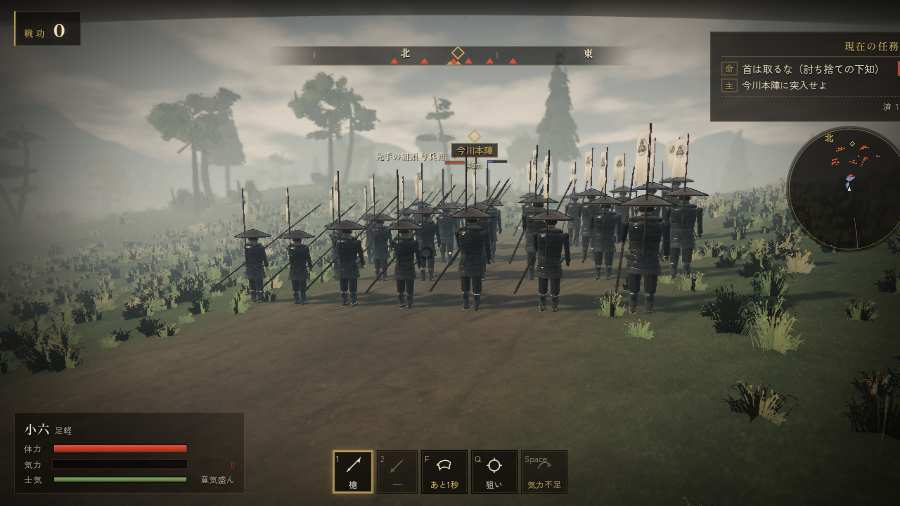

# テストプレイヤーの感想：指揮好きの戦略家

- 人：ケイコ（45歳・将棋と戦略ゲーム好き）（83番）
- 変わり目：連打・パソコン 1280×720・織田家編の戦を一つ・速い・足軽から・問屋:鉄砲・一人称
- 時：2026/9/28 0:13:43（101秒かかった）
- 画面：パソコン 1280×720・鍵盤とマウス・画質 高
- 遊んだ戦：桶狭間の戦い（達成）
- 機械の混み具合：5（load average）

## ひとこと

> 桶狭間で、号令を0回かけました。この戦では号令できる組が無い。指揮官としてはもどかしい。崩れた部隊が、また戦っている。ここが直れば、ぐっと指揮が楽しくなる。勝てはしましたが、自分の采配で勝った手応えはまだ薄いです。

## 見つけた問題（2件・困った順）

### 1. この戦では号令できる組が無い（指揮する所が無い）
- どこで：桶狭間の戦い・227秒・assault
- 何が：桶狭間の戦い
- どれくらい困ったか：★ 少し気になった（1回）
- 画面：（その戦の山場の一枚）

### 2. 崩れた部隊が、また戦っている
- どこで：桶狭間の戦い・151秒・assault
- 何が：部隊（号令：flee）
- どれくらい困ったか：★ 少し気になった（1回）
- 直し方の目安：崩れた部隊の号令を上書きしない
- 画面：（その戦の山場の一枚）

## 遊んだ記録

- 桶狭間の戦い：227秒・任務達成・戦功155・組—・討ち取り22・突き0/当たり66・号令0回・指で押した数1・読み込み1.6秒・戦の前の札254字・1コマ9.8ms（実時間60秒・内訳 brain 0.0・pad 0.0・tf 0.0・upd 0.0・eye 0.1）
  - 任務の流れ：0s 組頭の源八に話しかける → 1s 組頭の源八に話しかける〔済〕 → 4s （任務なし） → 108s 今川本陣に突入せよ → 159s 今川本陣に突入せよ〔済〕／本陣の敵を突き崩せ → 218s 今川本陣に突入せよ〔済〕／本陣の敵を突き崩せ〔済〕
  - 受けた傷：足軽 41・侍 0
  - 開戦：
  - 山場：
  - 勝ち負けが決まった所：
