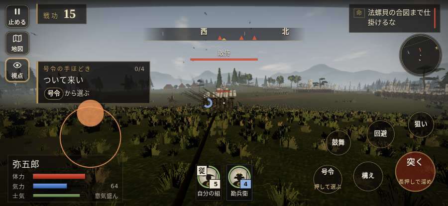

# テストプレイヤーの感想：せっかちな社会人

- 人：ユウキ（35歳・昼休みに遊ぶ会社員）（84番）
- 変わり目：台詞を全部読む・iPhone 横 932×430・織田家編の戦を一つ・ゆっくり・足軽から・問屋:供・一人称
- 時：2026/9/28 0:15:27（46秒かかった）
- 画面：iPhone の横向き 932×430・倍率3・指で触る操作（touch.js の釦・棒・なぞり）・画質 低
- 遊んだ戦：森部の戦い（失敗・倒れた）
- 機械の混み具合：4（load average）

## ひとこと

> 昼休みに1分ほど。森部。HUD の札どうしが重なって読めない。正直、飛ばしたい。戦の前の説明が長い。正直、飛ばしたい。倒れて戦が終わった。正直、飛ばしたい。結局、何分遊べば一区切りなのかが分からない。

## 見つけた問題（4件・困った順）

### 1. HUD の札どうしが重なって読めない
- どこで：森部の戦い・10秒・brief
- 何が：#tutorial と #choice（932×430）／#choice と #flash（932×430）
- どれくらい困ったか：★★ かなり困った（17回）
- 直し方の目安：置き場所をずらすか、片方を出している間はもう片方を隠す
- 画面：（その戦の山場の一枚）

### 2. 戦場が札に食われている（画面の3分の1超）
- どこで：森部の戦い・5秒・brief
- 何が：932×430 で 35%／932×430 で 60%
- どれくらい困ったか：★ 少し気になった（7回）
- 直し方の目安：札を小さくするか、平時は薄く・畳む
- 画面：（その戦の山場の一枚）

### 3. 戦の前の説明が長い
- どこで：森部の戦い
- 何が：森部の戦い：250字（読むのに1分かかる）
- どれくらい困ったか：★ 少し気になった（1回）
- 直し方の目安：三行ほどに縮め、残りは「くわしく」に畳む
- 画面：（その戦の山場の一枚）

### 4. 倒れて戦が終わった
- どこで：森部の戦い・73秒・brief
- 何が：73秒で倒れた（受けた傷：足軽 86・侍 24）
- どれくらい困ったか：★ 少し気になった（1回）
- 直し方の目安：初めの戦は受ける傷を減らす・危ない時に字幕で構えを教える
- 画面：（その戦の山場の一枚）

## 遊んだ記録

- 森部の戦い：73秒・任務失敗（倒れた）・戦功31・組5/5・討ち取り1・突き27/当たり14・号令0回・指で押した数44・読み込み1.0秒・戦の前の札250字・1コマ3.5ms（実時間13秒・内訳 brain 0.0・pad 0.1・tf 0.1・upd 3.2・eye 0.1）
  - 任務の流れ：0s 部下を連れて林の端を押さえる → 38s 部下を連れて林の端を押さえる〔済〕
  - 受けた傷：足軽 86・侍 24
  - 開戦：
  - 山場：
  - 勝ち負けが決まった所：
