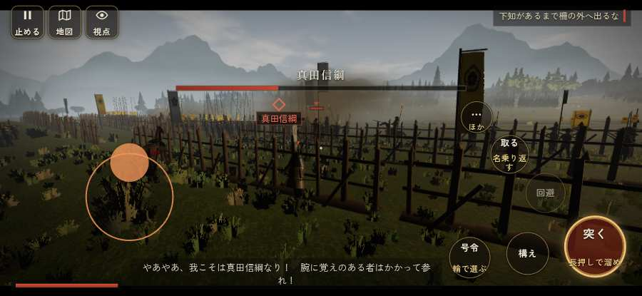

# テストプレイヤーの感想：アクション好き

- 人：ソウタ（24歳・アクションゲーム好き）（107番）
- 変わり目：迷子になりやすい・iPhone 横 932×430・新しく始める通し・ふつう・身分 中ほど・問屋:供・一人称・感度 敏感・止めない
- 時：2026/9/28 1:17:04（83秒かかった）
- 画面：iPhone の横向き 932×430・倍率3・指で触る操作（touch.js の釦・棒・なぞり）・画質 低
- 遊んだ戦：設楽原の決戦（失敗・倒れた）
- 機械の混み具合：4（load average）

## ひとこと

> とにかく突っ込んだ。3分で0人斬った。46回突いて3回当たり。当たらなさすぎ。倒れて戦が終わった、もったいない。突いても、なかなか当たらない、もったいない。「狙い」をしたいのに、押す丸が出ていない、ストレスたまる。1回やられた。難しいのはいいけど、何でやられたか分かるようにしてほしい。

## 見つけた問題（7件・困った順）

### 1. 倒れて戦が終わった
- どこで：設楽原の決戦・191秒・brief
- 何が：191秒で倒れた（受けた傷：騎馬 60・足軽 37・武将 26）
- どれくらい困ったか：★★ かなり困った（1回）
- 直し方の目安：初めの戦は受ける傷を減らす・危ない時に字幕で構えを教える
- 画面：（その戦の山場の一枚）

### 2. 突いても、なかなか当たらない
- どこで：設楽原の決戦・191秒・brief
- 何が：46回突いて、当たりは3回
- どれくらい困ったか：★★ かなり困った（1回）
- 直し方の目安：指の端末では、突きの向きを近くの敵へ少し寄せる（狙いの補助）
- 画面：（その戦の山場の一枚）

### 3. 戦う兵が遠景の大軍（影の兵）の中に埋もれている
- どこで：設楽原の決戦・61秒・brief
- 何が：味方の兵 6人が、遠景の大軍 #5（中心 -7,44・300人）の中（-5, -5）／味方の兵 9人が、遠景の大軍 #5（中心 -7,44・300人）の中（-6, -5）
- どれくらい困ったか：★ 少し気になった（6回）
- 直し方の目安：遠景の大軍を戦う場所から離す（addDistantArmy の x,z,w,d を見直す）か、兵の行き先を大軍の外にする
- 画面：（その戦の山場の一枚）

### 4. 自分が遠景の大軍（影の兵）の中に立っている
- どこで：設楽原の決戦・51秒・brief
- 何が：味方の兵 1人が、遠景の大軍 #4（中心 -7,-52・300人）の中（-6, -18）／味方の兵 5人が、遠景の大軍 #4（中心 -7,-52・300人）の中（-8, -12）
- どれくらい困ったか：★ 少し気になった（4回）
- 直し方の目安：遠景の大軍を戦う場所から離す（addDistantArmy の x,z,w,d を見直す）か、兵の行き先を大軍の外にする
- 画面：（その戦の山場の一枚）

### 5. 「狙い」をしたいのに、押す丸が出ていない
- どこで：設楽原の決戦・126秒・brief
- 何が：欲しかった時：設楽原の決戦・126秒・brief
- どれくらい困ったか：★ 少し気になった（2回）
- 直し方の目安：その時に使える釦は出す（touchFrame の出し入れ）
- 画面：（その戦の山場の一枚）

### 6. 馬に乗れる場面がなかった
- どこで：設楽原の決戦・191秒・brief
- 何が：設楽原の決戦
- どれくらい困ったか：★ 少し気になった（1回）
- 直し方の目安：空馬（主を失った馬）をもう少し置く
- 画面：（その戦の山場の一枚）

### 7. 斬り合う相手が少なくて退屈
- どこで：設楽原の決戦・191秒・brief
- 何が：3分で0人
- どれくらい困ったか：★ 少し気になった（1回）
- 画面：（その戦の山場の一枚）

## 遊んだ記録

- 設楽原の決戦：191秒・任務失敗（倒れた）・戦功42・組15/20・討ち取り0・突き46/当たり3・号令0回・指で押した数65・読み込み0.9秒・戦の前の札218字・1コマ8.9ms（実時間45秒・内訳 brain 0.1・pad 0.1・tf 0.6・upd 8.0・eye 0.1）
  - 任務の流れ：0s 馬防柵を守り抜け（武田の寄せ 0/3） → 75s 馬防柵を守り抜け（武田の寄せ 1/3） → 144s 馬防柵を守り抜け（武田の寄せ 2/3）
  - 受けた傷：騎馬 60・足軽 37・武将 26
  - 開戦：
  - 山場：
  - 勝ち負けが決まった所：
