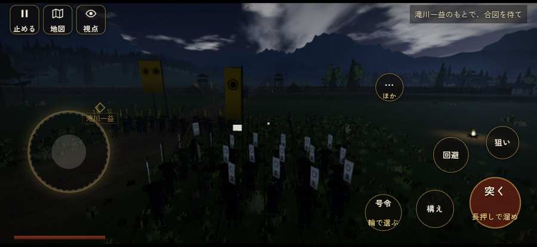

# テストプレイヤーの感想：せっかちな社会人

- 人：ユウキ（35歳・昼休みに遊ぶ会社員）（109番）
- 変わり目：迷子になりやすい・iPhone 横 874×402・新しく始める通し・速い・身分 上・問屋:供・三人称・感度 鈍い・止めない
- 時：2026/9/28 1:17:04（137秒かかった）
- 画面：iPhone の横向き 874×402・倍率3・指で触る操作（touch.js の釦・棒・なぞり）・画質 低
- 遊んだ戦：有岡城の戦い（達成）、天正伊賀の乱・比自山城（達成）
- 機械の混み具合：3（load average）

## ひとこと

> 昼休みに13分ほど。有岡城と天正伊賀の乱・比自山城。前へ進もうとしても進めない所があった。時間がもったいない。何もする事が無いまま待たされた。時間がもったいない。一つの戦が長い。ここで閉じる人は多いと思う。勝ち負けはすぐ分かって、そこは良かった。

## 見つけた問題（6件・困った順）

### 1. 前へ進もうとしても進めない所があった
- どこで：有岡城の戦い・33秒・open
- 何が：(58, 29)・段 open
- どれくらい困ったか：★★ かなり困った（11回）
- 直し方の目安：当たり（柵・建物・地形）と道のつながりを見直す
- 画面：

### 2. 何もする事が無いまま待たされた
- どこで：有岡城の戦い・178秒・town
- 何が：60秒、任務札が変わらず敵もいない（段 town）
- どれくらい困ったか：★★ かなり困った（1回）
- 直し方の目安：飛ばせる（canSkip）ようにするか、待つ間にする事を置く
- 画面：

### 3. 何もする事が無いまま待たされた
- どこで：有岡城の戦い・277秒・escape
- 何が：60秒、任務札が変わらず敵もいない（段 escape）
- どれくらい困ったか：★★ かなり困った（1回）
- 直し方の目安：飛ばせる（canSkip）ようにするか、待つ間にする事を置く
- 画面：（その戦の山場の一枚）

### 4. 前へ進もうとしても進めない所があった
- どこで：天正伊賀の乱・比自山城・33秒・raid
- 何が：(-17, 59)・段 raid
- どれくらい困ったか：★★ かなり困った（1回）
- 直し方の目安：当たり（柵・建物・地形）と道のつながりを見直す

### 5. 任務札が長く変わらないのに、何も起きない
- どこで：有岡城の戦い・208秒・town
- 何が：90秒「牢の錠を打ち壊して、官兵衛を救い出せ」のまま、82秒なにも起きない（段：town）／135秒「官兵衛の一行を守り、織田の陣まで供せよ」のまま、45秒なにも起きない（段：escape）
- どれくらい困ったか：★ 少し気になった（2回）
- 直し方の目安：この段で待たせるなら、飛ばせる（canSkip）か、進み具合（objProgress）や台詞で先を見せる
- 画面：（その戦の山場の一枚）

### 6. 一つの戦が長い（7分を超えた）
- どこで：有岡城の戦い・449秒・end
- 何が：有岡城の戦い：7分
- どれくらい困ったか：★ 少し気になった（1回）
- 直し方の目安：途中で区切れる所（段の切れ目）に「ここまで」を置く
- 画面：（その戦の山場の一枚）

## 遊んだ記録

- 有岡城の戦い：449秒・任務達成・戦功130・組20/20・討ち取り0・突き0/当たり0・号令0回・指で押した数3・読み込み7.8秒・戦の前の札198字・1コマ3.5ms（実時間41秒・内訳 brain 0.0・pad 0.0・tf 0.5・upd 2.9・eye 0.0）
  - 任務の流れ：0s 滝川一益のもとで、合図を待て → 15s 開いた木戸から攻め入り、砦の兵を退けよ → 56s 栗山善助とともに、本丸の脇の牢へ急げ → 118s 牢の錠を打ち壊して、官兵衛を救い出せ → 216s 官兵衛の一行を守り、織田の陣まで供せよ → 436s 官兵衛の一行を守り、織田の陣まで供せよ〔済〕
  - 開戦：
- 天正伊賀の乱・比自山城：303秒・任務達成・戦功144・組20/20・討ち取り4・突き48/当たり11・号令0回・指で押した数84・読み込み0.4秒・戦の前の札181字・1コマ5.6ms（実時間36秒・内訳 brain 0.0・pad 0.1・tf 0.6・upd 4.9・eye 0.1）
  - 任務の流れ：0s 陣の見張りにつけ → 16s 小屋の火を消し、忍び込んだ伊賀衆を討て → 116s 木戸を破る組を守り、比自山城の木戸を破れ → 256s 城の内に残った伊賀衆を退けよ → 291s 城の内に残った伊賀衆を退けよ〔済〕
  - 受けた傷：足軽 26・侍 10
