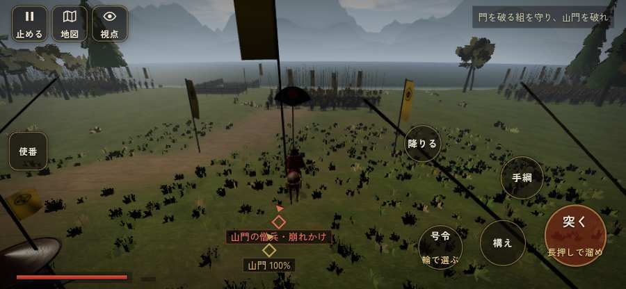

# テストプレイヤーの感想：せっかちな社会人

- 人：ユウキ（35歳・昼休みに遊ぶ会社員）（114番）
- 変わり目：迷子になりやすい・iPhone 横 844×390・信長で出陣・速い・身分 上・問屋:馬・一人称・感度 鈍い・途中で止める
- 時：2026/9/28 1:17:01（92秒かかった）
- 画面：iPhone の横向き 844×390・倍率3・指で触る操作（touch.js の釦・棒・なぞり）・画質 低
- 遊んだ戦：比叡山攻め（信長で出陣）（達成）
- 機械の混み具合：3（load average）

## ひとこと

> 昼休みに5分ほど。比叡山攻め（信長で出陣）。前へ進もうとしても進めない所があった。正直、飛ばしたい。戦が始まるまでの読み込みが長い。正直、飛ばしたい。読み込みも9秒待たされた。勝ち負けはすぐ分かって、そこは良かった。

## 見つけた問題（2件・困った順）

### 1. 前へ進もうとしても進めない所があった
- どこで：比叡山攻め（信長で出陣）・34秒・gate
- 何が：(61, 7)・段 gate
- どれくらい困ったか：★★ かなり困った（7回）
- 直し方の目安：当たり（柵・建物・地形）と道のつながりを見直す
- 画面：

### 2. 戦が始まるまでの読み込みが長い
- どこで：比叡山攻め（信長で出陣）
- 何が：比叡山攻め（信長で出陣）：押してから 8.8秒（機械が混んでいる時の値）
- どれくらい困ったか：★★ かなり困った（1回）
- 直し方の目安：読み込みの間に、戦の心得を読ませる／重い物を後から足す
- 画面：（その戦の山場の一枚）

## 遊んだ記録

- 比叡山攻め（信長で出陣）：273秒・任務達成・戦功188・組100/100・討ち取り16・突き101/当たり30・号令0回・指で押した数134・読み込み8.8秒・戦の前の札149字・1コマ6.5ms（実時間46秒・内訳 brain 0.0・pad 0.1・tf 0.1・upd 6.2・eye 0.1）
  - 任務の流れ：0s 明智光秀の手について、比叡の山道を山門まで登れ → 29s 門を破る組を守り、山門を破れ → 113s 門の内で、豪盛の衆（僧兵）を押し退けよ → 263s 門の内で、豪盛の衆（僧兵）を押し退けよ〔済〕
  - 受けた傷：足軽 18・侍 4
  - 開戦：
  - 勝ち負けが決まった所：
