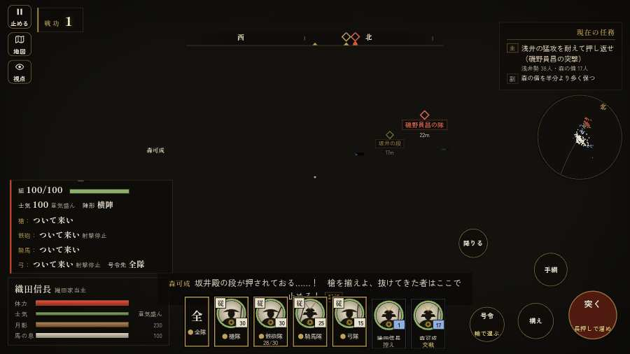

# テストプレイヤーの感想：指揮好きの戦略家

- 人：ケイコ（45歳・将棋と戦略ゲーム好き）（118番）
- 変わり目：台詞を全部読む・パソコン 1280×720・信長で出陣・ふつう・身分 中ほど・問屋:鉄砲・一人称・感度 ふつう・途中で止める
- 時：2026/9/28 1:17:05（253秒かかった）
- 画面：パソコン 1280×720・鍵盤とマウス・画質 中
- 遊んだ戦：姉川の戦い（信長で出陣）（達成）
- 機械の混み具合：5（load average）

## ひとこと

> 姉川（信長で出陣）で、号令を19回かけました。信長でも出陣して、軍配も触りました。HUD の札どうしが重なって読めない。采配の上で、これは痛い。字が枠から切れている。采配の上で、これは痛い。戦う兵が遠景の大軍（影の兵）の中に埋もれている。命令が信用できないと、策が立てられません。勝てはしましたが、自分の采配で勝った手応えはまだ薄いです。

## 見つけた問題（5件・困った順）

### 1. HUD の札どうしが重なって読めない
- どこで：姉川の戦い（信長で出陣）・5秒・brief
- 何が：#subtitle と #h-units（1280×720）
- どれくらい困ったか：★★★ やめたくなった（23回）
- 直し方の目安：置き場所をずらすか、片方を出している間はもう片方を隠す
- 画面：（その戦の山場の一枚）

### 2. 字が枠から切れている
- どこで：姉川の戦い（信長で出陣）・開戦
- 何が：#h-units > .uc.ally > .nm「織田信長」／#h-units > .uc.ally > .nm「森可成」
- どれくらい困ったか：★★ かなり困った（92回）
- 直し方の目安：枠を広げるか、字を折り返す
- 画面：（その戦の山場の一枚）

### 3. 戦う兵が遠景の大軍（影の兵）の中に埋もれている
- どこで：姉川の戦い（信長で出陣）・11秒・brief
- 何が：味方の兵 15人が、遠景の大軍 #9（中心 22,50・120人）の中（27, 52）／味方の兵 22人が、遠景の大軍 #9（中心 22,50・120人）の中（24, 49）
- どれくらい困ったか：★★ かなり困った（19回）
- 直し方の目安：遠景の大軍を戦う場所から離す（addDistantArmy の x,z,w,d を見直す）か、兵の行き先を大軍の外にする
- 画面：（その戦の山場の一枚）

### 4. 戦場が札に食われている（画面の3分の1超）
- どこで：姉川の戦い（信長で出陣）・10秒・brief
- 何が：1280×720 で 35%／1280×720 で 40%
- どれくらい困ったか：★★ かなり困った（15回）
- 直し方の目安：札を小さくするか、平時は薄く・畳む
- 画面：（その戦の山場の一枚）

### 5. 数で勝る隊が、小勢に一方的に削られて崩れた
- どこで：姉川の戦い（信長で出陣）・137秒・counter
- 何が：浅井の三の手 39 対 そばの敵 2（36を失った）
- どれくらい困ったか：★ 少し気になった（1回）
- 直し方の目安：兵の数の差が、削り合いと士気に効くようにする
- 画面：（その戦の山場の一枚）

## 遊んだ記録

- 姉川の戦い（信長で出陣）：181秒・任務達成・戦功180・組88/100・討ち取り25・突き0/当たり48・号令19回・指で押した数3・読み込み1.6秒・戦の前の札285字・1コマ31.1ms（実時間170秒・内訳 brain 0.0・pad 0.0・tf 0.0・upd 0.0・eye 0.2）
  - 任務の流れ：0s 浅井の猛攻を耐えて押し返せ → 18s 浅井の猛攻を耐えて押し返せ（磯野員昌の突撃） → 105s 浅井の猛攻を耐えて押し返せ（長政の旗本） → 136s 浅井の猛攻を耐えて押し返せ（長政の旗本）〔済〕／姉川を渡り、向こう岸で踏みとどまる浅井の殿（しんがり）を崩せ → 171s 浅井の猛攻を耐えて押し返せ（長政の旗本）〔済〕／姉川を渡り、向こう岸で踏みとどまる浅井の殿（しんがり）を崩せ〔済〕
  - 受けた傷：足軽 7
  - 開戦：
  - 山場：
  - 勝ち負けが決まった所：
