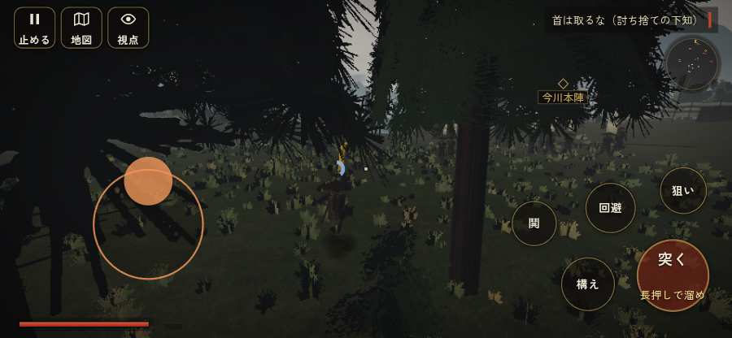

# テストプレイヤーの感想：アクション好き

- 人：ソウタ（24歳・アクションゲーム好き）（187番）
- 変わり目：走りっぱなし・iPhone 横 844×390・新しく始める通し・ふつう・足軽から・問屋:刀・槍・具足・三人称・感度 ふつう・止めない
- 時：2026/9/28 8:59:06（162秒かかった）
- 画面：iPhone の横向き 844×390・倍率3・指で触る操作（touch.js の釦・棒・なぞり）・画質 低
- 遊んだ戦：桶狭間の戦い（達成）、森部の戦い（失敗・倒れた）、墨俣築城防衛（失敗・倒れた）
- 機械の混み具合：3（load average）

## ひとこと

> とにかく突っ込んだ。9分で29人斬った。578回突いて77回当たり。当たらなさすぎ。前へ進もうとしても進めない所があった、手応えがスカスカ。突いても、なかなか当たらない、ここは爽快感が死んでる。倒れて戦が終わった、手応えがスカスカ。2回やられた。難しいのはいいけど、何でやられたか分かるようにしてほしい。問屋で上質な槍槍12貫を買った。強くなった感じがほしい。

## 見つけた問題（10件・困った順）

### 1. 戦う兵が遠景の大軍（影の兵）の中に埋もれている
- どこで：桶狭間の戦い・126秒・assault
- 何が：味方の兵 6人が、遠景の大軍 #10（中心 1,-83・36人）の中（3, -85）／味方の兵 4人が、遠景の大軍 #10（中心 1,-84・36人）の中（-3, -83）
- どれくらい困ったか：★★ かなり困った（13回）
- 直し方の目安：遠景の大軍を戦う場所から離す（addDistantArmy の x,z,w,d を見直す）か、兵の行き先を大軍の外にする
- 画面：（その戦の山場の一枚）

### 2. 前へ進もうとしても進めない所があった
- どこで：墨俣築城防衛・63秒・w1
- 何が：(-2, -14)・段 w1
- どれくらい困ったか：★★ かなり困った（2回）
- 直し方の目安：当たり（柵・建物・地形）と道のつながりを見直す
- 画面：（その戦の山場の一枚）

### 3. 突いても、なかなか当たらない
- どこで：桶狭間の戦い・230秒・assault
- 何が：562回突いて、当たりは69回
- どれくらい困ったか：★★ かなり困った（1回）
- 直し方の目安：指の端末では、突きの向きを近くの敵へ少し寄せる（狙いの補助）
- 画面：（その戦の山場の一枚）

### 4. 倒れて戦が終わった
- どこで：森部の戦い・77秒・brief
- 何が：77秒で倒れた（受けた傷：足軽 58・侍 47・武将 25・弓 9）
- どれくらい困ったか：★★ かなり困った（1回）
- 直し方の目安：初めの戦は受ける傷を減らす・危ない時に字幕で構えを教える

### 5. 始まってすぐやられる（難しすぎ）
- どこで：森部の戦い・77秒・brief
- 何が：77秒で倒れた（足軽 58・侍 47・武将 25・弓 9）
- どれくらい困ったか：★★ かなり困った（1回）

### 6. 前へ進もうとしても進めない所があった
- どこで：墨俣築城防衛・18秒・brief
- 何が：(-4, -4)・段 brief
- どれくらい困ったか：★★ かなり困った（1回）
- 直し方の目安：当たり（柵・建物・地形）と道のつながりを見直す
- 画面：（その戦の山場の一枚）

### 7. 倒れて戦が終わった
- どこで：墨俣築城防衛・228秒・w2
- 何が：228秒で倒れた（受けた傷：足軽 147）
- どれくらい困ったか：★★ かなり困った（1回）
- 直し方の目安：初めの戦は受ける傷を減らす・危ない時に字幕で構えを教える

### 8. 自分が遠景の大軍（影の兵）の中に立っている
- どこで：桶狭間の戦い・131秒・assault
- 何が：味方の兵 1人が、遠景の大軍 #8（中心 -21,-83・36人）の中（-17, -88）／味方・敵の兵 2人が、遠景の大軍 #10（中心 1,-84・36人）の中（-2, -83）
- どれくらい困ったか：★ 少し気になった（4回）
- 直し方の目安：遠景の大軍を戦う場所から離す（addDistantArmy の x,z,w,d を見直す）か、兵の行き先を大軍の外にする
- 画面：（その戦の山場の一枚）

### 9. 馬に乗れる場面がなかった
- どこで：桶狭間の戦い・230秒・assault
- 何が：桶狭間の戦い
- どれくらい困ったか：★ 少し気になった（3回）
- 直し方の目安：空馬（主を失った馬）をもう少し置く
- 画面：（その戦の山場の一枚）

### 10. 「狙い」をしたいのに、押す丸が出ていない
- どこで：桶狭間の戦い・227秒・assault
- 何が：欲しかった時：桶狭間の戦い・227秒・assault
- どれくらい困ったか：★ 少し気になった（1回）
- 直し方の目安：その時に使える釦は出す（touchFrame の出し入れ）
- 画面：（その戦の山場の一枚）

## 遊んだ記録

- 桶狭間の戦い：230秒・任務達成・戦功160・組—・討ち取り25・突き562/当たり69・号令0回・指で押した数653・読み込み1.5秒・戦の前の札165字・1コマ6.6ms（実時間45秒・内訳 brain 0.1・pad 0.3・tf 0.4・upd 5.8・eye 0.1）
  - 任務の流れ：0s 組頭の源八に話しかける → 1s 組頭の源八に話しかける〔済〕 → 4s （任務なし） → 111s 今川本陣に突入せよ → 161s 今川本陣に突入せよ〔済〕／旗本を崩し、味方を義元へ通せ → 221s 今川本陣に突入せよ〔済〕／旗本を崩し、味方を義元へ通せ〔済〕
  - 受けた傷：足軽 278・侍 95・武将 17・弓 0
  - 開戦：
  - 山場：
  - 勝ち負けが決まった所：
- 森部の戦い：77秒・任務失敗（倒れた）・戦功15・組3/5・討ち取り0・突き16/当たり2・号令0回・指で押した数685・読み込み0.6秒・戦の前の札172字・1コマ6.9ms（実時間11秒・内訳 brain 0.0・pad 0.1・tf 0.8・upd 6.0・eye 0.1）
  - 任務の流れ：0s 部下を連れて林の端を押さえる → 37s 部下を連れて林の端を押さえる〔済〕
  - 受けた傷：足軽 58・侍 47・武将 25・弓 9
- 墨俣築城防衛：228秒・任務失敗（倒れた）・戦功0・組7/15・討ち取り4・突き0/当たり6・号令9回・指で押した数775・読み込み0.4秒・戦の前の札177字・1コマ7.2ms（実時間34秒・内訳 brain 0.2・pad 0.1・tf 1.0・upd 5.9・eye 0.1）
  - 任務の流れ：0s 砦を守りきる（襲来 0/3） → 34s 砦を守りきる（襲来 1/3） → 134s 砦を守りきる（襲来 2/3）
  - 受けた傷：足軽 147
