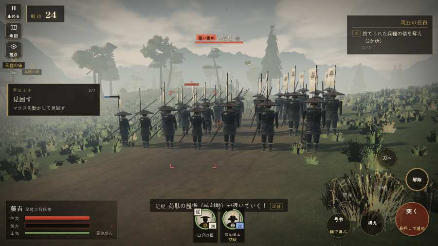

# テストプレイヤーの感想：アクション好き

- 人：ソウタ（24歳・アクションゲーム好き）（197番）
- 変わり目：連打・パソコン 1280×720・新しく始める通し・速い・身分 上・問屋:馬・三人称・感度 敏感・止めない
- 時：2026/9/28 8:53:37（95秒かかった）
- 画面：パソコン 1280×720・鍵盤とマウス・画質 高
- 遊んだ戦：三木城・大村の合戦（失敗・倒れた）
- 機械の混み具合：4（load average）

## ひとこと

> とにかく突っ込んだ。3分で51人斬った。字が枠から切れている、手応えがスカスカ。倒れて戦が終わった、ここは爽快感が死んでる。馬に乗れる場面がなかった、ストレスたまる。1回やられた。難しいのはいいけど、何でやられたか分かるようにしてほしい。

## 見つけた問題（4件・困った順）

### 1. 字が枠から切れている
- どこで：三木城・大村の合戦・開戦
- 何が：#h-units > .uc.ally > .nm「羽柴秀吉」
- どれくらい困ったか：★★ かなり困った（36回）
- 直し方の目安：枠を広げるか、字を折り返す
- 画面：（その戦の山場の一枚）

### 2. 倒れて戦が終わった
- どこで：三木城・大村の合戦・179秒・omura
- 何が：179秒で倒れた（受けた傷：足軽 100・鉄砲 53・侍 35）
- どれくらい困ったか：★★ かなり困った（1回）
- 直し方の目安：初めの戦は受ける傷を減らす・危ない時に字幕で構えを教える
- 画面：（その戦の山場の一枚）

### 3. HUD の札どうしが重なって読めない
- どこで：三木城・大村の合戦・85秒・hirata
- 何が：#subtitle と #h-units（1280×720）
- どれくらい困ったか：★ 少し気になった（7回）
- 直し方の目安：置き場所をずらすか、片方を出している間はもう片方を隠す
- 画面：（その戦の山場の一枚）

### 4. 馬に乗れる場面がなかった
- どこで：三木城・大村の合戦・179秒・omura
- 何が：三木城・大村の合戦
- どれくらい困ったか：★ 少し気になった（1回）
- 直し方の目安：空馬（主を失った馬）をもう少し置く
- 画面：（その戦の山場の一枚）

## 遊んだ記録

- 三木城・大村の合戦：179秒・任務失敗（倒れた）・戦功70・組7/20・討ち取り51・突き0/当たり104・号令0回・指で押した数1・読み込み0.9秒・戦の前の札313字・1コマ9.6ms（実時間52秒・内訳 brain 0.0・pad 0.0・tf 0.0・upd 0.0・eye 0.1）
  - 任務の流れ：0s 羽柴秀吉のもとで、下知を待て → 15s 荷駄の護衛を退け、荷を奪え → 39s 捨てられた兵糧の俵を奪え（2か所） → 54s 捨てられた兵糧の俵を奪え（2か所）〔済〕 → 58s 平田の付城へ駆けつけ、柵に取り付く別所勢を退けよ → 130s 大村坂で、別所・毛利勢を崩せ
  - 受けた傷：足軽 100・鉄砲 53・侍 35
  - 開戦：
  - 山場：
  - 勝ち負けが決まった所：
