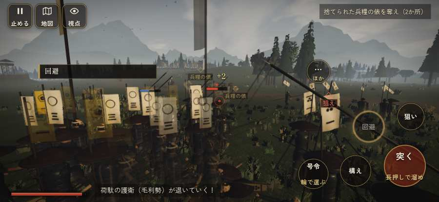

# テストプレイヤーの感想：指揮好きの戦略家

- 人：ケイコ（45歳・将棋と戦略ゲーム好き）（208番）
- 変わり目：連打・iPhone 横 874×402・新しく始める通し・ゆっくり・身分 上・問屋:刀・槍・具足・一人称・感度 鈍い・止めない
- 時：2026/9/28 8:59:29（184秒かかった）
- 画面：iPhone の横向き 874×402・倍率3・指で触る操作（touch.js の釦・棒・なぞり）・画質 低
- 遊んだ戦：三木城・大村の合戦（達成）、有岡城の戦い（達成）
- 機械の混み具合：4（load average）

## ひとこと

> 三木城・大村の合戦と有岡城で、号令を25回かけました。号令の輪で選んだのに、号令が出なかった。采配の上で、これは痛い。行き先があるのに20秒動かない兵。命令が信用できないと、策が立てられません。「鼓舞」をしたいのに、押す丸が出ていない。命令が信用できないと、策が立てられません。勝てはしましたが、自分の采配で勝った手応えはまだ薄いです。問屋で槍持ち雇い賃 3貫を揃えました。

## 見つけた問題（8件・困った順）

### 1. 行き先があるのに20秒動かない兵
- どこで：三木城・大村の合戦・105秒・convoy
- 何が：味方の鉄砲：味方の鉄砲（号令：attack）at (26,50)／味方の足軽：味方の足軽（号令：attack）at (21,44)
- どれくらい困ったか：★★★ やめたくなった（22回）
- 直し方の目安：道が塞がれていないか、行き先に着いたと見なせているかを見る
- 画面：（その戦の山場の一枚）

### 2. 号令の輪で選んだのに、号令が出なかった
- どこで：三木城・大村の合戦・247秒・end
- 何が：「attack」を選んで放した（三木城・大村の合戦・247秒・end）
- どれくらい困ったか：★★★ やめたくなった（1回）
- 直し方の目安：touch.js の号令の丸の滑らせ方と player.js の radialSel を見直す
- 画面：（その戦の山場の一枚）

### 3. HUD の札どうしが重なって読めない
- どこで：三木城・大村の合戦・70秒・convoy
- 何が：#flash と #cmdpanel（874×402）
- どれくらい困ったか：★★ かなり困った（7回）
- 直し方の目安：置き場所をずらすか、片方を出している間はもう片方を隠す
- 画面：（その戦の山場の一枚）

### 4. 前へ進もうとしても進めない所があった
- どこで：有岡城の戦い・50秒・open
- 何が：(6, 22)・段 open
- どれくらい困ったか：★★ かなり困った（1回）
- 直し方の目安：当たり（柵・建物・地形）と道のつながりを見直す

### 5. 「鼓舞」をしたいのに、押す丸が出ていない
- どこで：三木城・大村の合戦・35秒・convoy
- 何が：欲しかった時：三木城・大村の合戦・35秒・convoy
- どれくらい困ったか：★ 少し気になった（11回）
- 直し方の目安：その時に使える釦は出す（touchFrame の出し入れ）
- 画面：（その戦の山場の一枚）

### 6. 「狙い」をしたいのに、押す丸が出ていない
- どこで：三木城・大村の合戦・55秒・convoy
- 何が：欲しかった時：三木城・大村の合戦・55秒・convoy
- どれくらい困ったか：★ 少し気になった（5回）
- 直し方の目安：その時に使える釦は出す（touchFrame の出し入れ）
- 画面：（その戦の山場の一枚）

### 7. 「回避」をしたいのに、押す丸が出ていない
- どこで：三木城・大村の合戦・251秒・end
- 何が：欲しかった時：三木城・大村の合戦・251秒・end
- どれくらい困ったか：★ 少し気になった（1回）
- 直し方の目安：その時に使える釦は出す（touchFrame の出し入れ）
- 画面：（その戦の山場の一枚）

### 8. 押せる所どうしが重なっている
- どこで：有岡城の戦いの前・問屋
- 何が：「城下へ戻る」と「出世の道を見る」
- どれくらい困ったか：★ 少し気になった（1回）
- 直し方の目安：間を空ける
- 画面：（その戦の山場の一枚）

## 遊んだ記録

- 三木城・大村の合戦：257秒・任務達成・戦功143・組8/20・討ち取り28・突き904/当たり81・号令25回・指で押した数952・読み込み1.1秒・戦の前の札206字・1コマ12.2ms（実時間76秒・内訳 brain 0.0・pad 0.5・tf 1.5・upd 10.0・eye 0.1）
  - 任務の流れ：0s 羽柴秀吉のもとで、下知を待て → 15s 荷駄の護衛を退け、荷を奪え → 39s 捨てられた兵糧の俵を奪え（2か所） → 114s 平田の付城へ駆けつけ、柵に取り付く別所勢を退けよ → 181s 大村坂で、別所・毛利勢を崩せ → 245s 大村坂で、別所・毛利勢を崩せ〔済〕
  - 受けた傷：足軽 153・弓 12・侍 8
  - 開戦：
  - 山場：
  - 勝ち負けが決まった所：
- 有岡城の戦い：227秒・任務達成・戦功158・組20/20・討ち取り11・突き735/当たり32・号令0回・指で押した数1679・読み込み0.6秒・戦の前の札199字・1コマ10.7ms（実時間50秒・内訳 brain 0.0・pad 0.3・tf 1.4・upd 8.9・eye 0.1）
  - 任務の流れ：0s 滝川一益のもとで、合図を待て → 15s 開いた木戸から攻め入り、砦の兵を退けよ → 55s 栗山善助とともに、本丸の脇の牢へ急げ → 91s 牢の錠を打ち壊して、官兵衛を救い出せ → 116s 官兵衛の一行を守り、織田の陣まで供せよ → 214s 官兵衛の一行を守り、織田の陣まで供せよ〔済〕
  - 受けた傷：足軽 28
