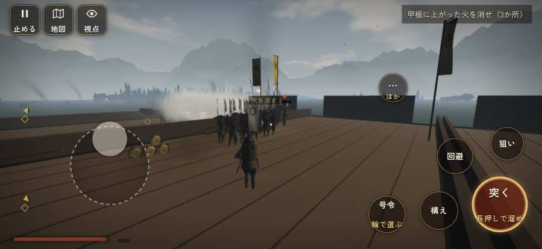

# テストプレイヤーの感想：指揮好きの戦略家

- 人：ケイコ（45歳・将棋と戦略ゲーム好き）（213番）
- 変わり目：台詞を全部読む・iPhone 横 874×402・織田家編の戦を一つ・ふつう・身分 上・問屋:供・一人称・感度 敏感・止めない
- 時：2026/9/28 8:52:39（85秒かかった）
- 画面：iPhone の横向き 874×402・倍率3・指で触る操作（touch.js の釦・棒・なぞり）・画質 低
- 遊んだ戦：第二次木津川口の戦い（達成）
- 機械の混み具合：6（load average）

## ひとこと

> 第二次木津川口で、号令を24回かけました。号令「form」から3秒たっても、組の7割が動かない。命令が信用できないと、策が立てられません。「鼓舞」をしたいのに、押す丸が出ていない。指揮官としてはもどかしい。勝てはしましたが、自分の采配で勝った手応えはまだ薄いです。

## 見つけた問題（2件・困った順）

### 1. 号令「form」から3秒たっても、組の7割が動かない
- どこで：第二次木津川口の戦い・231秒・end
- 何が：19人のうち動いたのは1人（第二次木津川口の戦い・231秒・end）
- どれくらい困ったか：★★ かなり困った（1回）
- 直し方の目安：号令を受けた兵がすぐ向きを変えて動き出すようにする（行き先・狙いの付け直し）
- 画面：（その戦の山場の一枚）

### 2. 「鼓舞」をしたいのに、押す丸が出ていない
- どこで：第二次木津川口の戦い・111秒・board
- 何が：欲しかった時：第二次木津川口の戦い・111秒・board
- どれくらい困ったか：★ 少し気になった（1回）
- 直し方の目安：その時に使える釦は出す（touchFrame の出し入れ）
- 画面：（その戦の山場の一枚）

## 遊んだ記録

- 第二次木津川口の戦い：234秒・任務達成・戦功220・組19/20・討ち取り31・突き341/当たり90・号令24回・指で押した数469・読み込み0.8秒・戦の前の札220字・1コマ8ms（実時間47秒・内訳 brain 0.0・pad 0.2・tf 1.2・upd 6.5・eye 0.0）
  - 任務の流れ：0s 九鬼嘉隆のもとで、下知を待て → 14s 大筒で小早を沈めよ（6艘） → 73s 甲板に上がった火を消せ（3か所） → 109s 甲板に乗り移った毛利勢を追い落とせ（船団が退くまで） → 222s 甲板に乗り移った毛利勢を追い落とせ（船団が退くまで）〔済〕
  - 受けた傷：足軽 47・侍 10
  - 開戦：
  - 山場：
  - 勝ち負けが決まった所：
