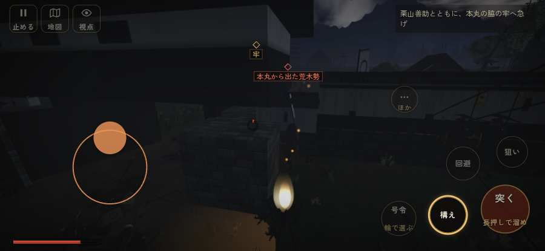

# テストプレイヤーの感想：アクション好き

- 人：ソウタ（24歳・アクションゲーム好き）（217番）
- 変わり目：台詞を全部読む・iPhone 横 932×430・新しく始める通し・ゆっくり・身分 上・問屋:鉄砲・一人称・感度 敏感・止めない
- 時：2026/9/28 8:59:28（101秒かかった）
- 画面：iPhone の横向き 932×430・倍率3・指で触る操作（touch.js の釦・棒・なぞり）・画質 低
- 遊んだ戦：有岡城の戦い（達成）
- 機械の混み具合：4（load average）

## ひとこと

> とにかく突っ込んだ。4分で15人斬った。188回突いて47回当たり。まあまあ。前へ進もうとしても進めない所があった、手応えがスカスカ。馬に乗れる場面がなかった、ストレスたまる。もっと派手に、じゃなくて重く斬り合いたい。

## 見つけた問題（2件・困った順）

### 1. 前へ進もうとしても進めない所があった
- どこで：有岡城の戦い・71秒・town
- 何が：(7, 20)・段 town
- どれくらい困ったか：★★ かなり困った（1回）
- 直し方の目安：当たり（柵・建物・地形）と道のつながりを見直す
- 画面：

### 2. 馬に乗れる場面がなかった
- どこで：有岡城の戦い・254秒・end
- 何が：有岡城の戦い
- どれくらい困ったか：★ 少し気になった（1回）
- 直し方の目安：空馬（主を失った馬）をもう少し置く
- 画面：（その戦の山場の一枚）

## 遊んだ記録

- 有岡城の戦い：254秒・任務達成・戦功192・組20/20・討ち取り15・突き188/当たり47・号令0回・指で押した数344・読み込み1.2秒・戦の前の札198字・1コマ8ms（実時間52秒・内訳 brain 0.0・pad 0.1・tf 1.0・upd 6.7・eye 0.1）
  - 任務の流れ：0s 滝川一益のもとで、合図を待て → 15s 開いた木戸から攻め入り、砦の兵を退けよ → 54s 栗山善助とともに、本丸の脇の牢へ急げ → 100s 牢の錠を打ち壊して、官兵衛を救い出せ → 120s 官兵衛の一行を守り、織田の陣まで供せよ → 241s 官兵衛の一行を守り、織田の陣まで供せよ〔済〕
  - 受けた傷：足軽 162・侍 57
  - 開戦：
  - 山場：
