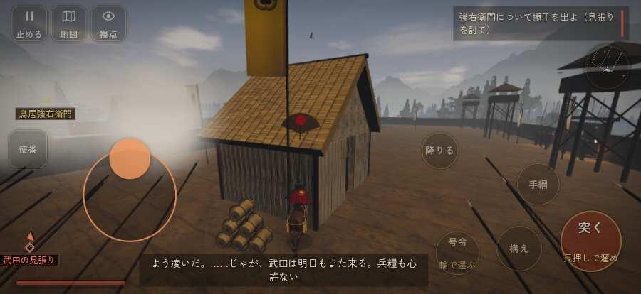

# テストプレイヤーの感想：せっかちな社会人

- 人：ユウキ（35歳・昼休みに遊ぶ会社員）（219番）
- 変わり目：構え多め・iPhone 横 874×402・信長で出陣・ゆっくり・身分 中ほど・問屋:刀・槍・具足・三人称・感度 ふつう・途中で止める
- 時：2026/9/28 9:03:04（150秒かかった）
- 画面：iPhone の横向き 874×402・倍率3・指で触る操作（touch.js の釦・棒・なぞり）・画質 低
- 遊んだ戦：長篠城籠城（信長で出陣）（達成）
- 機械の混み具合：3（load average）

## ひとこと

> 昼休みに7分ほど。長篠城籠城（信長で出陣）。前へ進もうとしても進めない所があった。待ってられない。行き先があるのに20秒動かない兵。待ってられない。何もする事が無いまま待たされた。待ってられない。勝ち負けはすぐ分かって、そこは良かった。

## 見つけた問題（4件・困った順）

### 1. 行き先があるのに20秒動かない兵
- どこで：長篠城籠城（信長で出陣）・83秒・w1
- 何が：味方の騎馬：味方の騎馬（号令：follow）at (30,-17)／味方の騎馬：味方の騎馬（号令：follow）at (29,-18)
- どれくらい困ったか：★★ かなり困った（41回）
- 直し方の目安：道が塞がれていないか、行き先に着いたと見なせているかを見る
- 画面：（その戦の山場の一枚）

### 2. 前へ進もうとしても進めない所があった
- どこで：長篠城籠城（信長で出陣）・118秒・sune
- 何が：(22, -7)・段 sune
- どれくらい困ったか：★★ かなり困った（5回）
- 直し方の目安：当たり（柵・建物・地形）と道のつながりを見直す
- 画面：

### 3. 何もする事が無いまま待たされた
- どこで：長篠城籠城（信長で出陣）・170秒・sune
- 何が：60秒、任務札が変わらず敵もいない（段 sune）
- どれくらい困ったか：★★ かなり困った（1回）
- 直し方の目安：飛ばせる（canSkip）ようにするか、待つ間にする事を置く
- 画面：（その戦の山場の一枚）

### 4. 一つの戦が長い（7分を超えた）
- どこで：長篠城籠城（信長で出陣）・442秒・end
- 何が：長篠城籠城（信長で出陣）：7分
- どれくらい困ったか：★ 少し気になった（1回）
- 直し方の目安：途中で区切れる所（段の切れ目）に「ここまで」を置く
- 画面：（その戦の山場の一枚）

## 遊んだ記録

- 長篠城籠城（信長で出陣）：442秒・任務達成・戦功160・組95/100・討ち取り13・突き16/当たり21・号令0回・指で押した数120・読み込み1.5秒・戦の前の札115字・1コマ9.5ms（実時間101秒・内訳 brain 0.0・pad 0.1・tf 0.1・upd 9.1・eye 0.1）
  - 任務の流れ：0s 長篠城を守り抜け（本丸の館を守る） → 330s 後詰の旗が見えるまで持ちこたえよ → 431s 後詰の旗が見えるまで持ちこたえよ〔済〕
  - 開戦：
  - 山場：
