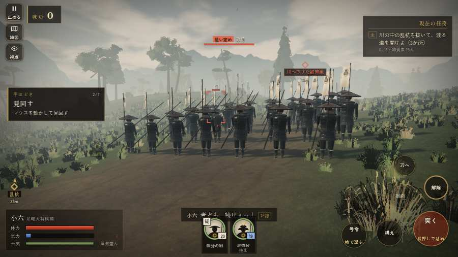

# テストプレイヤーの感想：アクション好き

- 人：ソウタ（24歳・アクションゲーム好き）（277番）
- 変わり目：連打・パソコン 1280×720・新しく始める通し・ふつう・身分 中ほど・問屋:馬・一人称・感度 鈍い・途中で止める
- 時：2026/9/28 8:59:46（122秒かかった）
- 画面：パソコン 1280×720・鍵盤とマウス・画質 高
- 遊んだ戦：雑賀攻め・小雑賀川（失敗・倒れた）
- 機械の混み具合：4（load average）

## ひとこと

> とにかく突っ込んだ。2分で0人斬った。城下から出陣できなかった、ストレスたまる。倒れて戦が終わった、手応えがスカスカ。始まってすぐやられる、ここは爽快感が死んでる。1回やられた。難しいのはいいけど、何でやられたか分かるようにしてほしい。

## 見つけた問題（8件・困った順）

### 1. 城下から出陣できなかった
- どこで：手取川の戦いの前・城下
- 何が：「出陣」の釦が見つからない・押しても戦の前の札が出ない
- どれくらい困ったか：★★★ やめたくなった（1回）
- 画面：（その戦の山場の一枚）

### 2. 倒れて戦が終わった
- どこで：雑賀攻め・小雑賀川・110秒・stakes
- 何が：110秒で倒れた（受けた傷：足軽 102）
- どれくらい困ったか：★★ かなり困った（1回）
- 直し方の目安：初めの戦は受ける傷を減らす・危ない時に字幕で構えを教える
- 画面：（その戦の山場の一枚）

### 3. 始まってすぐやられる（難しすぎ）
- どこで：雑賀攻め・小雑賀川・110秒・stakes
- 何が：110秒で倒れた（足軽 102）
- どれくらい困ったか：★★ かなり困った（1回）
- 画面：（その戦の山場の一枚）

### 4. 字が枠から切れている
- どこで：雑賀攻め・小雑賀川・開戦
- 何が：#h-units > .uc.ally > .nm「堀秀政」
- どれくらい困ったか：★ 少し気になった（24回）
- 直し方の目安：枠を広げるか、字を折り返す
- 画面：（その戦の山場の一枚）

### 5. HUD の札どうしが重なって読めない
- どこで：雑賀攻め・小雑賀川・50秒・stakes
- 何が：#subtitle と #h-units（1280×720）
- どれくらい困ったか：★ 少し気になった（4回）
- 直し方の目安：置き場所をずらすか、片方を出している間はもう片方を隠す
- 画面：（その戦の山場の一枚）

### 6. 馬に乗れる場面がなかった
- どこで：雑賀攻め・小雑賀川・110秒・stakes
- 何が：雑賀攻め・小雑賀川
- どれくらい困ったか：★ 少し気になった（1回）
- 直し方の目安：空馬（主を失った馬）をもう少し置く
- 画面：（その戦の山場の一枚）

### 7. 指の端末なのに、問屋の説明が鍵盤の言い方
- どこで：手取川の戦いの前・城下
- 何が：「具足・打刀 施設は数字キー 1〜9、または」
- どれくらい困ったか：★ 少し気になった（1回）
- 直し方の目安：isTouch の時は「持替の丸で」などの言い方に
- 画面：（その戦の山場の一枚）

### 8. 問屋に入っても、買える物が一つも無い（銭が足りない？）
- どこで：手取川の戦いの前・城下
- 何が：銭 99999貫
- どれくらい困ったか：★ 少し気になった（1回）
- 直し方の目安：買えない理由（あと何貫）を品ごとに書く
- 画面：（その戦の山場の一枚）

## 遊んだ記録

- 雑賀攻め・小雑賀川：110秒・任務失敗（倒れた）・戦功0・組6/20・討ち取り0・突き0/当たり0・号令0回・指で押した数3・読み込み18.0秒・戦の前の札303字・1コマ14.5ms（実時間56秒・内訳 brain 0.0・pad 0.0・tf 0.0・upd 0.0・eye 0.1）
  - 任務の流れ：0s 堀秀政のもとで、下知を待て → 15s 川の中の乱杭を抜いて、渡る道を開けよ（3か所）
  - 受けた傷：足軽 102
  - 開戦：
  - 山場：
  - 勝ち負けが決まった所：
