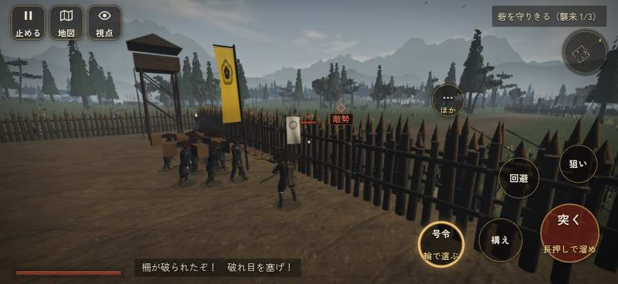

# テストプレイヤーの感想：せっかちな社会人

- 人：ユウキ（35歳・昼休みに遊ぶ会社員）（319番）
- 変わり目：走りっぱなし・iPhone 横 874×402・織田家編の戦を一つ・ゆっくり・足軽から・問屋:馬・一人称・感度 鈍い・途中で止める
- 時：2026/9/28 9:05:19（68秒かかった）
- 画面：iPhone の横向き 874×402・倍率3・指で触る操作（touch.js の釦・棒・なぞり）・画質 低
- 遊んだ戦：墨俣築城防衛（失敗・倒れた）
- 機械の混み具合：4（load average）

## ひとこと

> 昼休みに1分ほど。墨俣築城防衛。前へ進もうとしても進めない所があった。正直、飛ばしたい。倒れて戦が終わった。時間がもったいない。押せる所どうしが重なっている。待ってられない。結局、何分遊べば一区切りなのかが分からない。

## 見つけた問題（3件・困った順）

### 1. 前へ進もうとしても進めない所があった
- どこで：墨俣築城防衛・33秒・w1
- 何が：(4, -15)・段 w1
- どれくらい困ったか：★★ かなり困った（1回）
- 直し方の目安：当たり（柵・建物・地形）と道のつながりを見直す
- 画面：

### 2. 押せる所どうしが重なっている
- どこで：墨俣築城防衛・戦のあと
- 何が：「この戦をやり直す」と「城下へ戻る」／「この戦をやり直す」と「この戦をやり直す」
- どれくらい困ったか：★ 少し気になった（2回）
- 直し方の目安：間を空ける
- 画面：（その戦の山場の一枚）

### 3. 倒れて戦が終わった
- どこで：墨俣築城防衛・63秒・w1
- 何が：63秒で倒れた（受けた傷：足軽 112・侍 15）
- どれくらい困ったか：★ 少し気になった（1回）
- 直し方の目安：初めの戦は受ける傷を減らす・危ない時に字幕で構えを教える
- 画面：（その戦の山場の一枚）

## 遊んだ記録

- 墨俣築城防衛：63秒・任務失敗（倒れた）・戦功30・組3/5・討ち取り2・突き19/当たり12・号令1回・指で押した数36・読み込み0.9秒・戦の前の札181字・1コマ8.3ms（実時間21秒・内訳 brain 0.0・pad 0.1・tf 0.9・upd 7.2・eye 0.1）
  - 任務の流れ：0s 砦を守りきる（襲来 0/3） → 0s 砦を守りきる（襲来 1/3）
  - 受けた傷：足軽 112・侍 15
  - 開戦：
  - 山場：
