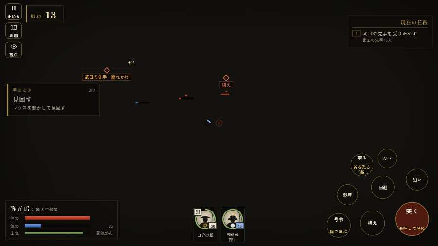

# テストプレイヤーの感想：指揮好きの戦略家

- 人：ケイコ（45歳・将棋と戦略ゲーム好き）（353番）
- 変わり目：迷子になりやすい・パソコン 1280×720・織田家編の戦を一つ・ゆっくり・身分 少し上・問屋:供・三人称・感度 鈍い・止めない
- 時：2026/9/28 17:46:49（140秒かかった）
- 画面：パソコン 1280×720・鍵盤とマウス・画質 中
- 遊んだ戦：三方ヶ原の戦い（失敗・倒れた）
- 機械の混み具合：5（load average）

## ひとこと

> 三方ヶ原で、号令を19回かけました。字が枠から切れている。ここが直れば、ぐっと指揮が楽しくなる。号令「ついて来い」から3秒たっても、組の7割が動かない。命令が信用できないと、策が立てられません。号令「槍衾」から3秒たっても、組の7割が動かない。ここが直れば、ぐっと指揮が楽しくなる。采配で負けたのか、操作で負けたのか分からないのが一番困ります。

## 見つけた問題（5件・困った順）

### 1. 字が枠から切れている
- どこで：三方ヶ原の戦い・開戦
- 何が：#h-units > .uc.ally > .nm「間信盛」
- どれくらい困ったか：★★ かなり困った（39回）
- 直し方の目安：枠を広げるか、字を折り返す
- 画面：（その戦の山場の一枚）

### 2. HUD の札どうしが重なって読めない
- どこで：三方ヶ原の戦い・35秒・first
- 何が：#subtitle と #h-units（1280×720）
- どれくらい困ったか：★★ かなり困った（7回）
- 直し方の目安：置き場所をずらすか、片方を出している間はもう片方を隠す
- 画面：（その戦の山場の一枚）

### 3. 号令「ついて来い」から3秒たっても、組の7割が動かない
- どこで：三方ヶ原の戦い・110秒・crash
- 何が：19人のうち動いたのは0人（三方ヶ原の戦い・110秒・crash）
- どれくらい困ったか：★★ かなり困った（1回）
- 直し方の目安：号令を受けた兵がすぐ向きを変えて動き出すようにする（行き先・狙いの付け直し）
- 画面：

### 4. 号令「槍衾」から3秒たっても、組の7割が動かない
- どこで：三方ヶ原の戦い・130秒・retreat
- 何が：19人のうち動いたのは0人（三方ヶ原の戦い・130秒・retreat）
- どれくらい困ったか：★★ かなり困った（1回）
- 直し方の目安：号令を受けた兵がすぐ向きを変えて動き出すようにする（行き先・狙いの付け直し）
- 画面：（その戦の山場の一枚）

### 5. 倒れて戦が終わった
- どこで：三方ヶ原の戦い・207秒・retreat
- 何が：207秒で倒れた（受けた傷：騎馬 116）
- どれくらい困ったか：★ 少し気になった（1回）
- 直し方の目安：初めの戦は受ける傷を減らす・危ない時に字幕で構えを教える
- 画面：（その戦の山場の一枚）

## 遊んだ記録

- 三方ヶ原の戦い：207秒・任務失敗（倒れた）・戦功0・組0/20・討ち取り8・突き0/当たり33・号令19回・指で押した数1・読み込み7.5秒・戦の前の札329字・1コマ13.7ms（実時間83秒・内訳 brain 0.0・pad 0.0・tf 0.0・upd 0.0・eye 0.1）
  - 任務の流れ：0s 平手汎秀のもとで、陣を固めよ → 16s 武田の先手を受け止めよ → 46s 横から来る赤備えの騎馬を食い止めよ → 116s 追ってくる武田勢を振り切り、浜松城へ退け → 172s 浜松城の門の前で、追手を食い止めよ（味方が入りきるまで）
  - 受けた傷：騎馬 116
  - 開戦：
  - 山場：
