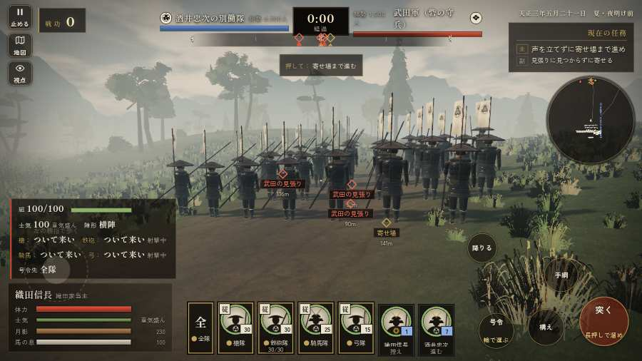

# テストプレイヤーの感想：歴史好きの大人

- 人：ミチオ（62歳・郷土史の会）（391番）
- 変わり目：連打・パソコン 1280×720・信長で出陣・速い・足軽から・問屋:買わない・一人称・感度 鈍い・途中で止める
- 時：2026/9/28 17:42:48（308秒かかった）
- 画面：パソコン 1280×720・鍵盤とマウス・画質 中
- 遊んだ戦：鳶ヶ巣山砦夜襲（信長で出陣）（達成）
- 機械の混み具合：5（load average）

## ひとこと

> 鳶ヶ巣山砦夜襲（信長で出陣）を、一人称で歩いて見て回りました。務めは果たせましたが、気になる所がいくつか。行き先があるのに20秒動かない兵。史実を知る者としては、ここは看過できません。前へ進もうとしても進めない所があった。細かい事ですが、こういう所で嘘っぽくなる。戦う兵が遠景の大軍（影の兵）の中に埋もれている。これでは興が醒めます。

## 見つけた問題（7件・困った順）

### 1. 行き先があるのに20秒動かない兵
- どこで：鳶ヶ巣山砦夜襲（信長で出陣）・368秒・relief
- 何が：味方の鉄砲：味方の鉄砲（号令：attack）at (-122,-24)／味方の鉄砲：味方の鉄砲（号令：attack）at (-123,-26)
- どれくらい困ったか：★★★ やめたくなった（20回）
- 直し方の目安：道が塞がれていないか、行き先に着いたと見なせているかを見る
- 画面：（その戦の山場の一枚）

### 2. 戦う兵が遠景の大軍（影の兵）の中に埋もれている
- どこで：鳶ヶ巣山砦夜襲（信長で出陣）・1秒・march
- 何が：味方の兵 7人が、遠景の大軍 #1（中心 -10,166・220人）の中（-9, 165）／味方の兵 9人が、遠景の大軍 #4（中心 -118,-14・140人）の中（-112, -14）
- どれくらい困ったか：★★★ やめたくなった（13回）
- 直し方の目安：遠景の大軍を戦う場所から離す（addDistantArmy の x,z,w,d を見直す）か、兵の行き先を大軍の外にする
- 画面：（その戦の山場の一枚）

### 3. 前へ進もうとしても進めない所があった
- どこで：鳶ヶ巣山砦夜襲（信長で出陣）・341秒・relief
- 何が：(-96, -46)・段 relief
- どれくらい困ったか：★★ かなり困った（3回）
- 直し方の目安：当たり（柵・建物・地形）と道のつながりを見直す
- 画面：（その戦の山場の一枚）

### 4. 敵が近いのに、まわりの兵の多くが棒立ち
- どこで：鳶ヶ巣山砦夜襲（信長で出陣）・330秒・relief
- 何が：330秒：まわり35mの53人のうち35人が止まったまま（段 relief）
- どれくらい困ったか：★★ かなり困った（2回）
- 直し方の目安：敵が30m内に入ったら、構える・にじり寄る・槍を揃えるなど体を動かす
- 画面：（その戦の山場の一枚）

### 5. 敵が近いのに、まわりの兵の多くが棒立ち
- どこで：鳶ヶ巣山砦夜襲（信長で出陣）・105秒・wait
- 何が：105秒：まわり35mの7人のうち5人が止まったまま（段 assault）
- どれくらい困ったか：★★ かなり困った（1回）
- 直し方の目安：敵が30m内に入ったら、構える・にじり寄る・槍を揃えるなど体を動かす
- 画面：（その戦の山場の一枚）

### 6. 字が枠から切れている
- どこで：鳶ヶ巣山砦夜襲（信長で出陣）・開戦
- 何が：#h-units > .uc.ally > .nm「織田信長」／#h-units > .uc.ally > .nm「酒井忠次」
- どれくらい困ったか：★ 少し気になった（185回）
- 直し方の目安：枠を広げるか、字を折り返す
- 画面：（その戦の山場の一枚）

### 7. 同じ知らせが20秒に4回以上
- どこで：鳶ヶ巣山砦夜襲（信長で出陣）・281秒・assault
- 何が：「者ども、ついて来い！」（台詞）
- どれくらい困ったか：★ 少し気になった（25回）
- 直し方の目安：一度出したら、しばらく同じ物を出さない
- 画面：（その戦の山場の一枚）

## 遊んだ記録

- 鳶ヶ巣山砦夜襲（信長で出陣）：412秒・任務達成・戦功180・組78/100・討ち取り24・突き0/当たり41・号令78回・指で押した数3・読み込み2.2秒・戦の前の札207字・1コマ24.8ms（実時間237秒・内訳 brain 0.0・pad 0.0・tf 0.0・upd 0.0・eye 0.2）
  - 任務の流れ：0s 声を立てずに寄せ場まで進め → 45s 声を立てずに寄せ場まで進め〔済〕 → 105s 声を立てずに寄せ場まで進め〔済〕／尾根の砦を落とせ（0/5） → 152s 声を立てずに寄せ場まで進め〔済〕／尾根の砦を落とせ（1/5） → 200s 声を立てずに寄せ場まで進め〔済〕／尾根の砦を落とせ（2/5） → 242s 声を立てずに寄せ場まで進め〔済〕／尾根の砦を落とせ（3/5） → 245s 声を立てずに寄せ場まで進め〔済〕／尾根の砦を落とせ（4/5） → 250s 声を立てずに寄せ場まで進め〔済〕／尾根の砦を落とせ（4/5）／鳶ヶ巣山砦の河窪信実を討て → 322s 声を立てずに寄せ場まで進め〔済〕／尾根の砦を落とせ（5/5）〔済〕／鳶ヶ巣山砦の河窪信実を討て〔済〕 → 328s 声を立てずに寄せ場まで進め〔済〕／尾根の砦を落とせ（5/5）〔済〕／鳶ヶ巣山砦の河窪信実を討て〔済〕／打って出た長篠城の城兵と合流せよ → 402s 声を立てずに寄せ場まで進め〔済〕／尾根の砦を落とせ（5/5）〔済〕／鳶ヶ巣山砦の河窪信実を討て〔済〕
  - 受けた傷：弓 27・武将 12・足軽 12
  - 開戦：
  - 一人称で見回す（45秒）：
  - 一人称で見回す（90秒）：
