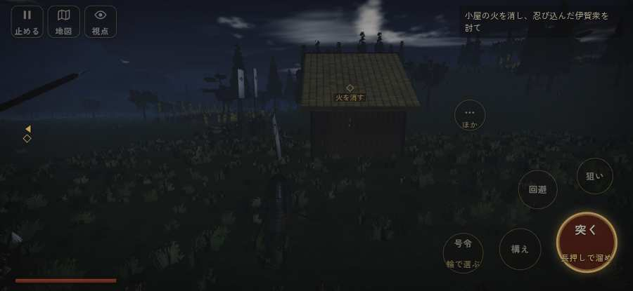

# テストプレイヤーの感想：指揮好きの戦略家

- 人：ケイコ（45歳・将棋と戦略ゲーム好き）（413番）
- 変わり目：走りっぱなし・iPhone 横 932×430・新しく始める通し・速い・身分 上・問屋:買わない・三人称・感度 鈍い・途中で止める
- 時：2026/9/28 17:48:33（154秒かかった）
- 画面：iPhone の横向き 932×430・倍率3・指で触る操作（touch.js の釦・棒・なぞり）・画質 低
- 遊んだ戦：天正伊賀の乱・比自山城（達成）、鳥取城の戦い（達成）
- 機械の混み具合：4（load average）

## ひとこと

> 天正伊賀の乱・比自山城と鳥取城で、号令を30回かけました。前へ進もうとしても進めない所があった。ここが直れば、ぐっと指揮が楽しくなる。号令「form」から3秒たっても、組の7割が動かない。命令が信用できないと、策が立てられません。号令「続け」から3秒たっても、組の7割が動かない。ここが直れば、ぐっと指揮が楽しくなる。勝てはしましたが、自分の采配で勝った手応えはまだ薄いです。

## 見つけた問題（5件・困った順）

### 1. 前へ進もうとしても進めない所があった
- どこで：天正伊賀の乱・比自山城・33秒・raid
- 何が：(-8, 32)・段 raid
- どれくらい困ったか：★★ かなり困った（7回）
- 直し方の目安：当たり（柵・建物・地形）と道のつながりを見直す
- 画面：

### 2. 号令「form」から3秒たっても、組の7割が動かない
- どこで：天正伊賀の乱・比自山城・115秒・raid
- 何が：19人のうち動いたのは2人（天正伊賀の乱・比自山城・115秒・raid）
- どれくらい困ったか：★★ かなり困った（6回）
- 直し方の目安：号令を受けた兵がすぐ向きを変えて動き出すようにする（行き先・狙いの付け直し）
- 画面：（その戦の山場の一枚）

### 3. 号令「続け」から3秒たっても、組の7割が動かない
- どこで：天正伊賀の乱・比自山城・95秒・raid
- 何が：19人のうち動いたのは2人（天正伊賀の乱・比自山城・95秒・raid）
- どれくらい困ったか：★★ かなり困った（1回）
- 直し方の目安：号令を受けた兵がすぐ向きを変えて動き出すようにする（行き先・狙いの付け直し）
- 画面：

### 4. 「鼓舞」をしたいのに、押す丸が出ていない
- どこで：天正伊賀の乱・比自山城・82秒・raid
- 何が：欲しかった時：天正伊賀の乱・比自山城・82秒・raid
- どれくらい困ったか：★ 少し気になった（1回）
- 直し方の目安：その時に使える釦は出す（touchFrame の出し入れ）
- 画面：（その戦の山場の一枚）

### 5. 押せる所どうしが重なっている
- どこで：鳥取城の戦いの前・問屋
- 何が：「城下へ戻る」と「出世の道を見る」
- どれくらい困ったか：★ 少し気になった（1回）
- 直し方の目安：間を空ける
- 画面：（その戦の山場の一枚）

## 遊んだ記録

- 天正伊賀の乱・比自山城：305秒・任務達成・戦功136・組19/20・討ち取り0・突き0/当たり0・号令30回・指で押した数56・読み込み9.2秒・戦の前の札181字・1コマ7.5ms（実時間57秒・内訳 brain 0.0・pad 0.1・tf 0.9・upd 6.4・eye 0.1）
  - 任務の流れ：0s 陣の見張りにつけ → 16s 小屋の火を消し、忍び込んだ伊賀衆を討て → 116s 木戸を破る組を守り、比自山城の木戸を破れ → 256s 城の内に残った伊賀衆を退けよ → 293s 城の内に残った伊賀衆を退けよ〔済〕
  - 開戦：
- 鳥取城の戦い：206秒・任務達成・戦功201・組18/20・討ち取り24・突き484/当たり63・号令0回・指で押した数641・読み込み0.7秒・戦の前の札198字・1コマ9.3ms（実時間40秒・内訳 brain 0.0・pad 0.3・tf 1.2・upd 7.6・eye 0.1）
  - 任務の流れ：0s 羽柴秀吉のもとで、下知を待て → 15s 舟の番を退け、岸の兵糧舟に火をかけよ（2艘） → 94s 柵の前で、打って出た城兵を止めよ → 173s 開城の返事を持つ使いを、城の木戸まで供せよ → 193s 開城の返事を持つ使いを、城の木戸まで供せよ〔済〕
  - 受けた傷：足軽 171・侍 37
