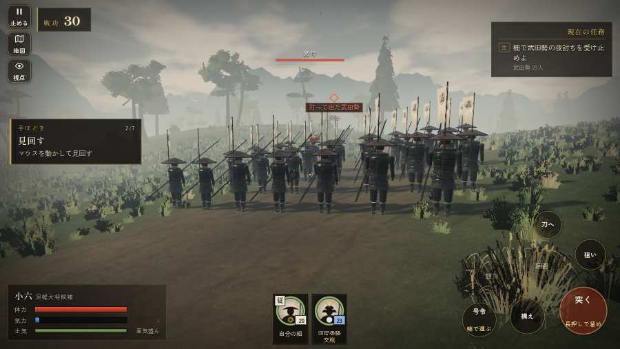

# テストプレイヤーの感想：せっかちな社会人

- 人：ユウキ（35歳・昼休みに遊ぶ会社員）（609番）
- 変わり目：連打・パソコン 1280×720・新しく始める通し・速い・身分 中ほど・問屋:供・一人称・感度 鈍い・止めない
- 時：2026/9/28 23:30:35（137秒かかった）
- 画面：パソコン 1280×720・鍵盤とマウス・画質 高
- 遊んだ戦：岩村城の戦い・水晶山（失敗・倒れた）、天王寺の戦い（達成）
- 機械の混み具合：5（load average）

## ひとこと

> 昼休みに9分ほど。岩村城・水晶山と天王寺。字が枠から切れている。待ってられない。何もする事が無いまま待たされた。時間がもったいない。HUD の札どうしが重なって読めない。正直、飛ばしたい。勝ち負けはすぐ分かって、そこは良かった。問屋はさっと若党雇い賃 8貫だけ。

## 見つけた問題（10件・困った順）

### 1. 字が枠から切れている
- どこで：岩村城の戦い・水晶山・開戦
- 何が：#h-units > .uc.ally > .nm「河尻秀隆」
- どれくらい困ったか：★★★ やめたくなった（234回）
- 直し方の目安：枠を広げるか、字を折り返す
- 画面：（その戦の山場の一枚）

### 2. HUD の札どうしが重なって読めない
- どこで：岩村城の戦い・水晶山・85秒・prepare
- 何が：#subtitle と #h-units（1280×720）
- どれくらい困ったか：★★ かなり困った（25回）
- 直し方の目安：置き場所をずらすか、片方を出している間はもう片方を隠す
- 画面：（その戦の山場の一枚）

### 3. 何もする事が無いまま待たされた
- どこで：岩村城の戦い・水晶山・75秒・prepare
- 何が：61秒、任務札が変わらず敵もいない（段 prepare）
- どれくらい困ったか：★★ かなり困った（1回）
- 直し方の目安：飛ばせる（canSkip）ようにするか、待つ間にする事を置く
- 画面：

### 4. 行き先があるのに20秒動かない兵
- どこで：天王寺の戦い・233秒・sortie
- 何が：味方の足軽：味方の足軽（号令：attack）at (-1,-36)／味方の足軽：味方の足軽（号令：attack）at (0,-36)
- どれくらい困ったか：★ 少し気になった（3回）
- 直し方の目安：道が塞がれていないか、行き先に着いたと見なせているかを見る

### 5. 指の端末なのに、鍵盤・マウスの案内が出ている
- どこで：岩村城の戦い・水晶山・205秒・raid
- 何が：戦のあとの画面に「と演出を飛ばします ・ Enter で「城下へ戻る」 ・」
- どれくらい困ったか：★ 少し気になった（2回）
- 直し方の目安：isTouch の時は「画面を押す」などの言い方にする
- 画面：（その戦の山場の一枚）

### 6. 戦の前の説明が長い
- どこで：岩村城の戦い・水晶山
- 何が：岩村城の戦い・水晶山：300字（読むのに1分かかる）
- どれくらい困ったか：★ 少し気になった（1回）
- 直し方の目安：三行ほどに縮め、残りは「くわしく」に畳む
- 画面：（その戦の山場の一枚）

### 7. 倒れて戦が終わった
- どこで：岩村城の戦い・水晶山・205秒・raid
- 何が：205秒で倒れた（受けた傷：騎馬 103・足軽 39・侍 14）
- どれくらい困ったか：★ 少し気になった（1回）
- 直し方の目安：初めの戦は受ける傷を減らす・危ない時に字幕で構えを教える
- 画面：（その戦の山場の一枚）

### 8. 敵に会うまでが長い
- どこで：岩村城の戦い・水晶山・205秒・raid
- 何が：125秒歩いてやっと敵
- どれくらい困ったか：★ 少し気になった（1回）
- 画面：（その戦の山場の一枚）

### 9. 指の端末なのに、問屋の説明が鍵盤の言い方
- どこで：天王寺の戦いの前・城下
- 何が：「具足・打刀 施設は数字キー 1〜9、または」
- どれくらい困ったか：★ 少し気になった（1回）
- 直し方の目安：isTouch の時は「持替の丸で」などの言い方に
- 画面：（その戦の山場の一枚）

### 10. 戦の前の説明が長い
- どこで：天王寺の戦い
- 何が：天王寺の戦い：303字（読むのに1分かかる）
- どれくらい困ったか：★ 少し気になった（1回）
- 直し方の目安：三行ほどに縮め、残りは「くわしく」に畳む
- 画面：（その戦の山場の一枚）

## 遊んだ記録

- 岩村城の戦い・水晶山：205秒・任務失敗（倒れた）・戦功66・組11/20・討ち取り24・突き0/当たり57・号令0回・指で押した数3・読み込み0.7秒・戦の前の札300字・1コマ6ms（実時間38秒・内訳 brain 0.0・pad 0.0・tf 0.0・upd 0.0・eye 0.0）
  - 任務の流れ：0s 河尻秀隆のもとで、陣の柵の守りにつけ → 14s 柵の持ち場に篝火を焚け（2か所） → 104s 柵の持ち場に篝火を焚け（2か所）〔済〕 → 112s 柵で武田勢の夜討ちを受け止めよ
  - 受けた傷：騎馬 103・足軽 39・侍 14
  - 開戦：
  - 山場：
- 天王寺の戦い：320秒・任務達成・戦功210・組10/20・討ち取り34・突き0/当たり72・号令0回・指で押した数12・読み込み0.4秒・戦の前の札303字・1コマ7.4ms（実時間50秒・内訳 brain 0.0・pad 0.0・tf 0.0・upd 0.0・eye 0.0）
  - 任務の流れ：0s 信長公の下知を待て → 14s 砦を囲む本願寺勢を突き破れ（雑賀の鉄砲に気をつけよ） → 95s 天王寺砦の門へ入れ → 99s 砦を守り抜け（柵の内の味方を切らすな） → 194s 砦から打って出て、本願寺勢を崩せ → 308s 砦から打って出て、本願寺勢を崩せ〔済〕
  - 受けた傷：足軽 104
