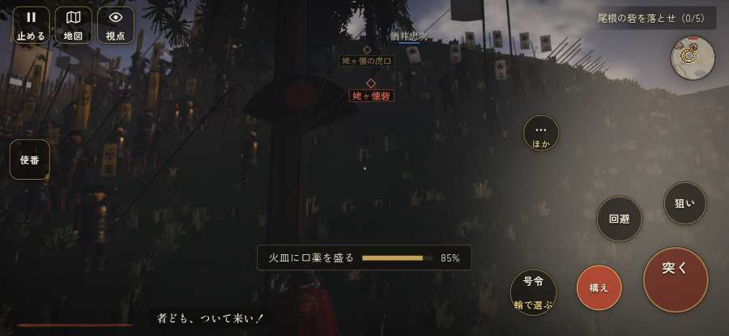

# テストプレイヤーの感想：指揮好きの戦略家

- 人：ケイコ（45歳・将棋と戦略ゲーム好き）（793番）
- 変わり目：連打・iPhone 横 932×430・信長で出陣・速い・身分 中ほど・問屋:鉄砲・一人称・感度 敏感・止めない
- 時：2026/9/29 5:57:25（284秒かかった）
- 画面：iPhone の横向き 932×430・倍率3・指で触る操作（touch.js の釦・棒・なぞり）・画質 低
- 遊んだ戦：鳶ヶ巣山砦夜襲（信長で出陣）（達成）
- 機械の混み具合：5（load average）

## ひとこと

> 鳶ヶ巣山砦夜襲（信長で出陣）で、号令を99回かけました。信長でも出陣して、軍配も触りました。「鼓舞」をしたいのに、押す丸が出ていない。命令が信用できないと、策が立てられません。号令の輪で選んだのに、号令が出なかった。采配の上で、これは痛い。指の端末では「Digit1」ができない。指揮官としてはもどかしい。勝てはしましたが、自分の采配で勝った手応えはまだ薄いです。

## 見つけた問題（11件・困った順）

### 1. 行き先があるのに20秒動かない兵
- どこで：鳶ヶ巣山砦夜襲（信長で出陣）・303秒・assault
- 何が：味方の鉄砲：味方の鉄砲（号令：attack）at (-102,-16)／味方の鉄砲：味方の鉄砲（号令：attack）at (-122,-27)
- どれくらい困ったか：★★★ やめたくなった（16回）
- 直し方の目安：道が塞がれていないか、行き先に着いたと見なせているかを見る
- 画面：（その戦の山場の一枚）

### 2. 号令の輪で選んだのに、号令が出なかった
- どこで：鳶ヶ巣山砦夜襲（信長で出陣）・396秒・relief
- 何が：「follow」を選んで放した（鳶ヶ巣山砦夜襲（信長で出陣）・396秒・relief）
- どれくらい困ったか：★★★ やめたくなった（1回）
- 直し方の目安：touch.js の号令の丸の滑らせ方と player.js の radialSel を見直す
- 画面：（その戦の山場の一枚）

### 3. 同じ知らせが20秒に4回以上
- どこで：鳶ヶ巣山砦夜襲（信長で出陣）・294秒・assault
- 何が：「者ども、ついて来い！」（台詞）／「ぐあっ…！」（台詞）
- どれくらい困ったか：★★ かなり困った（19回）
- 直し方の目安：一度出したら、しばらく同じ物を出さない
- 画面：（その戦の山場の一枚）

### 4. 指の端末では「Digit1」ができない（押す丸が無い）
- どこで：鳶ヶ巣山砦夜襲（信長で出陣）・76秒・assault
- 何が：bot の頭が Digit1 を押したがった（鳶ヶ巣山砦夜襲（信長で出陣）・76秒・assault）
- どれくらい困ったか：★★ かなり困った（6回）
- 直し方の目安：touch.js に釦を足すか、戦の方で要らなくする
- 画面：（その戦の山場の一枚）

### 5. 指の端末では「火縄銃に持ち替え（鍵盤の 3）」ができない（押す丸が無い）
- どこで：鳶ヶ巣山砦夜襲（信長で出陣）・82秒・assault
- 何が：bot の頭が Digit3 を押したがった（鳶ヶ巣山砦夜襲（信長で出陣）・82秒・assault）
- どれくらい困ったか：★★ かなり困った（5回）
- 直し方の目安：touch.js に釦を足すか、戦の方で要らなくする
- 画面：（その戦の山場の一枚）

### 6. 前へ進もうとしても進めない所があった
- どこで：鳶ヶ巣山砦夜襲（信長で出陣）・171秒・assault
- 何が：(35, -30)・段 assault
- どれくらい困ったか：★★ かなり困った（3回）
- 直し方の目安：当たり（柵・建物・地形）と道のつながりを見直す
- 画面：（その戦の山場の一枚）

### 7. 前へ進もうとしても進めない所があった
- どこで：鳶ヶ巣山砦夜襲（信長で出陣）・339秒・relief
- 何が：(-102, -53)・段 relief
- どれくらい困ったか：★★ かなり困った（3回）
- 直し方の目安：当たり（柵・建物・地形）と道のつながりを見直す
- 画面：（その戦の山場の一枚）

### 8. 号令「続け」から3秒たっても、組の7割が動かない
- どこで：鳶ヶ巣山砦夜襲（信長で出陣）・35秒・assault
- 何が：100人のうち動いたのは24人（鳶ヶ巣山砦夜襲（信長で出陣）・35秒・assault）
- どれくらい困ったか：★★ かなり困った（2回）
- 直し方の目安：号令を受けた兵がすぐ向きを変えて動き出すようにする（行き先・狙いの付け直し）
- 画面：

### 9. 「鼓舞」をしたいのに、押す丸が出ていない
- どこで：鳶ヶ巣山砦夜襲（信長で出陣）・11秒・assault
- 何が：欲しかった時：鳶ヶ巣山砦夜襲（信長で出陣）・11秒・assault
- どれくらい困ったか：★ 少し気になった（37回）
- 直し方の目安：その時に使える釦は出す（touchFrame の出し入れ）
- 画面：（その戦の山場の一枚）

### 10. 「狙い」をしたいのに、押す丸が出ていない
- どこで：鳶ヶ巣山砦夜襲（信長で出陣）・5秒・march
- 何が：欲しかった時：鳶ヶ巣山砦夜襲（信長で出陣）・5秒・march
- どれくらい困ったか：★ 少し気になった（4回）
- 直し方の目安：その時に使える釦は出す（touchFrame の出し入れ）
- 画面：（その戦の山場の一枚）

### 11. 「回避」をしたいのに、押す丸が出ていない
- どこで：鳶ヶ巣山砦夜襲（信長で出陣）・398秒・relief
- 何が：欲しかった時：鳶ヶ巣山砦夜襲（信長で出陣）・398秒・relief
- どれくらい困ったか：★ 少し気になった（2回）
- 直し方の目安：その時に使える釦は出す（touchFrame の出し入れ）
- 画面：（その戦の山場の一枚）

## 遊んだ記録

- 鳶ヶ巣山砦夜襲（信長で出陣）：405秒・任務達成・戦功180・組71/100・討ち取り10・突き3821/当たり22・号令99回・指で押した数3960・読み込み12.7秒・戦の前の札128字・1コマ21.7ms（実時間231秒・内訳 brain 0.1・pad 1.1・tf 2.2・upd 18.3・eye 0.1）
  - 任務の流れ：0s 声を立てずに寄せ場まで進め → 5s 尾根の砦を落とせ（0/5） → 74s 尾根の砦を落とせ（1/5） → 140s 尾根の砦を落とせ（2/5） → 229s 尾根の砦を落とせ（3/5） → 232s 尾根の砦を落とせ（4/5） → 237s 尾根の砦を落とせ（4/5）／鳶ヶ巣山砦の河窪信実を討て → 315s 尾根の砦を落とせ（5/5）〔済〕／鳶ヶ巣山砦の河窪信実を討て〔済〕 → 321s 尾根の砦を落とせ（5/5）〔済〕／鳶ヶ巣山砦の河窪信実を討て〔済〕／打って出た長篠城の城兵と合流せよ → 395s 尾根の砦を落とせ（5/5）〔済〕／鳶ヶ巣山砦の河窪信実を討て〔済〕
  - 受けた傷：足軽 9・武将 3
  - 開戦：
  - 山場：
