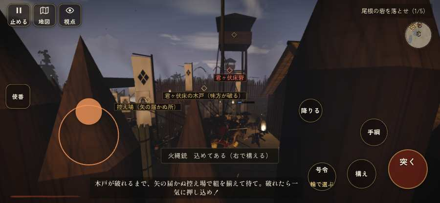

# テストプレイヤーの感想：指揮好きの戦略家

- 人：ケイコ（45歳・将棋と戦略ゲーム好き）（808番）
- 変わり目：走りっぱなし・iPhone 横 932×430・信長で出陣・ふつう・身分 上・問屋:馬・一人称・感度 ふつう・途中で止める
- 時：2026/9/29 6:06:18（177秒かかった）
- 画面：iPhone の横向き 932×430・倍率3・指で触る操作（touch.js の釦・棒・なぞり）・画質 低
- 遊んだ戦：鳶ヶ巣山砦夜襲（信長で出陣）（達成）
- 機械の混み具合：5（load average）

## ひとこと

> 鳶ヶ巣山砦夜襲（信長で出陣）で、号令を94回かけました。信長でも出陣して、軍配も触りました。行き先があるのに20秒動かない兵。采配の上で、これは痛い。指の端末では「Digit1」ができない。指揮官としてはもどかしい。前へ進もうとしても進めない所があった。指揮官としてはもどかしい。勝てはしましたが、自分の采配で勝った手応えはまだ薄いです。

## 見つけた問題（8件・困った順）

### 1. 行き先があるのに20秒動かない兵
- どこで：鳶ヶ巣山砦夜襲（信長で出陣）・360秒・relief
- 何が：味方の鉄砲：味方の鉄砲（号令：attack）at (-122,-24)／味方の鉄砲：味方の鉄砲（号令：attack）at (-122,-25)
- どれくらい困ったか：★★★ やめたくなった（17回）
- 直し方の目安：道が塞がれていないか、行き先に着いたと見なせているかを見る
- 画面：（その戦の山場の一枚）

### 2. 戦う兵が遠景の大軍（影の兵）の中に埋もれている
- どこで：鳶ヶ巣山砦夜襲（信長で出陣）・1秒・march
- 何が：味方の兵 7人が、遠景の大軍 #1（中心 -10,166・220人）の中（-9, 165）／味方の兵 11人が、遠景の大軍 #1（中心 -10,166・220人）の中（-5, 159）
- どれくらい困ったか：★★ かなり困った（21回）
- 直し方の目安：遠景の大軍を戦う場所から離す（addDistantArmy の x,z,w,d を見直す）か、兵の行き先を大軍の外にする
- 画面：（その戦の山場の一枚）

### 3. 同じ知らせが20秒に4回以上
- どこで：鳶ヶ巣山砦夜襲（信長で出陣）・201秒・assault
- 何が：「御大将、お先に…」（台詞）／「かかれっ！突っ込め！」（台詞）
- どれくらい困ったか：★★ かなり困った（21回）
- 直し方の目安：一度出したら、しばらく同じ物を出さない
- 画面：（その戦の山場の一枚）

### 4. 指の端末では「Digit1」ができない（押す丸が無い）
- どこで：鳶ヶ巣山砦夜襲（信長で出陣）・201秒・assault
- 何が：bot の頭が Digit1 を押したがった（鳶ヶ巣山砦夜襲（信長で出陣）・201秒・assault）
- どれくらい困ったか：★★ かなり困った（3回）
- 直し方の目安：touch.js に釦を足すか、戦の方で要らなくする
- 画面：（その戦の山場の一枚）

### 5. 前へ進もうとしても進めない所があった
- どこで：鳶ヶ巣山砦夜襲（信長で出陣）・40秒・assault
- 何が：(24, 14)・段 assault
- どれくらい困ったか：★★ かなり困った（2回）
- 直し方の目安：当たり（柵・建物・地形）と道のつながりを見直す
- 画面：

### 6. 指の端末では「火縄銃に持ち替え（鍵盤の 3）」ができない（押す丸が無い）
- どこで：鳶ヶ巣山砦夜襲（信長で出陣）・261秒・assault
- 何が：bot の頭が Digit3 を押したがった（鳶ヶ巣山砦夜襲（信長で出陣）・261秒・assault）
- どれくらい困ったか：★★ かなり困った（2回）
- 直し方の目安：touch.js に釦を足すか、戦の方で要らなくする
- 画面：（その戦の山場の一枚）

### 7. 前へ進もうとしても進めない所があった
- どこで：鳶ヶ巣山砦夜襲（信長で出陣）・337秒・relief
- 何が：(-96, -46)・段 relief
- どれくらい困ったか：★★ かなり困った（2回）
- 直し方の目安：当たり（柵・建物・地形）と道のつながりを見直す
- 画面：（その戦の山場の一枚）

### 8. 「鼓舞」をしたいのに、押す丸が出ていない
- どこで：鳶ヶ巣山砦夜襲（信長で出陣）・134秒・assault
- 何が：欲しかった時：鳶ヶ巣山砦夜襲（信長で出陣）・134秒・assault
- どれくらい困ったか：★ 少し気になった（4回）
- 直し方の目安：その時に使える釦は出す（touchFrame の出し入れ）
- 画面：（その戦の山場の一枚）

## 遊んだ記録

- 鳶ヶ巣山砦夜襲（信長で出陣）：405秒・任務達成・戦功180・組56/100・討ち取り21・突き858/当たり45・号令94回・指で押した数1192・読み込み1.6秒・戦の前の札128字・1コマ11.7ms（実時間139秒・内訳 brain 0.0・pad 0.3・tf 0.7・upd 10.7・eye 0.1）
  - 任務の流れ：0s 声を立てずに寄せ場まで進め → 25s 尾根の砦を落とせ（0/5） → 109s 尾根の砦を落とせ（1/5） → 156s 尾根の砦を落とせ（2/5） → 214s 尾根の砦を落とせ（3/5） → 217s 尾根の砦を落とせ（4/5） → 222s 尾根の砦を落とせ（4/5）／鳶ヶ巣山砦の河窪信実を討て → 315s 尾根の砦を落とせ（5/5）〔済〕／鳶ヶ巣山砦の河窪信実を討て〔済〕 → 321s 尾根の砦を落とせ（5/5）〔済〕／鳶ヶ巣山砦の河窪信実を討て〔済〕／打って出た長篠城の城兵と合流せよ → 395s 尾根の砦を落とせ（5/5）〔済〕／鳶ヶ巣山砦の河窪信実を討て〔済〕
  - 受けた傷：足軽 131・鉄砲 36・弓 9・武将 8
  - 開戦：
  - 山場：
