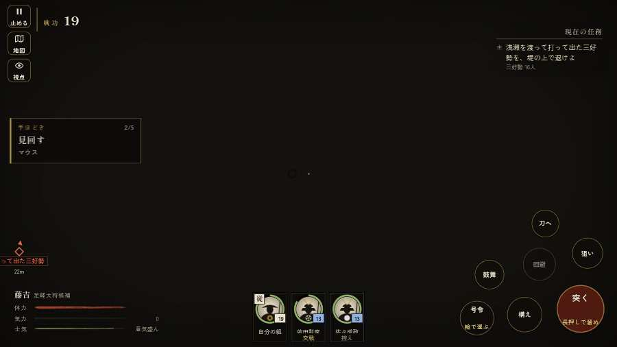

# テストプレイヤーの感想：せっかちな社会人

- 人：ユウキ（35歳・昼休みに遊ぶ会社員）（814番）
- 変わり目：連打・パソコン 1280×720・新しく始める通し・速い・身分 少し上・問屋:買わない・一人称・感度 ふつう・途中で止める
- 時：2026/9/29 5:56:08（180秒かかった）
- 画面：パソコン 1280×720・鍵盤とマウス・画質 中
- 遊んだ戦：野田・福島の戦い（失敗・倒れた）
- 機械の混み具合：5（load average）

## ひとこと

> 昼休みに3分ほど。野田・福島。字が枠から切れている。待ってられない。戦が始まるまでの読み込みが長い。正直、飛ばしたい。HUD の札どうしが重なって読めない。正直、飛ばしたい。読み込みも18秒待たされた。結局、何分遊べば一区切りなのかが分からない。

## 見つけた問題（7件・困った順）

### 1. 字が枠から切れている
- どこで：野田・福島の戦い・開戦
- 何が：#h-units > .uc.ally > .nm「前田利家」／#h-units > .uc.ally > .nm「佐々成政」
- どれくらい困ったか：★★ かなり困った（74回）
- 直し方の目安：枠を広げるか、字を折り返す
- 画面：（その戦の山場の一枚）

### 2. HUD の札どうしが重なって読めない
- どこで：野田・福島の戦い・30秒・carry
- 何が：#subtitle と #h-units（1280×720）／#choice と #bark（1280×720）
- どれくらい困ったか：★★ かなり困った（24回）
- 直し方の目安：置き場所をずらすか、片方を出している間はもう片方を隠す
- 画面：（その戦の山場の一枚）

### 3. 同じ知らせが20秒に4回以上
- どこで：野田・福島の戦い・159秒・sally
- 何が：「備の兵が退いていく！」（台詞）
- どれくらい困ったか：★★ かなり困った（3回）
- 直し方の目安：一度出したら、しばらく同じ物を出さない
- 画面：（その戦の山場の一枚）

### 4. 戦が始まるまでの読み込みが長い
- どこで：野田・福島の戦い
- 何が：野田・福島の戦い：押してから 18.1秒（機械が混んでいる時の値）
- どれくらい困ったか：★★ かなり困った（1回）
- 直し方の目安：読み込みの間に、戦の心得を読ませる／重い物を後から足す
- 画面：（その戦の山場の一枚）

### 5. 戦の前の説明が長い
- どこで：野田・福島の戦い
- 何が：野田・福島の戦い：294字（読むのに1分かかる）
- どれくらい困ったか：★ 少し気になった（1回）
- 直し方の目安：三行ほどに縮め、残りは「くわしく」に畳む
- 画面：（その戦の山場の一枚）

### 6. 倒れて戦が終わった
- どこで：野田・福島の戦い・183秒・sally
- 何が：183秒で倒れた（受けた傷：足軽 118）
- どれくらい困ったか：★ 少し気になった（1回）
- 直し方の目安：初めの戦は受ける傷を減らす・危ない時に字幕で構えを教える
- 画面：（その戦の山場の一枚）

### 7. 指の端末なのに、鍵盤・マウスの案内が出ている
- どこで：野田・福島の戦い・183秒・sally
- 何が：戦のあとの画面に「と演出を飛ばします ・ Enter で「城下へ戻る」 ・」
- どれくらい困ったか：★ 少し気になった（1回）
- 直し方の目安：isTouch の時は「画面を押す」などの言い方にする
- 画面：（その戦の山場の一枚）

## 遊んだ記録

- 野田・福島の戦い：183秒・任務失敗（倒れた）・戦功33・組0/20・討ち取り24・突き0/当たり66・号令4回・指で押した数3・読み込み18.1秒・戦の前の札294字・1コマ21.8ms（実時間119秒・内訳 brain 0.0・pad 0.0・tf 0.0・upd 0.0・eye 0.1）
  - 任務の流れ：0s 前田利家のもとで、下知を待て → 15s 竹束を堤の上へ運んで据えよ（3つ） → 41s 竹束を堤の上へ運んで据えよ（3つ）〔済〕 → 51s 浅瀬を渡って打って出た三好勢を、堤の上で退けよ → 104s 浅瀬を渡って打って出た三好勢を、堤の上で退けよ／中洲の三好の鉄砲衆を崩せ
  - 受けた傷：足軽 118
  - 開戦：
  - 山場：
  - 勝ち負けが決まった所：
