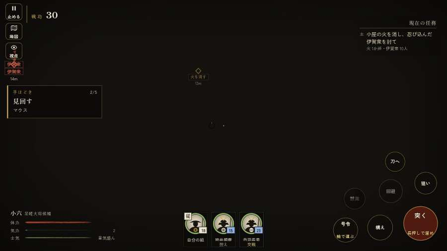

# テストプレイヤーの感想：はじめての中学生

- 人：ハルト（13歳・中学一年）（815番）
- 変わり目：連打・パソコン 1280×720・新しく始める通し・ゆっくり・身分 上・問屋:鉄砲・三人称・感度 敏感・途中で止める
- 時：2026/9/29 5:59:11（277秒かかった）
- 画面：パソコン 1280×720・鍵盤とマウス・画質 中
- 遊んだ戦：天正伊賀の乱・比自山城（失敗・倒れた）、鳥取城の戦い（失敗・倒れた）
- 機械の混み具合：5（load average）

## ひとこと

> えっと、遊んでみた。天正伊賀の乱・比自山城と鳥取城をやった。よく分かんないまま終わった。2回すぐ死んだ…。「字が枠から切れている」のとこ、だるい。「HUD の札どうしが重なって読めない」のとこ、だるい。「前へ進もうとしても進めない所があった」のとこ、ふつうに困った。ぶっちゃけ、ここで一回やめかけた。問屋で「鉄砲足軽雇い賃 12貫」買ってみた。

## 見つけた問題（11件・困った順）

### 1. 字が枠から切れている
- どこで：天正伊賀の乱・比自山城・開戦
- 何が：#h-units > .uc.ally > .nm「丹羽長秀」／#h-units > .uc.ally > .nm「筒井順慶」
- どれくらい困ったか：★★★ やめたくなった（162回）
- 直し方の目安：枠を広げるか、字を折り返す
- 画面：（その戦の山場の一枚）

### 2. HUD の札どうしが重なって読めない
- どこで：天正伊賀の乱・比自山城・25秒・raid
- 何が：#subtitle と #h-units（1280×720）／#choice と #flash（1280×720）
- どれくらい困ったか：★★★ やめたくなった（28回）
- 直し方の目安：置き場所をずらすか、片方を出している間はもう片方を隠す

### 3. 戦場が札に食われている（画面の3分の1超）
- どこで：天正伊賀の乱・比自山城・125秒・raid
- 何が：1280×720 で 34%／1280×720 で 35%
- どれくらい困ったか：★★★ やめたくなった（3回）
- 直し方の目安：札を小さくするか、平時は薄く・畳む

### 4. 字が小さい（11px 未満）
- どこで：鳥取城の戦いの前・問屋
- 何が：g > g > text：5.6px「問」／g > g > text：5.6px「屋」
- どれくらい困ったか：★★★ やめたくなった（3回）
- 直し方の目安：11px 以上にする（飾りの字なら外す）
- 画面：（その戦の山場の一枚）

### 5. 前へ進もうとしても進めない所があった
- どこで：天正伊賀の乱・比自山城・95秒・raid
- 何が：(-10, 53)・段 raid
- どれくらい困ったか：★★ かなり困った（1回）
- 直し方の目安：当たり（柵・建物・地形）と道のつながりを見直す
- 画面：

### 6. 前へ進もうとしても進めない所があった
- どこで：天正伊賀の乱・比自山城・112秒・raid
- 何が：(-10, 57)・段 raid
- どれくらい困ったか：★★ かなり困った（1回）
- 直し方の目安：当たり（柵・建物・地形）と道のつながりを見直す
- 画面：（その戦の山場の一枚）

### 7. 指の端末なのに、鍵盤・マウスの案内が出ている
- どこで：天正伊賀の乱・比自山城・194秒・raid
- 何が：戦のあとの画面に「と演出を飛ばします ・ Enter で「城下へ戻る」 ・」
- どれくらい困ったか：★ 少し気になった（2回）
- 直し方の目安：isTouch の時は「画面を押す」などの言い方にする
- 画面：（その戦の山場の一枚）

### 8. すぐに倒れてしまった
- どこで：天正伊賀の乱・比自山城・194秒・raid
- 何が：194秒で倒れた（受けた傷：足軽 120・侍 12）
- どれくらい困ったか：★ 少し気になった（1回）
- 直し方の目安：初めの戦は受ける傷を減らす・危ない時に字幕で構えを教える
- 画面：（その戦の山場の一枚）

### 9. 指の端末なのに、問屋の説明が鍵盤の言い方
- どこで：鳥取城の戦いの前・城下
- 何が：「具足・打刀 施設は数字キー 1〜9、または」
- どれくらい困ったか：★ 少し気になった（1回）
- 直し方の目安：isTouch の時は「持替の丸で」などの言い方に
- 画面：（その戦の山場の一枚）

### 10. すぐに倒れてしまった
- どこで：鳥取城の戦い・435秒・sortie
- 何が：435秒で倒れた（受けた傷：足軽 309・侍 27・鉄砲 3）
- どれくらい困ったか：★ 少し気になった（1回）
- 直し方の目安：初めの戦は受ける傷を減らす・危ない時に字幕で構えを教える
- 画面：（その戦の山場の一枚）

### 11. 字と背景の明暗の比が低い（3 未満）
- どこで：鳥取城の戦い・310秒・boats
- 何が：#obj-list > .done.main > .tag：1.3「主」
- どれくらい困ったか：★ 少し気になった（1回）
- 直し方の目安：字を明るく、または背景を暗く

## 遊んだ記録

- 天正伊賀の乱・比自山城：194秒・任務失敗（倒れた）・戦功62・組17/20・討ち取り13・突き0/当たり33・号令5回・指で押した数3・読み込み13.6秒・戦の前の札286字・1コマ12.9ms（実時間81秒・内訳 brain 0.0・pad 0.0・tf 0.0・upd 0.0・eye 0.1）
  - 任務の流れ：0s 陣の見張りにつけ → 16s 小屋の火を消し、忍び込んだ伊賀衆を討て → 116s 夜討ちから陣を守りぬけ → 142s 夜討ちから陣を守りぬけ／筒井殿の陣に斬り込んだ伊賀衆を崩せ
  - 受けた傷：足軽 120・侍 12
  - 開戦：
  - 山場：
- 鳥取城の戦い：435秒・任務失敗（倒れた）・戦功103・組0/20・討ち取り68・突き0/当たり167・号令5回・指で押した数12・読み込み0.6秒・戦の前の札307字・1コマ13.1ms（実時間118秒・内訳 brain 0.0・pad 0.0・tf 0.0・upd 0.0・eye 0.1）
  - 任務の流れ：0s 羽柴秀吉のもとで、下知を待て → 15s 舟の番を退け、岸の兵糧舟に火をかけよ（2艘） → 71s 兵糧を一粒も城へ入れるな → 97s 兵糧を一粒も城へ入れるな／川岸に踏みとどまり、舟の衆を岸へ上げるな → 237s 兵糧を一粒も城へ入れるな／舟の衆の本手を崩せ → 307s 兵糧を一粒も城へ入れるな／舟の衆の本手を崩せ〔済〕 → 311s 兵糧を一粒も城へ入れるな → 315s 柵の前で、打って出た城兵を止めよ
  - 受けた傷：足軽 309・侍 27・鉄砲 3
