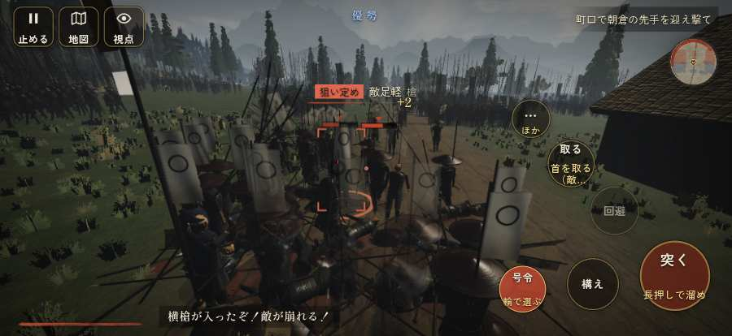

# テストプレイヤーの感想：指揮好きの戦略家

- 人：ケイコ（45歳・将棋と戦略ゲーム好き）（993番）
- 変わり目：連打・iPhone 横 874×402・織田家編の戦を一つ・ふつう・身分 少し上・問屋:買わない・一人称・感度 敏感・途中で止める
- 時：2026/9/29 13:03:37（115秒かかった）
- 画面：iPhone の横向き 874×402・倍率3・指で触る操作（touch.js の釦・棒・なぞり）・画質 低
- 遊んだ戦：志賀の陣・宇佐山城（失敗・倒れた）
- 機械の混み具合：5（load average）

## ひとこと

> 志賀の陣・宇佐山城で、号令を36回かけました。戦う兵が遠景の大軍（影の兵）の中に埋もれている。采配の上で、これは痛い。「鼓舞」をしたいのに、押す丸が出ていない。指揮官としてはもどかしい。「狙い」をしたいのに、押す丸が出ていない。采配の上で、これは痛い。采配で負けたのか、操作で負けたのか分からないのが一番困ります。

## 見つけた問題（7件・困った順）

### 1. 戦う兵が遠景の大軍（影の兵）の中に埋もれている
- どこで：志賀の陣・宇佐山城・31秒・first
- 何が：敵の兵 15人が、遠景の大軍 #3（中心 20,-46・260人）の中（19, -42）／敵の兵 5人が、遠景の大軍 #3（中心 20,-37・260人）の中（19, -37）
- どれくらい困ったか：★★★ やめたくなった（32回）
- 直し方の目安：遠景の大軍を戦う場所から離す（addDistantArmy の x,z,w,d を見直す）か、兵の行き先を大軍の外にする
- 画面：（その戦の山場の一枚）

### 2. 行き先があるのに20秒動かない兵
- どこで：志賀の陣・宇佐山城・231秒・first
- 何が：味方の足軽：味方の足軽（号令：attack）at (-44,7)／味方の足軽：味方の足軽（号令：attack）at (-42,8)
- どれくらい困ったか：★★ かなり困った（5回）
- 直し方の目安：道が塞がれていないか、行き先に着いたと見なせているかを見る
- 画面：（その戦の山場の一枚）

### 3. 「鼓舞」をしたいのに、押す丸が出ていない
- どこで：志賀の陣・宇佐山城・3秒・brief
- 何が：欲しかった時：志賀の陣・宇佐山城・3秒・brief
- どれくらい困ったか：★ 少し気になった（25回）
- 直し方の目安：その時に使える釦は出す（touchFrame の出し入れ）
- 画面：（その戦の山場の一枚）

### 4. 同じ知らせが20秒に4回以上
- どこで：志賀の陣・宇佐山城・73秒・first
- 何が：「備の兵が崩れて退くぞ！」（台詞）／「お頭、お先に…」（台詞）
- どれくらい困ったか：★ 少し気になった（6回）
- 直し方の目安：一度出したら、しばらく同じ物を出さない
- 画面：（その戦の山場の一枚）

### 5. HUD の札どうしが重なって読めない
- どこで：志賀の陣・宇佐山城・25秒・first
- 何が：#flash と #cmdpanel（874×402）／#choice と #flash（874×402）
- どれくらい困ったか：★ 少し気になった（2回）
- 直し方の目安：置き場所をずらすか、片方を出している間はもう片方を隠す
- 画面：（その戦の山場の一枚）

### 6. 「狙い」をしたいのに、押す丸が出ていない
- どこで：志賀の陣・宇佐山城・130秒・first
- 何が：欲しかった時：志賀の陣・宇佐山城・130秒・first
- どれくらい困ったか：★ 少し気になった（1回）
- 直し方の目安：その時に使える釦は出す（touchFrame の出し入れ）
- 画面：（その戦の山場の一枚）

### 7. 倒れて戦が終わった
- どこで：志賀の陣・宇佐山城・269秒・first
- 何が：269秒で倒れた（受けた傷：足軽 413・侍 24・弓 3）
- どれくらい困ったか：★ 少し気になった（1回）
- 直し方の目安：初めの戦は受ける傷を減らす・危ない時に字幕で構えを教える
- 画面：（その戦の山場の一枚）

## 遊んだ記録

- 志賀の陣・宇佐山城：269秒・任務失敗（倒れた）・戦功89・組0/20・討ち取り62・突き2929/当たり137・号令36回・指で押した数3211・読み込み3.5秒・戦の前の札182字・1コマ12.6ms（実時間89秒・内訳 brain 0.0・pad 0.8・tf 1.3・upd 10.4・eye 0.1）
  - 任務の流れ：0s 森可成のもとで、坂本の町口を固めよ → 16s 町口で朝倉の先手を迎え撃て → 99s 町口で朝倉の先手を迎え撃て／山裾を回る浅井の手を止めよ → 249s 町口で朝倉の先手を迎え撃て／山裾を回る浅井の手を止めよ〔済〕 → 253s 町口で朝倉の先手を迎え撃て
  - 受けた傷：足軽 413・侍 24・弓 3
  - 開戦：
  - 山場：
  - 勝ち負けが決まった所：
