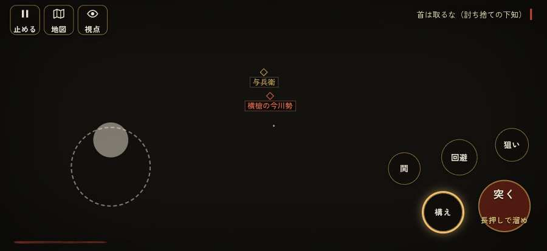

# テストプレイヤーの感想：指揮好きの戦略家

- 人：ケイコ（45歳・将棋と戦略ゲーム好き）（1008番）
- 変わり目：迷子になりやすい・iPhone 横 874×402・織田家編の戦を一つ・ふつう・足軽から・問屋:鉄砲・一人称・感度 ふつう・止めない
- 時：2026/9/29 13:19:32（141秒かかった）
- 画面：iPhone の横向き 874×402・倍率3・指で触る操作（touch.js の釦・棒・なぞり）・画質 低
- 遊んだ戦：桶狭間の戦い（失敗・倒れた）
- 機械の混み具合：5（load average）

## ひとこと

> 桶狭間で、号令を0回かけました。前へ進もうとしても進めない所があった。指揮官としてはもどかしい。戦う兵が遠景の大軍（影の兵）の中に埋もれている。指揮官としてはもどかしい。倒れて戦が終わった。采配の上で、これは痛い。采配で負けたのか、操作で負けたのか分からないのが一番困ります。

## 見つけた問題（6件・困った順）

### 1. 戦う兵が遠景の大軍（影の兵）の中に埋もれている
- どこで：桶狭間の戦い・126秒・assault
- 何が：味方の兵 19人が、遠景の大軍 #10（中心 1,-81・36人）の中（3, -86）／味方の兵 12人が、遠景の大軍 #10（中心 1,-84・36人）の中（0, -88）
- どれくらい困ったか：★★ かなり困った（22回）
- 直し方の目安：遠景の大軍を戦う場所から離す（addDistantArmy の x,z,w,d を見直す）か、兵の行き先を大軍の外にする
- 画面：（その戦の山場の一枚）

### 2. 自分が遠景の大軍（影の兵）の中に立っている
- どこで：桶狭間の戦い・46秒・march
- 何が：味方の兵 1人が、遠景の大軍 #11（中心 7,136・36人）の中（5, 137）／味方の兵 1人が、遠景の大軍 #7（中心 -70,45・160人）の中（-55, 41）
- どれくらい困ったか：★★ かなり困った（5回）
- 直し方の目安：遠景の大軍を戦う場所から離す（addDistantArmy の x,z,w,d を見直す）か、兵の行き先を大軍の外にする
- 画面：（その戦の山場の一枚）

### 3. 行き先があるのに20秒動かない兵
- どこで：桶狭間の戦い・355秒・assault
- 何が：味方の足軽：味方の足軽（号令：attack）at (-27,-102)／味方の足軽：味方の足軽（号令：attack）at (-28,-93)
- どれくらい困ったか：★★ かなり困った（4回）
- 直し方の目安：道が塞がれていないか、行き先に着いたと見なせているかを見る
- 画面：（その戦の山場の一枚）

### 4. 前へ進もうとしても進めない所があった
- どこで：桶狭間の戦い・193秒・assault
- 何が：(-9, 169)・段 assault
- どれくらい困ったか：★★ かなり困った（1回）
- 直し方の目安：当たり（柵・建物・地形）と道のつながりを見直す
- 画面：

### 5. 倒れて戦が終わった
- どこで：桶狭間の戦い・479秒・assault
- 何が：479秒で倒れた（受けた傷：足軽 310・侍 67・弓 3）
- どれくらい困ったか：★ 少し気になった（1回）
- 直し方の目安：初めの戦は受ける傷を減らす・危ない時に字幕で構えを教える
- 画面：（その戦の山場の一枚）

### 6. この戦では号令できる組が無い（指揮する所が無い）
- どこで：桶狭間の戦い・479秒・assault
- 何が：桶狭間の戦い
- どれくらい困ったか：★ 少し気になった（1回）
- 画面：（その戦の山場の一枚）

## 遊んだ記録

- 桶狭間の戦い：479秒・任務失敗（倒れた）・戦功66・組—・討ち取り3・突き93/当たり19・号令0回・指で押した数140・読み込み1.7秒・戦の前の札165字・1コマ5.5ms（実時間94秒・内訳 brain 0.0・pad 0.1・tf 0.1・upd 5.2・eye 0.1）
  - 任務の流れ：0s 組頭の源八と話せ → 1s 組頭の源八と話せ〔済〕 → 4s （任務なし） → 111s 坂の下の今川の先手を突き崩せ → 141s 坂の下の今川の先手を突き崩せ〔済〕 → 153s 坂の下の今川の先手を突き崩せ〔済〕／畦の今川足軽組を押し崩せ（味方の組と並んで） → 245s 坂の下の今川の先手を突き崩せ〔済〕／畦の今川足軽組を押し崩せ（味方の組と並んで）〔済〕 → 263s 坂の下の今川の先手を突き崩せ〔済〕／林の今川の鉄砲組を潰せ（込め直しの間に寄れ） → 348s 坂の下の今川の先手を突き崩せ〔済〕／林の今川の鉄砲組を潰せ（込め直しの間に寄れ）〔済〕 → 368s 与兵衛の組を助け、横槍の今川勢を崩せ／林の今川の鉄砲組を潰せ（込め直しの間に寄れ）〔済〕 → 440s 本陣の前を固める備えを崩せ（槍衾。味方の組と横から突け）／林の今川の鉄砲組を潰せ（込め直しの間に寄れ）〔済〕
  - 受けた傷：足軽 310・侍 67・弓 3
  - 開戦：
  - 山場：
