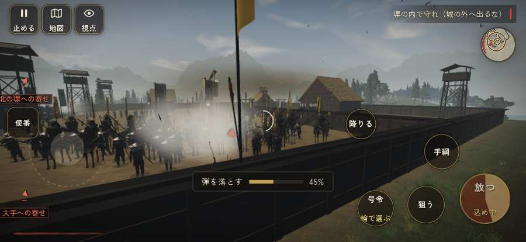

# テストプレイヤーの感想：はじめての中学生

- 人：ハルト（13歳・中学一年）（1205番）
- 変わり目：迷子になりやすい・iPhone 横 874×402・信長で出陣・速い・足軽から・問屋:供・三人称・感度 敏感・途中で止める
- 時：2026/9/29 19:02:44（234秒かかった）
- 画面：iPhone の横向き 874×402・倍率3・指で触る操作（touch.js の釦・棒・なぞり）・画質 低
- 遊んだ戦：長篠城籠城（信長で出陣）（達成）
- 機械の混み具合：6（load average）

## ひとこと

> 友だちにすすめられて、やってみた。長篠城籠城（信長で出陣）をやった。1回はなんかクリアできた。「「鼓舞」をしたいのに、押す丸が出ていない」のとこ、だるい。「「狙い」をしたいのに、押す丸が出ていない」のとこ、ムリ。「前へ進もうとしても進めない所があった」のとこ、マジで意味わかんない。槍でつくのはちょっと楽しい。

## 見つけた問題（5件・困った順）

### 1. 前へ進もうとしても進めない所があった
- どこで：長篠城籠城（信長で出陣）・33秒・w1
- 何が：(-37, -6)・段 w1
- どれくらい困ったか：★★ かなり困った（4回）
- 直し方の目安：当たり（柵・建物・地形）と道のつながりを見直す
- 画面：

### 2. 次に何をすればいいか分からない時間が続いた
- どこで：長篠城籠城（信長で出陣）・262秒・sune
- 何が：262秒ごろ、段「sune」。任務「長篠城を守り抜け（本丸の館を守る）」のまま30秒、印は70m先、近くに敵もいない
- どれくらい困ったか：★★ かなり困った（1回）
- 直し方の目安：印を近くに出す・台詞で次の行き先を言う・進み具合を見せる
- 画面：

### 3. この戦のあいだ、迷っていた時間が長い
- どこで：長篠城籠城（信長で出陣）・459秒・end
- 何が：長篠城籠城（信長で出陣）：合わせて74秒
- どれくらい困ったか：★★ かなり困った（1回）
- 直し方の目安：最初の任務の印を近くに・大きく。長い説明は戦の中で一つずつ
- 画面：（その戦の山場の一枚）

### 4. 「鼓舞」をしたいのに、押す丸が出ていない
- どこで：長篠城籠城（信長で出陣）・17秒・w1
- 何が：欲しかった時：長篠城籠城（信長で出陣）・17秒・w1
- どれくらい困ったか：★ 少し気になった（33回）
- 直し方の目安：その時に使える釦は出す（touchFrame の出し入れ）
- 画面：（その戦の山場の一枚）

### 5. 「狙い」をしたいのに、押す丸が出ていない
- どこで：長篠城籠城（信長で出陣）・25秒・w1
- 何が：欲しかった時：長篠城籠城（信長で出陣）・25秒・w1
- どれくらい困ったか：★ 少し気になった（25回）
- 直し方の目安：その時に使える釦は出す（touchFrame の出し入れ）
- 画面：（その戦の山場の一枚）

## 遊んだ記録

- 長篠城籠城（信長で出陣）：459秒・任務達成・戦功160・組89/100・討ち取り1・突き1205/当たり1・号令0回・指で押した数1243・読み込み2.1秒・戦の前の札120字・1コマ14.7ms（実時間175秒・内訳 brain 0.1・pad 0.3・tf 0.3・upd 13.8・eye 0.1）
  - 任務の流れ：0s 長篠城を守り抜け（本丸の館を守る） → 330s 後詰の旗が見えるまで持ちこたえよ → 448s 後詰の旗が見えるまで持ちこたえよ〔済〕
  - 味方の隊：隊10・動いた計1087m・味方の討ち取り87・敵を前に20秒止まった44回・本物の味方5人未満0秒
  - 開戦：
