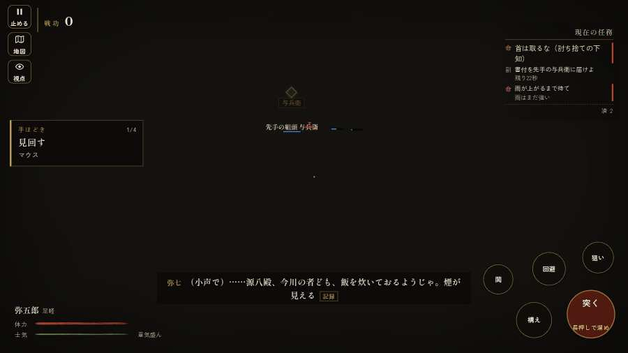

# テストプレイヤーの感想：歴史好きの大人

- 人：ミチオ（62歳・郷土史の会）（1216番）
- 変わり目：台詞を全部読む・パソコン 1280×720・新しく始める通し・速い・足軽から・問屋:馬・三人称・感度 鈍い・止めない
- 時：2026/9/29 18:59:45（312秒かかった）
- 画面：パソコン 1280×720・鍵盤とマウス・画質 中
- 遊んだ戦：桶狭間の戦い（途中で打ち切り）（達成）
- 機械の混み具合：3（load average）

## ひとこと

> 桶狭間（途中で打ち切り）を、一人称で歩いて見て回りました。務めは果たせましたが、気になる所がいくつか。前へ進もうとしても進めない所があった。細かい事ですが、こういう所で嘘っぽくなる。名のある武将なのに、顔も装束も並の侍と同じ。これでは興が醒めます。戦う兵が遠景の大軍（影の兵）の中に埋もれている。史実を知る者としては、ここは看過できません。

## 見つけた問題（5件・困った順）

### 1. 戦う兵が遠景の大軍（影の兵）の中に埋もれている
- どこで：桶狭間の戦い・191秒・assault
- 何が：味方・敵の兵 14人が、遠景の大軍 #22（中心 8,-121・160人）の中（6, -118）／敵の兵 6人が、遠景の大軍 #17（中心 -3,-115・76人）の中（-2, -111）
- どれくらい困ったか：★★ かなり困った（2回）
- 直し方の目安：遠景の大軍を戦う場所から離す（addDistantArmy の x,z,w,d を見直す）か、兵の行き先を大軍の外にする
- 画面：（その戦の山場の一枚）

### 2. 前へ進もうとしても進めない所があった
- どこで：桶狭間の戦い・164秒・assault
- 何が：(1, -104)・段 assault
- どれくらい困ったか：★★ かなり困った（1回）
- 直し方の目安：当たり（柵・建物・地形）と道のつながりを見直す
- 画面：（その戦の山場の一枚）

### 3. 前へ進もうとしても進めない所があった
- どこで：桶狭間の戦い・360秒・assault
- 何が：(15, -124)・段 assault
- どれくらい困ったか：★★ かなり困った（1回）
- 直し方の目安：当たり（柵・建物・地形）と道のつながりを見直す
- 画面：（その戦の山場の一枚）

### 4. 前へ進もうとしても進めない所があった
- どこで：桶狭間の戦い・372秒・assault
- 何が：(12, -124)・段 assault
- どれくらい困ったか：★★ かなり困った（1回）
- 直し方の目安：当たり（柵・建物・地形）と道のつながりを見直す
- 画面：（その戦の山場の一枚）

### 5. 名のある武将なのに、顔も装束も並の侍と同じ
- どこで：桶狭間の戦い・380秒・assault
- 何が：蒲原氏徳（敵）
- どれくらい困ったか：★ 少し気になった（3回）
- 直し方の目安：units.js の GENERALS に顔・甲冑・兜を足す
- 画面：（その戦の山場の一枚）

## 遊んだ記録

- 桶狭間の戦い（途中で打ち切り）：395秒・任務達成・戦功270・組—・討ち取り41・突き0/当たり119・号令0回・指で押した数1・読み込み1.9秒・戦の前の札245字・1コマ25.8ms（実時間239秒・内訳 brain 0.0・pad 0.0・tf 0.0・upd 0.0・eye 0.2）
  - 任務の流れ：0s 組頭の源八と話せ → 1s 組頭の源八と話せ〔済〕 → 4s （任務なし） → 100s 坂の下の今川の先手を突き崩せ → 114s 坂の下の今川の先手を突き崩せ〔済〕 → 126s 坂の下の今川の先手を突き崩せ〔済〕／畦の今川足軽組を押し崩せ（味方の組と並んで） → 200s 坂の下の今川の先手を突き崩せ〔済〕／畦の今川足軽組を押し崩せ（味方の組と並んで）〔済〕 → 218s 坂の下の今川の先手を突き崩せ〔済〕／林の今川の鉄砲組を潰せ（込め直しの間に寄れ） → 238s 坂の下の今川の先手を突き崩せ〔済〕／林の今川の鉄砲組を潰せ（込め直しの間に寄れ）〔済〕 → 258s 与兵衛の組を助け、横槍の今川勢を崩せ／林の今川の鉄砲組を潰せ（込め直しの間に寄れ）〔済〕 → 267s 本陣の前備えを横から突き崩せ／林の今川の鉄砲組を潰せ（込め直しの間に寄れ）〔済〕 → 278s 本陣の前備えを横から突き崩せ〔済〕／林の今川の鉄砲組を潰せ（込め直しの間に寄れ）〔済〕 → 283s 本陣の前備えを横から突き崩せ〔済〕／林の今川の鉄砲組を潰せ（込め直しの間に寄れ）〔済〕／旗本を崩し、味方を義元へ通せ〔済〕 → 293s 引き返す今川勢から本陣の跡を守れ／林の今川の鉄砲組を潰せ（込め直しの間に寄れ）〔済〕／旗本を崩し、味方を義元へ通せ〔済〕
  - 味方の隊：隊46・動いた計6208m・味方の討ち取り158・敵を前に20秒止まった28回・本物の味方5人未満0秒
  - 受けた傷：足軽 8・侍 4
  - 開戦：
  - 一人称で見回す（45秒）：
  - 山場：
