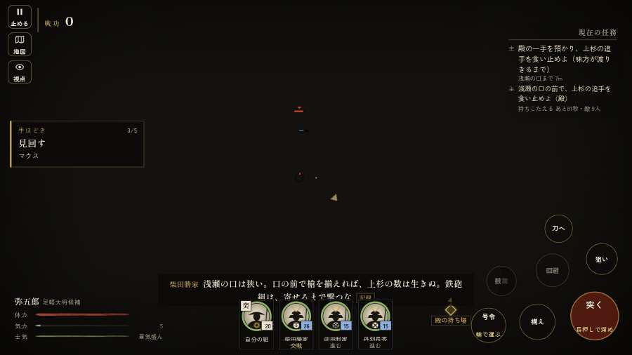

# テストプレイヤーの感想：はじめての中学生

- 人：ハルト（13歳・中学一年）（1395番）
- 変わり目：走りっぱなし・パソコン 1280×720・織田家編の戦を一つ・速い・身分 中ほど・問屋:買わない・三人称・感度 ふつう・止めない
- 時：2026/9/29 23:18:01（305秒かかった）
- 画面：パソコン 1280×720・鍵盤とマウス・画質 中
- 遊んだ戦：手取川の戦い（失敗・倒れた）
- 機械の混み具合：4（load average）

## ひとこと

> 友だちにすすめられて、やってみた。手取川をやった。よく分かんないまま終わった。1回すぐ死んだ…。「字が枠から切れている」のとこ、ムリ。「HUD の札どうしが重なって読めない」のとこ、ふつうに困った。「戦場が札に食われている」のとこ、マジで意味わかんない。ぶっちゃけ、ここで一回やめかけた。

## 見つけた問題（7件・困った順）

### 1. 字が枠から切れている
- どこで：手取川の戦い・開戦
- 何が：#h-units > .uc.ally > .nm「柴田勝家」／#h-units > .uc.ally > .nm「前田利家」
- どれくらい困ったか：★★★ やめたくなった（339回）
- 直し方の目安：枠を広げるか、字を折り返す
- 画面：（その戦の山場の一枚）

### 2. HUD の札どうしが重なって読めない
- どこで：手取川の戦い・55秒・rear
- 何が：#subtitle と #h-units（1280×720）／#choice と #bark（1280×720）
- どれくらい困ったか：★★★ やめたくなった（43回）
- 直し方の目安：置き場所をずらすか、片方を出している間はもう片方を隠す
- 画面：（その戦の山場の一枚）

### 3. 戦場が札に食われている（画面の3分の1超）
- どこで：手取川の戦い・155秒・rear
- 何が：1280×720 で 42%／1280×720 で 39%
- どれくらい困ったか：★★★ やめたくなった（5回）
- 直し方の目安：札を小さくするか、平時は薄く・畳む
- 画面：（その戦の山場の一枚）

### 4. 同じ知らせが20秒に4回以上
- どこで：手取川の戦い・307秒・rear
- 何が：「備の兵が退いた！」（台詞）
- どれくらい困ったか：★★★ やめたくなった（4回）
- 直し方の目安：一度出したら、しばらく同じ物を出さない
- 画面：（その戦の山場の一枚）

### 5. 字と背景の明暗の比が低い（3 未満）
- どこで：手取川の戦い・155秒・rear
- 何が：#obj-list > .done.main > .tag：1.3「主」
- どれくらい困ったか：★★★ やめたくなった（3回）
- 直し方の目安：字を明るく、または背景を暗く
- 画面：（その戦の山場の一枚）

### 6. すぐに倒れてしまった
- どこで：手取川の戦い・556秒・cross
- 何が：556秒で倒れた（受けた傷：騎馬 69・足軽 61・鉄砲 46・侍 6）
- どれくらい困ったか：★ 少し気になった（1回）
- 直し方の目安：初めの戦は受ける傷を減らす・危ない時に字幕で構えを教える
- 画面：（その戦の山場の一枚）

### 7. 指の端末なのに、鍵盤・マウスの案内が出ている
- どこで：手取川の戦い・556秒・cross
- 何が：戦のあとの画面に「と演出を飛ばします ・ Enter で「城下へ戻る」 ・」
- どれくらい困ったか：★ 少し気になった（1回）
- 直し方の目安：isTouch の時は「画面を押す」などの言い方にする
- 画面：（その戦の山場の一枚）

## 遊んだ記録

- 手取川の戦い：556秒・任務失敗（倒れた）・戦功176・組14/20・討ち取り14・突き0/当たり48・号令7回・指で押した数3・読み込み18.7秒・戦の前の札285字・1コマ17ms（実時間241秒・内訳 brain 0.0・pad 0.0・tf 0.0・upd 0.0・eye 0.2）
  - 任務の流れ：0s 柴田勝家の手で足軽の一手を預かり、下知を待て → 18s 北の岸の浅瀬の口まで退け → 54s 殿の一手を預かり、上杉の追手を食い止めよ（味方が渡りきるまで）／浅瀬の口の前で、上杉の追手を食い止めよ（殿） → 152s 殿の一手を預かり、上杉の追手を食い止めよ（味方が渡りきるまで）／浅瀬の口の前で、上杉の追手を食い止めよ（殿）〔済〕 → 171s 殿の一手を預かり、上杉の追手を食い止めよ（味方が渡りきるまで）／丹羽殿の手の横を突く上杉の別手を崩せ → 220s 殿の一手を預かり、上杉の追手を食い止めよ（味方が渡りきるまで）／丹羽殿の手の横を突く上杉の別手を崩せ〔済〕 → 224s 殿の一手を預かり、上杉の追手を食い止めよ（味方が渡りきるまで） → 250s 殿の一手を預かり、上杉の追手を食い止めよ（味方が渡りきるまで）／上杉の総掛かりを押し返せ（押し返したら退く） → 350s 増えた手取川を渡り、南の岸へ／上杉の総掛かりを押し返せ（押し返したら退く）〔済〕 → 381s 南の岸を守り、手取川を渡りきれ／上杉の総掛かりを押し返せ（押し返したら退く）〔済〕 → 384s 南の岸を守り、手取川を渡りきれ → 411s 南の岸を守り、手取川を渡りきれ／川の中で、取り残された組を囲む上杉勢を崩せ → 469s 南の岸を守り、手取川を渡りきれ／南の岸で、川を渡ってくる上杉勢を叩け
  - 味方の隊：隊65・動いた計23296m・味方の討ち取り231・敵を前に20秒止まった4回・本物の味方5人未満0秒
  - 受けた傷：騎馬 69・足軽 61・鉄砲 46・侍 6
  - 開戦：
  - 山場：
  - 勝ち負けが決まった所：
