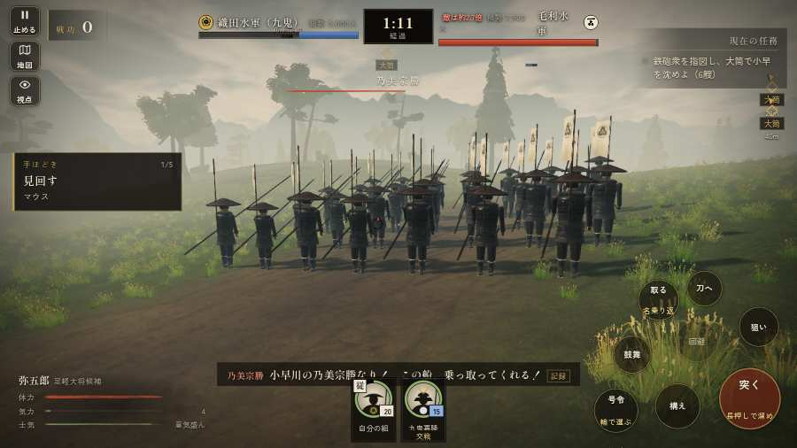

# テストプレイヤーの感想：せっかちな社会人

- 人：ユウキ（35歳・昼休みに遊ぶ会社員）（1814番）
- 変わり目：迷子になりやすい・パソコン 1280×720・新しく始める通し・速い・身分 上・問屋:買わない・一人称・感度 鈍い・止めない
- 時：2026/9/30 8:55:15（133秒かかった）
- 画面：パソコン 1280×720・鍵盤とマウス・画質 高
- 遊んだ戦：第二次木津川口の戦い（失敗・倒れた）
- 機械の混み具合：5（load average）

## ひとこと

> 昼休みに5分ほど。第二次木津川口。城下から出陣できなかった。待ってられない。字が枠から切れている。正直、飛ばしたい。戦が始まるまでの読み込みが長い。ここで閉じる人は多いと思う。読み込みも18秒待たされた。結局、何分遊べば一区切りなのかが分からない。

## 見つけた問題（11件・困った順）

### 1. 城下から出陣できなかった
- どこで：三木城・大村の合戦の前・城下
- 何が：「出陣」の釦が見つからない・押しても戦の前の札が出ない
- どれくらい困ったか：★★★ やめたくなった（1回）
- 画面：（その戦の山場の一枚）

### 2. 字が枠から切れている
- どこで：第二次木津川口の戦い・開戦
- 何が：#h-units > .uc.ally > .nm「九鬼嘉隆」／.item > .x > .ty-note「穂の根元の両脇に鎌刃を張り出した」
- どれくらい困ったか：★★ かなり困った（61回）
- 直し方の目安：枠を広げるか、字を折り返す
- 画面：（その戦の山場の一枚）

### 3. HUD の札どうしが重なって読めない
- どこで：第二次木津川口の戦い・145秒・fire
- 何が：#subtitle と #h-units（1280×720）／#choice と #bark（1280×720）
- どれくらい困ったか：★★ かなり困った（9回）
- 直し方の目安：置き場所をずらすか、片方を出している間はもう片方を隠す
- 画面：（その戦の山場の一枚）

### 4. 戦が始まるまでの読み込みが長い
- どこで：第二次木津川口の戦い
- 何が：第二次木津川口の戦い：押してから 17.7秒（機械が混んでいる時の値）
- どれくらい困ったか：★★ かなり困った（1回）
- 直し方の目安：読み込みの間に、戦の心得を読ませる／重い物を後から足す
- 画面：（その戦の山場の一枚）

### 5. 何もする事が無いまま待たされた
- どこで：第二次木津川口の戦い・82秒・cannon
- 何が：68秒、任務札が変わらず敵もいない（段 cannon）
- どれくらい困ったか：★★ かなり困った（1回）
- 直し方の目安：飛ばせる（canSkip）ようにするか、待つ間にする事を置く
- 画面：

### 6. 何もする事が無いまま待たされた
- どこで：第二次木津川口の戦い・174秒・fire
- 何が：60秒、任務札が変わらず敵もいない（段 fire）
- どれくらい困ったか：★★ かなり困った（1回）
- 直し方の目安：飛ばせる（canSkip）ようにするか、待つ間にする事を置く
- 画面：（その戦の山場の一枚）

### 7. 戦の前の説明が長い
- どこで：第二次木津川口の戦い
- 何が：第二次木津川口の戦い：339字（読むのに1分かかる）
- どれくらい困ったか：★ 少し気になった（1回）
- 直し方の目安：三行ほどに縮め、残りは「くわしく」に畳む
- 画面：（その戦の山場の一枚）

### 8. 倒れて戦が終わった
- どこで：第二次木津川口の戦い・290秒・fire
- 何が：290秒で倒れた（受けた傷：足軽 145）
- どれくらい困ったか：★ 少し気になった（1回）
- 直し方の目安：初めの戦は受ける傷を減らす・危ない時に字幕で構えを教える
- 画面：（その戦の山場の一枚）

### 9. 指の端末なのに、鍵盤・マウスの案内が出ている
- どこで：第二次木津川口の戦い・290秒・fire
- 何が：戦のあとの画面に「と演出を飛ばします ・ Enter で「城下へ戻る」 ・」
- どれくらい困ったか：★ 少し気になった（1回）
- 直し方の目安：isTouch の時は「画面を押す」などの言い方にする
- 画面：（その戦の山場の一枚）

### 10. 指の端末なのに、問屋の説明が鍵盤の言い方
- どこで：三木城・大村の合戦の前・城下
- 何が：「道具 火縄銃30貫 数字キー3で持ち替え。右」
- どれくらい困ったか：★ 少し気になった（1回）
- 直し方の目安：isTouch の時は「持替の丸で」などの言い方に
- 画面：（その戦の山場の一枚）

### 11. 問屋に入っても、買える物が一つも無い（銭が足りない？）
- どこで：三木城・大村の合戦の前・城下
- 何が：銭 99999貫
- どれくらい困ったか：★ 少し気になった（1回）
- 直し方の目安：買えない理由（あと何貫）を品ごとに書く
- 画面：（その戦の山場の一枚）

## 遊んだ記録

- 第二次木津川口の戦い：290秒・任務失敗（倒れた）・戦功66・組3/20・討ち取り4・突き0/当たり8・号令2回・指で押した数3・読み込み17.7秒・戦の前の札339字・1コマ8.2ms（実時間72秒・内訳 brain 0.0・pad 0.0・tf 0.0・upd 0.0・eye 0.1）
  - 任務の流れ：0s 九鬼嘉隆の船で鉄砲衆の一手を預かり、下知を待て → 14s 鉄砲衆を指図し、大筒で小早を沈めよ（6艘） → 114s 甲板に上がった火を消せ（3か所） → 229s 甲板に上がった火を消せ（3か所）／西の舷で、大筒を撃ちながら乗り込みを防げ
  - 味方の隊：隊3・動いた計1235m・味方の討ち取り78・敵を前に20秒止まった0回・本物の味方5人未満0秒
  - 受けた傷：足軽 145
  - 開戦：
  - 山場：
