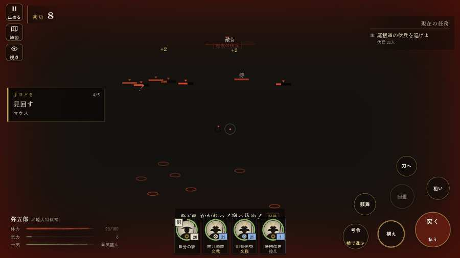

# テストプレイヤーの感想：指揮好きの戦略家

- 人：ケイコ（45歳・将棋と戦略ゲーム好き）（1993番）
- 変わり目：台詞を全部読む・パソコン 1280×720・新しく始める通し・ゆっくり・身分 上・問屋:馬・三人称・感度 ふつう・途中で止める
- 時：2026/9/30 16:05:03（202秒かかった）
- 画面：パソコン 1280×720・鍵盤とマウス・画質 中
- 遊んだ戦：信貴山城の戦い（達成）
- 機械の混み具合：5（load average）

## ひとこと

> 信貴山城で、号令を32回かけました。字が枠から切れている。ここが直れば、ぐっと指揮が楽しくなる。HUD の札どうしが重なって読めない。采配の上で、これは痛い。号令「敵を狙え」から3秒たっても、組の7割が動かない。命令が信用できないと、策が立てられません。勝てはしましたが、自分の采配で勝った手応えはまだ薄いです。

## 見つけた問題（4件・困った順）

### 1. 字が枠から切れている
- どこで：信貴山城の戦い・開戦
- 何が：#h-units > .uc.ally > .nm「筒井順慶」／#h-units > .uc.ally > .nm「明智光秀」
- どれくらい困ったか：★★★ やめたくなった（135回）
- 直し方の目安：枠を広げるか、字を折り返す
- 画面：（その戦の山場の一枚）

### 2. HUD の札どうしが重なって読めない
- どこで：信貴山城の戦い・15秒・brief
- 何が：#subtitle と #h-units（1280×720）
- どれくらい困ったか：★★★ やめたくなった（22回）
- 直し方の目安：置き場所をずらすか、片方を出している間はもう片方を隠す
- 画面：（その戦の山場の一枚）

### 3. 号令「敵を狙え」から3秒たっても、組の7割が動かない
- どこで：信貴山城の戦い・215秒・climb
- 何が：18人のうち動いたのは5人（信貴山城の戦い・215秒・climb）
- どれくらい困ったか：★★ かなり困った（1回）
- 直し方の目安：号令を受けた兵がすぐ向きを変えて動き出すようにする（行き先・狙いの付け直し）
- 画面：（その戦の山場の一枚）

### 4. 号令が届いたのか、画面で分からない
- どこで：信貴山城の戦い・56秒・climb
- 何が：号令のあと1秒、字幕も知らせも出なかった（信貴山城の戦い・56秒・climb）
- どれくらい困ったか：★ 少し気になった（2回）
- 直し方の目安：号令を出したら、短い字幕か組の頭上の印で「届いた」を見せる
- 画面：（その戦の山場の一枚）

## 遊んだ記録

- 信貴山城の戦い：217秒・任務達成・戦功194・組18/20・討ち取り34・突き0/当たり84・号令32回・指で押した数3・読み込み2.2秒・戦の前の札307字・1コマ21.4ms（実時間129秒・内訳 brain 0.0・pad 0.0・tf 0.0・upd 0.0・eye 0.2）
  - 任務の流れ：0s 足軽の一手を預かり、筒井順慶の城攻めの下知を待て → 16s 筒井順慶について尾根道を登れ → 28s 尾根道の伏兵を退けよ → 58s 尾根道の伏兵を退けよ／預かった一手を尾根道に並べ、駆け下りる松永勢を受け止めよ → 129s 尾根道の伏兵を退けよ／預かった一手を尾根道に並べ、駆け下りる松永勢を受け止めよ〔済〕 → 132s 尾根道の伏兵を退けよ → 154s 尾根道の伏兵を退けよ／預かった一手で西の尾根の出丸を攻め取れ → 206s 尾根道の伏兵を退けよ／門の前で、柵の外に出た松永勢を押し返せ
  - 味方の隊：隊45・動いた計3927m・味方の討ち取り100・敵を前に20秒止まった3回・本物の味方5人未満0秒
  - 受けた傷：足軽 17
  - 開戦：
  - 山場：
  - 勝ち負けが決まった所：
