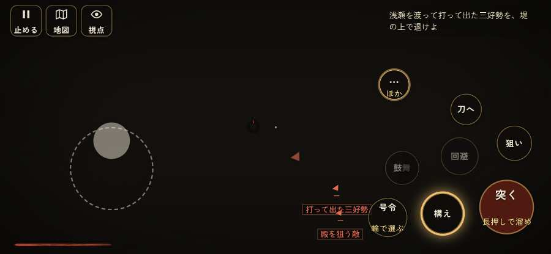

# テストプレイヤーの感想：はじめての中学生

- 人：ハルト（13歳・中学一年）（2000番）
- 変わり目：構え多め・iPhone 横 844×390・新しく始める通し・速い・身分 少し上・問屋:馬・三人称・感度 敏感・止めない
- 時：2026/9/30 15:56:56（231秒かかった）
- 画面：iPhone の横向き 844×390・倍率3・指で触る操作（touch.js の釦・棒・なぞり）・画質 低
- 遊んだ戦：野田・福島の戦い（失敗）
- 機械の混み具合：5（load average）

## ひとこと

> えっと、遊んでみた。野田・福島をやった。よく分かんないまま終わった。「前へ進もうとしても進めない所があった」のとこ、だるい。「遊び手を責める言い回し」のとこ、ムリ。「戦場が札に食われている」のとこ、ふつうに困った。槍でつくのはちょっと楽しい。

## 見つけた問題（3件・困った順）

### 1. 遊び手を責める言い回し
- どこで：野田・福島の戦い・55秒・carry
- 何が：「味方「しっかりせい……！　まだ死ぬな！」」（報せ）
- どれくらい困ったか：★★ かなり困った（2回）
- 直し方の目安：責めずに、次にどうすればよいかを言う
- 画面：（その戦の山場の一枚）

### 2. 前へ進もうとしても進めない所があった
- どこで：野田・福島の戦い・33秒・carry
- 何が：(-7, -15)・段 carry
- どれくらい困ったか：★★ かなり困った（1回）
- 直し方の目安：当たり（柵・建物・地形）と道のつながりを見直す
- 画面：

### 3. 戦場が札に食われている（画面の3分の1超）
- どこで：野田・福島の戦い・170秒・sally
- 何が：844×390 で 35%
- どれくらい困ったか：★ 少し気になった（1回）
- 直し方の目安：札を小さくするか、平時は薄く・畳む
- 画面：（その戦の山場の一枚）

## 遊んだ記録

- 野田・福島の戦い：369秒・任務失敗・戦功105・組5/20・討ち取り11・突き2156/当たり38・号令2回・指で押した数2608・読み込み6.5秒・戦の前の札218字・1コマ19.5ms（実時間183秒・内訳 brain 0.1・pad 0.7・tf 0.9・upd 17.8・eye 0.2）
  - 任務の流れ：0s 前田利家と並んで堤の一手を預かる。下知を待て → 4s 預かった手の先に立ち、竹束を堤の上へ据えさせよ（3つ） → 65s 預かった手の先に立ち、竹束を堤の上へ据えさせよ（3つ）〔済〕 → 72s 浅瀬を渡って打って出た三好勢を、堤の上で退けよ → 173s 浅瀬を渡って打って出た三好勢を、堤の上で退けよ／中洲の三好の鉄砲衆を崩せ → 307s 浅瀬を渡って打って出た三好勢を、堤の上で退けよ／中洲の三好の鉄砲衆を崩せ〔済〕 → 311s 春日井の堤の一手を預かり、寄せる一揆勢を退けよ（夜明けまで）／中洲の三好の鉄砲衆を崩せ〔済〕
  - 味方の隊：隊75・動いた計11244m・味方の討ち取り308・敵を前に20秒止まった27回・本物の味方5人未満0秒
  - 受けた傷：足軽 173
  - 開戦：
  - 山場：
