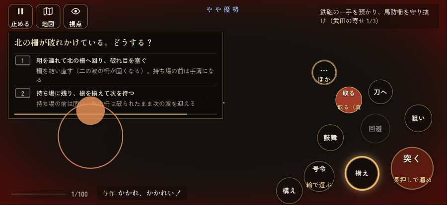

# テストプレイヤーの感想：アクション好き

- 人：ソウタ（24歳・アクションゲーム好き）（2162番）
- 変わり目：走りっぱなし・iPhone 横 874×402・織田家編の戦を一つ・ふつう・身分 中ほど・問屋:買わない・一人称・感度 鈍い・止めない
- 時：2026/9/30 20:57:57（139秒かかった）
- 画面：iPhone の横向き 874×402・倍率3・指で触る操作（touch.js の釦・棒・なぞり）・画質 低
- 遊んだ戦：設楽原の決戦（失敗・倒れた）
- 機械の混み具合：4（load average）

## ひとこと

> とにかく突っ込んだ。2分で3人斬った。96回突いて25回当たり。まあまあ。倒れて戦が終わった、ここは爽快感が死んでる。始まってすぐやられる、ストレスたまる。一人倒すのに何度も突かされる、手応えがスカスカ。1回やられた。難しいのはいいけど、何でやられたか分かるようにしてほしい。

## 見つけた問題（4件・困った順）

### 1. 倒れて戦が終わった
- どこで：設楽原の決戦・108秒・brief
- 何が：108秒で倒れた（受けた傷：騎馬 107・足軽 77・武将 15・弓 5）
- どれくらい困ったか：★★ かなり困った（1回）
- 直し方の目安：初めの戦は受ける傷を減らす・危ない時に字幕で構えを教える
- 画面：（その戦の山場の一枚）

### 2. 始まってすぐやられる（難しすぎ）
- どこで：設楽原の決戦・108秒・brief
- 何が：108秒で倒れた（騎馬 107・足軽 77・武将 15・弓 5）
- どれくらい困ったか：★★ かなり困った（1回）
- 画面：（その戦の山場の一枚）

### 3. 戦う兵が遠景の大軍（影の兵）の中に埋もれている
- どこで：設楽原の決戦・16秒・brief
- 何が：敵の兵 4人が、遠景の大軍 #23（中心 111,-36・170人）の中（112, -24）／敵の兵 7人が、遠景の大軍 #11（中心 124,-40・200人）の中（130, -44）
- どれくらい困ったか：★ 少し気になった（4回）
- 直し方の目安：遠景の大軍を戦う場所から離す（addDistantArmy の x,z,w,d を見直す）か、兵の行き先を大軍の外にする
- 画面：（その戦の山場の一枚）

### 4. 一人倒すのに何度も突かされる
- どこで：設楽原の決戦・108秒・brief
- 何が：平均 8.3回で一人
- どれくらい困ったか：★ 少し気になった（1回）
- 直し方の目安：足軽は2〜3突きで倒れるくらいに
- 画面：（その戦の山場の一枚）

## 遊んだ記録

- 設楽原の決戦：108秒・任務失敗（倒れた）・戦功105・組14/20・討ち取り3・突き96/当たり25・号令0回・指で押した数173・読み込み11.2秒・戦の前の札239字・1コマ31.6ms（実時間94秒・内訳 brain 0.2・pad 0.3・tf 0.9・upd 29.8・eye 0.3）
  - 任務の流れ：0s 鉄砲の一手を預かり、馬防柵を守り抜け（武田の寄せ 0/3） → 38s 鉄砲の一手を預かり、馬防柵を守り抜け（武田の寄せ 1/3）
  - 味方の隊：隊64・動いた計1176m・味方の討ち取り9・敵を前に20秒止まった8回・本物の味方5人未満0秒
  - 受けた傷：騎馬 107・足軽 77・武将 15・弓 5
  - 開戦：
  - 山場：
  - 勝ち負けが決まった所：
