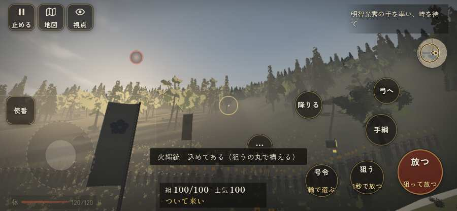

# テストプレイヤーの感想：歴史好きの大人

- 人：ミチオ（62歳・郷土史の会）（3006番）
- 変わり目：構え多め・iPhone 横 844×390・信長で出陣・ゆっくり・身分 中ほど・問屋:供・一人称・感度 鈍い・止めない
- 時：2026/10/1 20:45:51（224秒かかった）
- 画面：iPhone の横向き 844×390・倍率3・指で触る操作（touch.js の釦・棒・なぞり）・画質 低
- 遊んだ戦：比叡山攻め（信長で出陣）（達成）
- 機械の混み具合：5（load average）

## ひとこと

> 比叡山攻め（信長で出陣）を、一人称で歩いて見て回りました。務めは果たせましたが、気になる所がいくつか。行き先があるのに20秒動かない兵。細かい事ですが、こういう所で嘘っぽくなる。兵が一息で飛んだ。史実を知る者としては、ここは看過できません。前へ進もうとしても進めない所があった。これでは興が醒めます。

## 見つけた問題（7件・困った順）

### 1. 行き先があるのに20秒動かない兵
- どこで：比叡山攻め（信長で出陣）・85秒・climb
- 何が：味方の足軽：味方の足軽（号令：attack・佐久間信盛の手（槍）・頭：full/engage・近い敵14m）at (47,-103)／味方の足軽：味方の足軽（号令：move・佐久間信盛の手（槍）・頭：無/―・近い敵51m逃）at (57,-93)
- どれくらい困ったか：★★★ やめたくなった（47回）
- 直し方の目安：道が塞がれていないか、行き先に着いたと見なせているかを見る
- 画面：（その戦の山場の一枚）

### 2. 兵が一息で飛んだ（6m 超）
- どこで：比叡山攻め（信長で出陣）・1秒・brief
- 何が：味方の足軽：味方の足軽：(4,-188) → (4,-176)／味方の足軽：味方の足軽：(-4,-188) → (-4,-176)
- どれくらい困ったか：★★★ やめたくなった（19回）
- 直し方の目安：位置を直接書き換えている所を探す（出し直し・押し出し）
- 画面：（その戦の山場の一枚）

### 3. 崩れた部隊が、また戦っている
- どこで：比叡山攻め（信長で出陣）・202秒・climb
- 何が：無動寺谷の僧兵（薙刀）（号令：flee）／無動寺谷の僧兵（弓）（号令：flee）
- どれくらい困ったか：★★★ やめたくなった（7回）
- 直し方の目安：崩れた部隊の号令を上書きしない
- 画面：（その戦の山場の一枚）

### 4. 前へ進もうとしても進めない所があった
- どこで：比叡山攻め（信長で出陣）・162秒・climb
- 何が：(57, -77)・段 climb
- どれくらい困ったか：★★ かなり困った（1回）
- 直し方の目安：当たり（柵・建物・地形）と道のつながりを見直す
- 画面：（その戦の山場の一枚）

### 5. 敵が近いのに、まわりの兵の多くが棒立ち
- どこで：比叡山攻め（信長で出陣）・195秒・climb
- 何が：195秒：まわり35mの8人のうち5人が止まったまま（段 climb）
- どれくらい困ったか：★★ かなり困った（1回）
- 直し方の目安：敵が30m内に入ったら、構える・にじり寄る・槍を揃えるなど体を動かす
- 画面：（その戦の山場の一枚）

### 6. 前へ進もうとしても進めない所があった
- どこで：比叡山攻め（信長で出陣）・212秒・climb
- 何が：(59, -61)・段 climb
- どれくらい困ったか：★★ かなり困った（1回）
- 直し方の目安：当たり（柵・建物・地形）と道のつながりを見直す
- 画面：（その戦の山場の一枚）

### 7. 始まりの場所がおかしい（坂本の総門（明智光秀の手の後ろ）のはず）
- どこで：比叡山攻め（信長で出陣）・1秒・brief
- 何が：自分は (0, -176)。目安 (0, -192) から 16m（16m の内のはず）
- どれくらい困ったか：★ 少し気になった（1回）
- 直し方の目安：戦の定義の lordSpawn を lordAt の内に置く（または筋を替えて lordAt を直す）
- 画面：（その戦の山場の一枚）

## 遊んだ記録

- 比叡山攻め（信長で出陣）：245秒・任務達成・戦功116・組97/100・討ち取り0・突き0/当たり0・号令0回・指で押した数7・読み込み2.9秒・戦の前の札151字・1コマ30.9ms（実時間179秒・内訳 brain 0.0・pad 0.1・tf 0.2・upd 30.2・eye 0.3）
  - 任務の流れ：0s 明智光秀の手を率い、時を待て → 14s 無動寺谷の外堂を落とし、東塔の根本中堂へ攻め上れ → 235s 無動寺谷の外堂を落とし、東塔の根本中堂へ攻め上れ〔済〕
  - 味方の隊：隊8・動いた計1265m・味方の討ち取り53・敵を前に20秒止まった0回・本物の味方5人未満0秒
  - 開戦：
  - 一人称で見回す（45秒）：
  - 一人称で見回す（90秒）：
