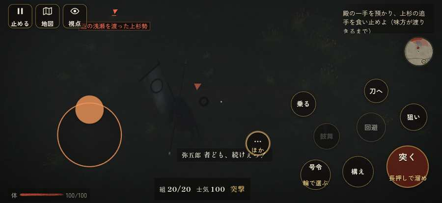

# テストプレイヤーの感想：せっかちな社会人

- 人：ユウキ（35歳・昼休みに遊ぶ会社員）（3019番）
- 変わり目：連打・iPhone 横 874×402・織田家編の戦を一つ・ふつう・身分 中ほど・問屋:馬・三人称・感度 敏感・途中で止める
- 時：2026/10/1 20:55:12（136秒かかった）
- 画面：iPhone の横向き 874×402・倍率3・指で触る操作（touch.js の釦・棒・なぞり）・画質 低
- 遊んだ戦：手取川の戦い（達成）
- 機械の混み具合：4（load average）

## ひとこと

> 昼休みに3分ほど。手取川。「狙い」をしたいのに、押す丸が出ていない。時間がもったいない。前へ進もうとしても進めない所があった。時間がもったいない。味方が味方を傷つけている。時間がもったいない。勝ち負けはすぐ分かって、そこは良かった。

## 見つけた問題（3件・困った順）

### 1. 前へ進もうとしても進めない所があった
- どこで：手取川の戦い・176秒・rear
- 何が：(-62, -46)・段 rear
- どれくらい困ったか：★★ かなり困った（1回）
- 直し方の目安：当たり（柵・建物・地形）と道のつながりを見直す
- 画面：（その戦の山場の一枚）

### 2. 味方が味方を傷つけている
- どこで：手取川の戦い・5秒・retreat
- 何が：自分：自分 → 味方の柴田勝家（20）／自分：自分 → 味方の柴田勝家（35）
- どれくらい困ったか：★ 少し気になった（9回）
- 直し方の目安：狙いの相手を選ぶときに、同じ側を外す
- 画面：（その戦の山場の一枚）

### 3. 「狙い」をしたいのに、押す丸が出ていない
- どこで：手取川の戦い・42秒・rear
- 何が：欲しかった時：手取川の戦い・42秒・rear
- どれくらい困ったか：★ 少し気になった（8回）
- 直し方の目安：その時に使える釦は出す（touchFrame の出し入れ）
- 画面：（その戦の山場の一枚）

## 遊んだ記録

- 手取川の戦い：177秒・任務達成・戦功200・組19/20・討ち取り14・突き1643/当たり58・号令2回・指で押した数1677・読み込み7.1秒・戦の前の札207字・1コマ21.8ms（実時間101秒・内訳 brain 0.0・pad 0.9・tf 0.6・upd 20.1・eye 0.2）
  - 任務の流れ：0s 柴田勝家の手で足軽の一手を預かり、下知を待て → 3s 北の岸の浅瀬の口まで退け → 10s 殿の一手を預かり、上杉の追手を食い止めよ（味方が渡りきるまで）／浅瀬の口の前で、上杉の追手を食い止めよ（殿） → 100s 殿の一手を預かり、上杉の追手を食い止めよ（味方が渡りきるまで）／浅瀬の口の前で、上杉の追手を食い止めよ（殿）〔済〕 → 121s 殿の一手を預かり、上杉の追手を食い止めよ（味方が渡りきるまで）／丹羽殿の手の横を突く上杉の別手を崩せ
  - 味方の隊：隊55・動いた計8540m・味方の討ち取り89・敵を前に20秒止まった1回・本物の味方5人未満0秒
  - 受けた傷：足軽 83・侍 31・武将 8
  - 開戦：
  - 山場：
  - 勝ち負けが決まった所：
