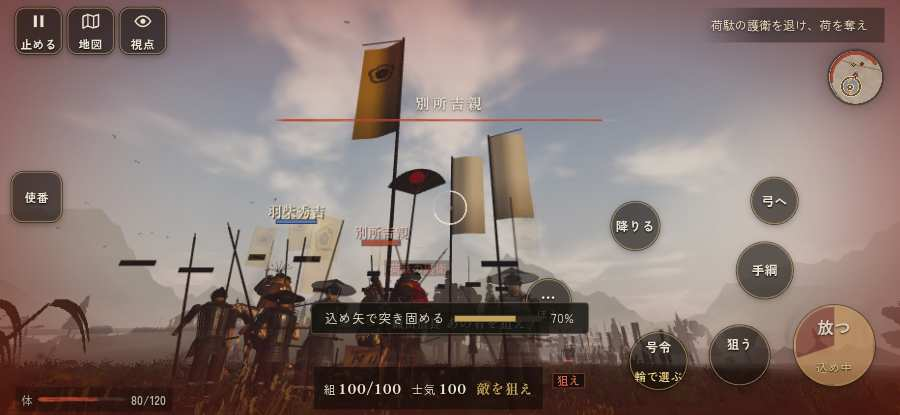

# テストプレイヤーの感想：指揮好きの戦略家

- 人：ケイコ（45歳・将棋と戦略ゲーム好き）（3618番）
- 変わり目：台詞を全部読む・iPhone 横 932×430・信長で出陣・ふつう・身分 少し上・問屋:刀・槍・具足・三人称・感度 敏感・止めない
- 時：2026/10/2 14:24:03（306秒かかった）
- 画面：iPhone の横向き 932×430・倍率3・指で触る操作（touch.js の釦・棒・なぞり）・画質 低
- 遊んだ戦：三木城・大村の合戦（信長で出陣）（途中で打ち切り）（失敗）
- 機械の混み具合：6（load average）

## ひとこと

> 三木城・大村の合戦（信長で出陣）（途中で打ち切り）で、号令を99回かけました。信長でも出陣して、軍配も触りました。死んだ相手を3秒以上狙い続けている。指揮官としてはもどかしい。行き先があるのに20秒動かない兵。指揮官としてはもどかしい。号令「射撃／停止」が、指の号令の輪から出せない。命令が信用できないと、策が立てられません。采配で負けたのか、操作で負けたのか分からないのが一番困ります。

## 見つけた問題（6件・困った順）

### 1. 死んだ相手を3秒以上狙い続けている
- どこで：三木城・大村の合戦（信長で出陣）・376秒・hirata
- 何が：敵の鉄砲：敵の鉄砲／味方の足軽：味方の足軽
- どれくらい困ったか：★★★ やめたくなった（310回）
- 直し方の目安：相手が倒れたら狙いを外す
- 画面：（その戦の山場の一枚）

### 2. 行き先があるのに20秒動かない兵
- どこで：三木城・大村の合戦（信長で出陣）・219秒・hirata
- 何が：敵の足軽：敵の足軽（号令：attack・打って出た別所勢・頭：full/engage・近い敵8m）at (-45,-57)／敵の足軽：敵の足軽（号令：attack・打って出た別所勢・頭：full/engage・近い敵9m）at (-44,-57)
- どれくらい困ったか：★★★ やめたくなった（37回）
- 直し方の目安：道が塞がれていないか、行き先に着いたと見なせているかを見る
- 画面：（その戦の山場の一枚）

### 3. 号令「射撃／停止」が、指の号令の輪から出せない
- どこで：三木城・大村の合戦（信長で出陣）・21秒・convoy
- 何が：号令の輪（RADIAL）に無い、または身分が足りず選べない（三木城・大村の合戦（信長で出陣）・21秒・convoy）
- どれくらい困ったか：★★★ やめたくなった（1回）
- 直し方の目安：号令の輪に足すか、短く押した時の指揮の札（数字の号令）を指で押せるようにする
- 画面：（その戦の山場の一枚）

### 4. 字が枠から切れている
- どこで：三木城・大村の合戦（信長で出陣）・20秒・convoy
- 何が：.tr > #objectives > .objnew「任務更新：荷駄の護衛を退け、荷を」／.tr > #objectives > .objnew「任務更新：捨てられた兵糧の俵を奪」
- どれくらい困ったか：★★ かなり困った（10回）
- 直し方の目安：枠を広げるか、字を折り返す
- 画面：（その戦の山場の一枚）

### 5. 指の端末では「火縄銃に持ち替え（鍵盤の 3）」ができない（押す丸が無い）
- どこで：三木城・大村の合戦（信長で出陣）・708秒・omura
- 何が：bot の頭が Digit3 を押したがった（三木城・大村の合戦（信長で出陣）・708秒・omura）
- どれくらい困ったか：★★ かなり困った（1回）
- 直し方の目安：touch.js に釦を足すか、戦の方で要らなくする
- 画面：（その戦の山場の一枚）

### 6. 遊び手を責める言い回し
- どこで：三木城・大村の合戦（信長で出陣）・271秒・hirata
- 何が：「味方「しっかりせい……！　まだ死ぬな！」」（報せ）
- どれくらい困ったか：★ 少し気になった（2回）
- 直し方の目安：責めずに、次にどうすればよいかを言う
- 画面：（その戦の山場の一枚）

## 遊んだ記録

- 三木城・大村の合戦（信長で出陣）（途中で打ち切り）：727秒・任務失敗・戦功190・組48/100・討ち取り18・突き18/当たり22・号令99回・指で押した数3196・読み込み1.6秒・戦の前の札116字・1コマ12.1ms（実時間272秒・内訳 brain 0.0・pad 0.5・tf 0.4・upd 11.1・eye 0.1）
  - 任務の流れ：0s 羽柴秀吉の手を率い、時を待て → 15s 荷駄の護衛を退け、荷を奪え → 93s 捨てられた兵糧の俵を奪え（2か所） → 135s 捨てられた兵糧の俵を奪え（2か所）〔済〕 → 139s 平田の付城へ駆けつけ、柵に取り付く別所勢を退けよ → 289s 平田の付城を守り、別所・毛利勢を城へ入れるな → 317s 平田の付城を守り、別所・毛利勢を城へ入れるな／付城の口を守り、囲みに来る別所勢を退けよ → 409s 平田の付城を守り、別所・毛利勢を城へ入れるな／付城の口を守り、囲みに来る別所勢を退けよ〔済〕 → 413s 平田の付城を守り、別所・毛利勢を城へ入れるな → 437s 平田の付城を守り、別所・毛利勢を城へ入れるな／西の谷道で、荷駄を守る毛利勢を崩せ → 514s 大村坂で、別所・毛利勢を崩せ／西の谷道で、荷駄を守る毛利勢を崩せ〔済〕 → 654s 大村坂を押さえ、城の者を二度と出すな／西の谷道で、荷駄を守る毛利勢を崩せ〔済〕 → 658s 大村坂を押さえ、城の者を二度と出すな → 682s 大村坂を押さえ、城の者を二度と出すな／城の手前で、逃げ込む別所勢と城からの新手を崩せ
  - 味方の隊：隊107・動いた計12394m・味方の討ち取り334・敵を前に20秒止まった24回・本物の味方5人未満0秒
  - 受けた傷：足軽 242・鉄砲 29・弓 16・武将 14・侍 6
  - 開戦：
  - 山場：
  - 終わり近く：
