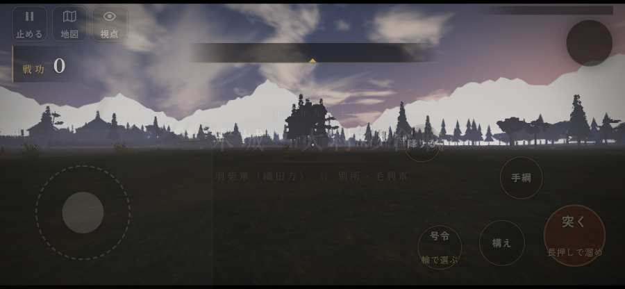

# テストプレイヤーの感想：歴史好きの大人

- 人：ミチオ（62歳・郷土史の会）（4346番）
- 変わり目：迷子になりやすい・iPhone 横 844×390・新しく始める通し・ふつう・身分 上・問屋:供・一人称・感度 鈍い・止めない
- 時：2026/10/3 11:57:37（107秒かかった）
- 画面：iPhone の横向き 844×390・倍率3・指で触る操作（touch.js の釦・棒・なぞり）・画質 低
- 遊んだ戦：三木城・大村の合戦（失敗・倒れた）
- 機械の混み具合：4（load average）

## ひとこと

> 三木城・大村の合戦を、一人称で歩いて見て回りました。務めは果たせませんでしたが、それより気になる所があります。城下から出陣できなかった。細かい事ですが、こういう所で嘘っぽくなる。行き先があるのに20秒動かない兵。当時の人が見たら首を傾げるでしょう。倒れて戦が終わった。これでは興が醒めます。問屋では若党雇い賃 8貫を求めました。

## 見つけた問題（3件・困った順）

### 1. 行き先があるのに20秒動かない兵
- どこで：三木城・大村の合戦・189秒・hirata
- 何が：敵の足軽：敵の足軽（号令：attack・打って出た別所勢・頭：full/engage・近い敵8m）at (-42,-54)／敵の足軽：敵の足軽（号令：attack・打って出た別所勢・頭：full/engage・近い敵10m）at (-39,-52)
- どれくらい困ったか：★★★ やめたくなった（20回）
- 直し方の目安：道が塞がれていないか、行き先に着いたと見なせているかを見る
- 画面：（その戦の山場の一枚）

### 2. 城下から出陣できなかった
- どこで：有岡城の戦いの前・城下
- 何が：「出陣」の釦が見つからない・押しても戦の前の札が出ない
- どれくらい困ったか：★★★ やめたくなった（1回）
- 画面：（その戦の山場の一枚）

### 3. 倒れて戦が終わった
- どこで：三木城・大村の合戦・447秒・hirata
- 何が：447秒で倒れた（受けた傷：足軽 125・侍 35・弓 16）
- どれくらい困ったか：★ 少し気になった（1回）
- 直し方の目安：初めの戦は受ける傷を減らす・危ない時に字幕で構えを教える
- 画面：（その戦の山場の一枚）

## 遊んだ記録

- 三木城・大村の合戦：447秒・任務失敗（倒れた）・戦功254・組0/20・討ち取り8・突き17/当たり25・号令2回・指で押した数240・読み込み2.5秒・戦の前の札226字・1コマ5.7ms（実時間72秒・内訳 brain 0.0・pad 0.1・tf 0.1・upd 5.3・eye 0.1）
  - 任務の流れ：0s 足軽の一手を預かり、羽柴秀吉の下知を待て → 15s 荷駄の護衛を退け、荷を奪え → 95s 捨てられた兵糧の俵を奪え（2か所） → 135s 平田の付城へ駆けつけ、柵に取り付く別所勢を退けよ → 235s 平田の付城の一手を預かり、別所・毛利勢を城へ入れるな → 261s 平田の付城の一手を預かり、別所・毛利勢を城へ入れるな／預かった一手で付城の口を固め、囲みに来る別所勢を退けよ → 333s 平田の付城の一手を預かり、別所・毛利勢を城へ入れるな／預かった一手で付城の口を固め、囲みに来る別所勢を退けよ〔済〕 → 337s 平田の付城の一手を預かり、別所・毛利勢を城へ入れるな → 359s 平田の付城の一手を預かり、別所・毛利勢を城へ入れるな／預かった一手で西の谷道を塞ぎ、毛利の荷駄を焼け
  - 味方の隊：隊16・動いた計2935m・味方の討ち取り87・敵を前に20秒止まった4回・本物の味方5人未満0秒
  - 受けた傷：足軽 125・侍 35・弓 16
  - 開戦：
  - 一人称で見回す（45秒）：
  - 一人称で見回す（90秒）：
